**[License](LICENSE.md)** 📢 Nominate ([@madhavagarwal3012](https://github.com/madhavagarwal3012/)) as **[GitHub Star ★](https://stars.github.com/nominate)**. If you appreciate his hard work and dedication to open source.


<p align="right">
  <a href="https://github.com/madhavagarwal3012">
    
  </a>
  <a href="https://github.com/madhavagarwal3012?tab=followers">
    
  </a>
  <a href="https://github.com/sponsors/madhavagarwal3012">
    
  </a>
  <a href="https://www.naukri.com/code360/profile/madhvagrwal3012">
    
  </a>
</p>

<h1 align="center"></a></h1>

<h2 align="center">I’m a web developer in the making, learning from Coding Ninja’s full stack web development course. I have a solid foundation in Python, SQL, Java, and DSA. I enjoy discovering new tools and techniques to make awesome web apps. I’m looking for opportunities to apply my skills and creativity to real-world projects. I value teamwork, problem-solving, and continuous improvement as the keys to success. 🚀</h2>

<h2 align="center">🎓 I have finished my class 12th from GD Goenka Public School in 2023, where I spent my entire school life. I have always been an avid and curious learner, participating in various academic and co-curricular activities. I have earned certificates of excellence in Java from Coding Ninja, and certificates of completion in Python and SQL from SoloLearn. I have also aced the LinkedIn skill assessment test in Python. I’m proud of my achievements and thankful for the support of my teachers, mentors, and friends. 🙌</h2>

<h2 align="center">👩‍💻 I’m currently pursuing my Bachelors in Computer Applications from the prestigious Jaypee Institute of Information Technology (JIIT, Noida). Taking my web development skills to the next level and exploring new technologies. Excited to apply my expertise and creativity in building amazing and user-friendly web apps. 💯</h2>

<p align="left"> <a href="https://github.com/ryo-ma/github-profile-trophy"></a> </p>
<p align="left"> <a href="https://twitter.com/madhvagrwal3012" target="blank"></a> </p>

- 🌱 I’m currently learning **Data Structures And Algorithm In Java**
-  **📫 How to reach me**

<div align="left"> 
  <a href="mailto:madhavaggarwal3584@hotmail.com">
    
  </a>
  <a href="https://madhavagarwal3012.github.io./Portfolio/index.html" target="_blank">
      <!-- sqlite, safari, google-chrome are other good icon options -->
  </a>
  <a href="https://madhavagarwal3012-resume.tiiny.site" target="_blank">
     
  </a>
</div>

<h2 align="left">Connect With Me:</h2>
<p align="left">
<a href="https://twitter.com/madhvagrwal3012" target="blank"></a>
<a href="https://linkedin.com/in/madhavagarwal3012" target="blank"></a>
<a href="https://instagram.com/madhavagarwal3012" target="blank"></a>
<a href="https://youtube.com/@madhavagarwal3012?si=lYsWf56XH8R9EMQT" target="blank"></a>
<a href="https://www.hackerrank.com/madhvagarwal3012" target="blank"></a>
<a href="https://www.leetcode.com/madhavagarwal3012" target="blank"></a>
<a href="https://auth.geeksforgeeks.org/user/madhavagarwal3012" target="blank"></a>

---

<h2 align="left">Languages and Tools:</h2>
<p align="left">
    <a href="https://www.java.com" target="_blank" rel="noreferrer">
        
    </a>
    <a href="https://www.python.org" target="_blank" rel="noreferrer">
        
    </a>
    <a href="https://www.cprogramming.com/" target="_blank" rel="noreferrer">
        
    </a>
    <a href="https://www.w3schools.com/html/" target="_blank" rel="noreferrer">
        
    </a>
    <a href="https://www.w3schools.com/css/" target="_blank" rel="noreferrer">
        
    </a>
    <a href="https://developer.mozilla.org/en-US/docs/Web/JavaScript" target="_blank" rel="noreferrer">
        
    </a>
    <a href="https://www.mysql.com/" target="_blank" rel="noreferrer">
        
    </a>
    <a href="https://www.linux.org/" target="_blank" rel="noreferrer">
        
    </a>
    <a href="https://www.vectorlogo.zone/logos/google_cloud/google_cloud-icon.svg" target="_blank" rel="noreferrer">
        
    </a>
    <a href="https://www.photoshop.com/en" target="_blank" rel="noreferrer">
        
    </a>
</p>

<p align="center">
  
</p>

---

 <h2 align="left">  My Main Projects </h2>

```javascript
console.log(`Feel free to contribute`);
```

<table style="width:100%" align="center">
  <tr>
    <td>
      <a href="https://github.com/madhavagarwal3012/Calcunite-Executable-File-Application ">
        
      </a>
    </td>
    <td>
      <a href="https://github.com/madhavagarwal3012/2D-Array-Operation-Executable-File-Application-">
        
      </a>
    </td>
    </tr>
  <!-- <tr>
    <td>
      <a href="https://github.com/madhavagarwal3012/Game-Arena-Board-Verse-GameHub">
        
      </a>
    </td>
  </tr> -->
</table>


<br>


---

## 📂 My Repository Structure & Workflows 📂

```
madhavagarwal3012/
    ├── __pycache__/
    │   ├── connect4.cpython-310.pyc
    ├── .github/
    │   ├── workflows/
    │   │   ├── breakout.yaml
    │   │   ├── Chess.yml
    │   │   ├── Connect4.yml
    │   │   ├── main.yml
    │   │   ├── metrics.yml
    │   │   ├── waka.yml
    │   ├── FUNDING.yml
    ├── assets/
    │   ├── bar_graph.png
    │   ├── breakout.svg
    ├── data/
    │   ├── captured_data.txt
    │   ├── last_moves.txt
    │   ├── last_movesC4.txt
    │   ├── settings.yaml
    │   ├── settingsC4.yml
    │   ├── top_moves.txt
    │   ├── top_movesC4.txt
    │   ├── win_statsC4.txt
    ├── games/
    │   ├── current.pgn
    │   ├── currentC4.p
    ├── img/
    │   ├── black/
    │   │   ├── bishop.svg
    │   │   ├── king.svg
    │   │   ├── knight.svg
    │   │   ├── pawn.svg
    │   │   ├── queen.svg
    │   │   ├── rook.svg
    │   ├── circles/
    │   │   ├── blue.png
    │   │   ├── red.png
    │   ├── hearts/
    │   │   ├── blue.png
    │   │   ├── red.png
    │   ├── pieces/
    │   │   ├── bishop.png
    │   │   ├── king.png
    │   │   ├── knight.png
    │   │   ├── pawn.png
    │   │   ├── queen.png
    │   │   ├── rook.png
    │   ├── white/
    │   │   ├── bishop.svg
    │   │   ├── king.svg
    │   │   ├── knight.svg
    │   │   ├── pawn.svg
    │   │   ├── queen.svg
    │   │   ├── rook.svg
    │   ├── blank.png
    │   ├── blankC4.png
    ├── src/
    │   ├── __pycache__/
    │   │   ├── markdown.cpython-310.pyc
    │   │   ├── markdownC4.cpython-310.pyc
    │   │   ├── mockGithub.cpython-310.pyc
    │   │   └── selftest.cpython-310.pyc
    │   ├── markdown.py
    │   ├── markdownC4.py
    │   ├── mockGithub.py
    │   └── selftest.py
    ├── Black Background.gif
    ├── central text.svg
    ├── code-the-cool-stuff.gif
    ├── coding-life.gif
    ├── connect4.py
    ├── contribution name graph.svg
    ├── contributions.webp
    ├── Github Ascii Art Text.png
    ├── Github Graph Wavy Art.svg
    ├── github-metrics.svg
    ├── header.png
    ├── html-css-js.gif
    ├── LICENSE.md
    ├── main.py
    ├── mainC4.py
    ├── random dev quote.png
    ├── README.md
    ├── requirements.txt
    ├── sponsor badge.jpg
    ├── techy.PNG
    ├── typing.gif
    └── White Background.gif
```

---

<div align="left">
  <h2>🐍 My Contributions 🐍</h2>
  <br>
  
  
  
  
  
  
</div>

  ---
  
  <div>
  <h2 align="left">Support:</h2>
  
  <p><a href="https://buymeacoffee.com/madhavagarwal3012"> </a><a href="https://github.com/sponsors/madhavagarwal3012"> </a></p>
</div>

<br/><br/><br/>

--- 

<h2 align="left">Stats:</h2>
<br>
<div align=left>
  
  
  <br/>
  <br><br>

  ---
  
  <!--START_SECTION:waka-->
**🐱 My GitHub Data** 

> 📦 65.5 kB Used in GitHub's Storage 
 > 
> 🏆 812 Contributions in the Year 2026
 > 
> 🚫 Not Opted to Hire
 > 
> 📜 20 Public Repositories 
 > 
> 🔑 3 Private Repositories 
 > 
**I'm a Night 🦉** 

```text
🌞 Morning                406 commits         ██░░░░░░░░░░░░░░░░░░░░░░░   09.09 % 
🌆 Daytime                544 commits         ███░░░░░░░░░░░░░░░░░░░░░░   12.18 % 
🌃 Evening                1592 commits        █████████░░░░░░░░░░░░░░░░   35.64 % 
🌙 Night                  1925 commits        ███████████░░░░░░░░░░░░░░   43.09 % 
```
📅 **I'm Most Productive on Sunday** 

```text
Monday                   643 commits         ████░░░░░░░░░░░░░░░░░░░░░   14.39 % 
Tuesday                  698 commits         ████░░░░░░░░░░░░░░░░░░░░░   15.63 % 
Wednesday                356 commits         ██░░░░░░░░░░░░░░░░░░░░░░░   07.97 % 
Thursday                 473 commits         ███░░░░░░░░░░░░░░░░░░░░░░   10.59 % 
Friday                   749 commits         ████░░░░░░░░░░░░░░░░░░░░░   16.77 % 
Saturday                 638 commits         ████░░░░░░░░░░░░░░░░░░░░░   14.28 % 
Sunday                   910 commits         █████░░░░░░░░░░░░░░░░░░░░   20.37 % 
```


📊 **This Week I Spent My Time On** 

```text
🕑︎ Time Zone: Asia/Kolkata

💬 Programming Languages: 
No Activity Tracked This Week

🔥 Editors: 
No Activity Tracked This Week

🐱‍💻 Projects: 
No Activity Tracked This Week
```

**Timeline**


 Last Updated on 09/02/2026 02:35:32 UTC
<!--END_SECTION:waka-->
</div>

---

<h2 align="left">🏆 Hacktoberfest Badges</h2>
<div align="left">
<a href="https://www.holopin.io/@madhavagarwal3012#" target="_blank" rel="noopener noreferrer">
    <picture>
      <source media="(max-width: 600px)" srcset="https://holopin.me/madhavagarwal3012?size=small">
      
    </picture>
  </a>
</div>

<div style="display: flex; justify-content: space-between; align-items: center;">
  <h2>Random Dev Quotes:</h2>
   <div style="display: flex; justify-content: space-between; width: 100%;">
    
  </div>
</div>

---

<div>
  
  
  
</div>
<div style="clear: both; text-align: center; padding-top: 20px;">
  
</div>

--- 


Counting of visitors to this page started on <strong>August 28, 2025</strong>

<a href="https://info.flagcounter.com/isZI"></a>
<br clear="both">

---

## ♟️ Chess Game ♟️
This is an open chess tournament where ANYONE can play. That's the fun part.  

### 🗺️ Guide to Chess Piece Movement

Before making your move, here's a quick refresher on how each piece can move and capture.

| Piece | Image | Movement | Capturing | Key Rule |
| :---: | :---: | :---: | :---: | :---: |
| **King** | 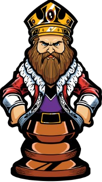 | Moves **one square** in any direction (horizontal, vertical, or diagonal). | Captures like it moves (1 square in any direction). | **Must never** move into a square where it can be captured (check). |
| **Queen** | 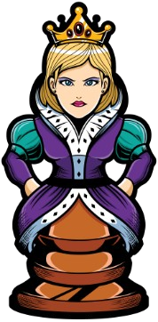 | Moves any number of squares **horizontally, vertically, or diagonally**. | Captures on any square along its line of movement. | The most powerful piece on the board. |
| **Rook (Elephant)** | 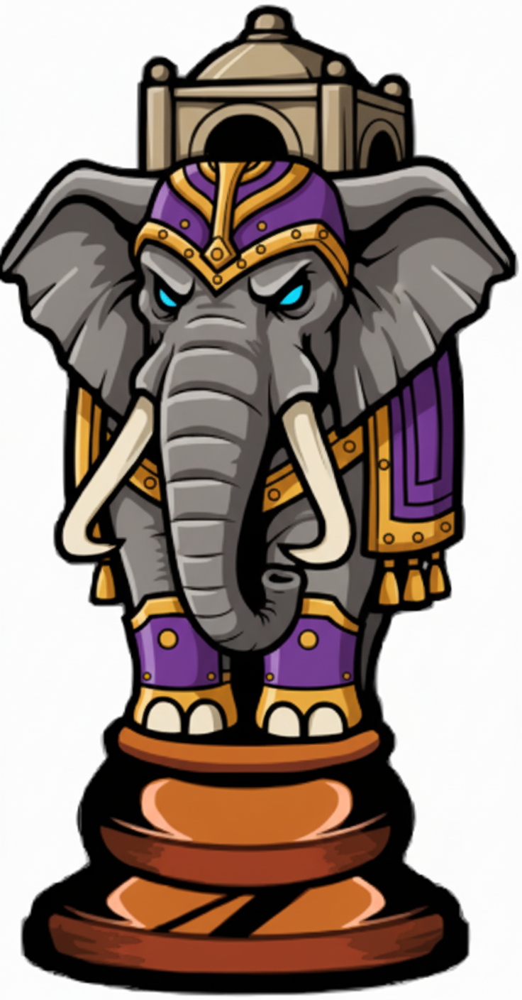 | Moves any number of squares **horizontally** (across files) or **vertically** (up/down ranks). | Captures on any square along its straight line of movement. | Cannot jump over other pieces. |
| **Bishop** |  | Moves any number of squares **diagonally**. | Captures on any square along its diagonal line of movement. | Stays on its original color square for the entire game. |
| **Knight (Horse)** | 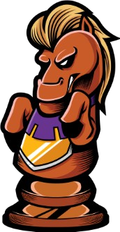 | Moves in an **"L" shape** (two squares in one cardinal direction and then one square perpendicular). | Captures only on the square it lands on. | **The only piece that can jump** over other pieces. |
| **Pawn** | 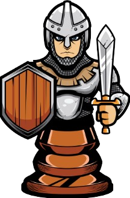 | Moves **forward one square** (two squares on its first move only). | Captures **diagonally** one square forward. | If it reaches the opposite side of the board, it must **Promote** (usually to a Queen). |

---

### 🕹️ Game Status
<!-- BEGIN TOP STATUS -->

<!-- END TOP STATUS -->

<!-- BEGIN CHESS BOARD -->
|   | A | B | C | D | E | F | G | H |   |
|---|:-:|:-:|:-:|:-:|:-:|:-:|:-:|:-:|:-:|
| **8** |  | 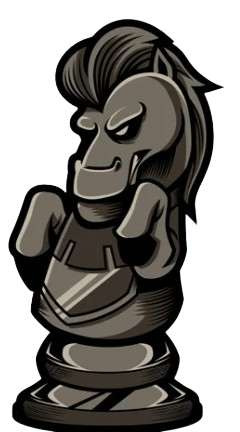 |  | 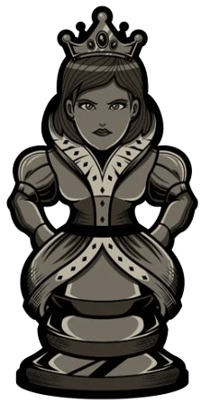 |  |  |  |  | | **8** | 
| **7** | 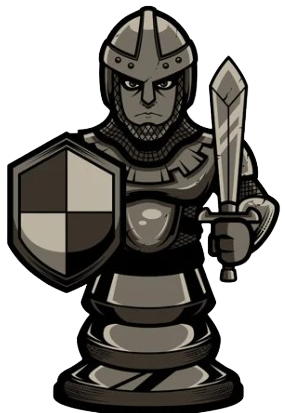 |  |  |  |  |  |  |  | | **7** | 
| **6** |  |  |  |  |  |  |  |  | | **6** | 
| **5** |  |  |  |  |  |  |  |  | | **5** | 
| **4** |  |  |  | 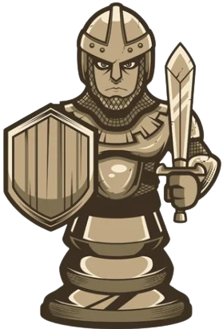 |  |  |  |  | | **4** | 
| **3** |  |  |  |  |  |  |  |  | | **3** | 
| **2** |  |  |  |  |  |  |  |  | | **2** | 
| **1** |  |  |  | 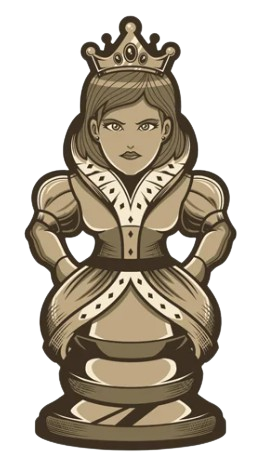 | 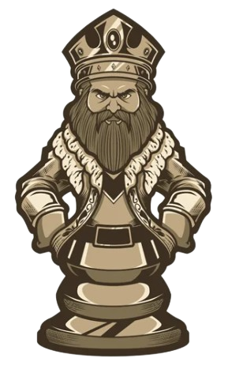 |  |  |  | | **1** | 
| | **A** | **B** | **C** | **D** | **E** | **F** | **G** | **H** | |
<!-- END CHESS BOARD -->

<!-- BEGIN BOTTOM STATUS -->

<!-- END BOTTOM STATUS -->

---

**It's your turn to move! Choose one from the following table**
<!-- BEGIN MOVES LIST -->
| Piece | Type | From | To (Click to Move) |
| :---: | :--- | :---: | :--- |
|  | **Pawn** | `A2` | [A3](https://github.com/madhavagarwal3012/madhavagarwal3012/issues/new?body=Please+do+not+change+the+title.+Just+click+%22Submit+new+issue%22.+You+don%27t+need+to+do+anything+else+%3AD&title=Chess%3A+Move+A2+to+A3), [A4](https://github.com/madhavagarwal3012/madhavagarwal3012/issues/new?body=Please+do+not+change+the+title.+Just+click+%22Submit+new+issue%22.+You+don%27t+need+to+do+anything+else+%3AD&title=Chess%3A+Move+A2+to+A4) |
|  | **Pawn** | `B2` | [B3](https://github.com/madhavagarwal3012/madhavagarwal3012/issues/new?body=Please+do+not+change+the+title.+Just+click+%22Submit+new+issue%22.+You+don%27t+need+to+do+anything+else+%3AD&title=Chess%3A+Move+B2+to+B3), [B4](https://github.com/madhavagarwal3012/madhavagarwal3012/issues/new?body=Please+do+not+change+the+title.+Just+click+%22Submit+new+issue%22.+You+don%27t+need+to+do+anything+else+%3AD&title=Chess%3A+Move+B2+to+B4) |
|  | **Pawn** | `F2` | [F3](https://github.com/madhavagarwal3012/madhavagarwal3012/issues/new?body=Please+do+not+change+the+title.+Just+click+%22Submit+new+issue%22.+You+don%27t+need+to+do+anything+else+%3AD&title=Chess%3A+Move+F2+to+F3), [F4](https://github.com/madhavagarwal3012/madhavagarwal3012/issues/new?body=Please+do+not+change+the+title.+Just+click+%22Submit+new+issue%22.+You+don%27t+need+to+do+anything+else+%3AD&title=Chess%3A+Move+F2+to+F4) |
|  | **Pawn** | `G2` | [G3](https://github.com/madhavagarwal3012/madhavagarwal3012/issues/new?body=Please+do+not+change+the+title.+Just+click+%22Submit+new+issue%22.+You+don%27t+need+to+do+anything+else+%3AD&title=Chess%3A+Move+G2+to+G3), [G4](https://github.com/madhavagarwal3012/madhavagarwal3012/issues/new?body=Please+do+not+change+the+title.+Just+click+%22Submit+new+issue%22.+You+don%27t+need+to+do+anything+else+%3AD&title=Chess%3A+Move+G2+to+G4) |
|  | **Pawn** | `C3` | [C4](https://github.com/madhavagarwal3012/madhavagarwal3012/issues/new?body=Please+do+not+change+the+title.+Just+click+%22Submit+new+issue%22.+You+don%27t+need+to+do+anything+else+%3AD&title=Chess%3A+Move+C3+to+C4) |
|  | **Pawn** | `E3` | [E4](https://github.com/madhavagarwal3012/madhavagarwal3012/issues/new?body=Please+do+not+change+the+title.+Just+click+%22Submit+new+issue%22.+You+don%27t+need+to+do+anything+else+%3AD&title=Chess%3A+Move+E3+to+E4) |
|  | **Knight** | `B1` | [A3](https://github.com/madhavagarwal3012/madhavagarwal3012/issues/new?body=Please+do+not+change+the+title.+Just+click+%22Submit+new+issue%22.+You+don%27t+need+to+do+anything+else+%3AD&title=Chess%3A+Move+B1+to+A3), [D2](https://github.com/madhavagarwal3012/madhavagarwal3012/issues/new?body=Please+do+not+change+the+title.+Just+click+%22Submit+new+issue%22.+You+don%27t+need+to+do+anything+else+%3AD&title=Chess%3A+Move+B1+to+D2) |
|  | **Knight** | `H3` | [F4](https://github.com/madhavagarwal3012/madhavagarwal3012/issues/new?body=Please+do+not+change+the+title.+Just+click+%22Submit+new+issue%22.+You+don%27t+need+to+do+anything+else+%3AD&title=Chess%3A+Move+H3+to+F4), [G1](https://github.com/madhavagarwal3012/madhavagarwal3012/issues/new?body=Please+do+not+change+the+title.+Just+click+%22Submit+new+issue%22.+You+don%27t+need+to+do+anything+else+%3AD&title=Chess%3A+Move+H3+to+G1), [G5](https://github.com/madhavagarwal3012/madhavagarwal3012/issues/new?body=Please+do+not+change+the+title.+Just+click+%22Submit+new+issue%22.+You+don%27t+need+to+do+anything+else+%3AD&title=Chess%3A+Move+H3+to+G5) |
|  | **Bishop** | `C1` | [D2](https://github.com/madhavagarwal3012/madhavagarwal3012/issues/new?body=Please+do+not+change+the+title.+Just+click+%22Submit+new+issue%22.+You+don%27t+need+to+do+anything+else+%3AD&title=Chess%3A+Move+C1+to+D2) |
|  | **Bishop** | `D3` | [A6](https://github.com/madhavagarwal3012/madhavagarwal3012/issues/new?body=Please+do+not+change+the+title.+Just+click+%22Submit+new+issue%22.+You+don%27t+need+to+do+anything+else+%3AD&title=Chess%3A+Move+D3+to+A6), [B5](https://github.com/madhavagarwal3012/madhavagarwal3012/issues/new?body=Please+do+not+change+the+title.+Just+click+%22Submit+new+issue%22.+You+don%27t+need+to+do+anything+else+%3AD&title=Chess%3A+Move+D3+to+B5), [C2](https://github.com/madhavagarwal3012/madhavagarwal3012/issues/new?body=Please+do+not+change+the+title.+Just+click+%22Submit+new+issue%22.+You+don%27t+need+to+do+anything+else+%3AD&title=Chess%3A+Move+D3+to+C2), [C4](https://github.com/madhavagarwal3012/madhavagarwal3012/issues/new?body=Please+do+not+change+the+title.+Just+click+%22Submit+new+issue%22.+You+don%27t+need+to+do+anything+else+%3AD&title=Chess%3A+Move+D3+to+C4), [E2](https://github.com/madhavagarwal3012/madhavagarwal3012/issues/new?body=Please+do+not+change+the+title.+Just+click+%22Submit+new+issue%22.+You+don%27t+need+to+do+anything+else+%3AD&title=Chess%3A+Move+D3+to+E2), [E4](https://github.com/madhavagarwal3012/madhavagarwal3012/issues/new?body=Please+do+not+change+the+title.+Just+click+%22Submit+new+issue%22.+You+don%27t+need+to+do+anything+else+%3AD&title=Chess%3A+Move+D3+to+E4), [F1](https://github.com/madhavagarwal3012/madhavagarwal3012/issues/new?body=Please+do+not+change+the+title.+Just+click+%22Submit+new+issue%22.+You+don%27t+need+to+do+anything+else+%3AD&title=Chess%3A+Move+D3+to+F1), [F5](https://github.com/madhavagarwal3012/madhavagarwal3012/issues/new?body=Please+do+not+change+the+title.+Just+click+%22Submit+new+issue%22.+You+don%27t+need+to+do+anything+else+%3AD&title=Chess%3A+Move+D3+to+F5), [G6](https://github.com/madhavagarwal3012/madhavagarwal3012/issues/new?body=Please+do+not+change+the+title.+Just+click+%22Submit+new+issue%22.+You+don%27t+need+to+do+anything+else+%3AD&title=Chess%3A+Move+D3+to+G6), [H7](https://github.com/madhavagarwal3012/madhavagarwal3012/issues/new?body=Please+do+not+change+the+title.+Just+click+%22Submit+new+issue%22.+You+don%27t+need+to+do+anything+else+%3AD&title=Chess%3A+Move+D3+to+H7) |
|  | **Rook** | `H1` | [F1](https://github.com/madhavagarwal3012/madhavagarwal3012/issues/new?body=Please+do+not+change+the+title.+Just+click+%22Submit+new+issue%22.+You+don%27t+need+to+do+anything+else+%3AD&title=Chess%3A+Move+H1+to+F1), [G1](https://github.com/madhavagarwal3012/madhavagarwal3012/issues/new?body=Please+do+not+change+the+title.+Just+click+%22Submit+new+issue%22.+You+don%27t+need+to+do+anything+else+%3AD&title=Chess%3A+Move+H1+to+G1) |
|  | **Queen** | `D1` | [A4](https://github.com/madhavagarwal3012/madhavagarwal3012/issues/new?body=Please+do+not+change+the+title.+Just+click+%22Submit+new+issue%22.+You+don%27t+need+to+do+anything+else+%3AD&title=Chess%3A+Move+D1+to+A4), [B3](https://github.com/madhavagarwal3012/madhavagarwal3012/issues/new?body=Please+do+not+change+the+title.+Just+click+%22Submit+new+issue%22.+You+don%27t+need+to+do+anything+else+%3AD&title=Chess%3A+Move+D1+to+B3), [C2](https://github.com/madhavagarwal3012/madhavagarwal3012/issues/new?body=Please+do+not+change+the+title.+Just+click+%22Submit+new+issue%22.+You+don%27t+need+to+do+anything+else+%3AD&title=Chess%3A+Move+D1+to+C2), [D2](https://github.com/madhavagarwal3012/madhavagarwal3012/issues/new?body=Please+do+not+change+the+title.+Just+click+%22Submit+new+issue%22.+You+don%27t+need+to+do+anything+else+%3AD&title=Chess%3A+Move+D1+to+D2), [E2](https://github.com/madhavagarwal3012/madhavagarwal3012/issues/new?body=Please+do+not+change+the+title.+Just+click+%22Submit+new+issue%22.+You+don%27t+need+to+do+anything+else+%3AD&title=Chess%3A+Move+D1+to+E2), [F3](https://github.com/madhavagarwal3012/madhavagarwal3012/issues/new?body=Please+do+not+change+the+title.+Just+click+%22Submit+new+issue%22.+You+don%27t+need+to+do+anything+else+%3AD&title=Chess%3A+Move+D1+to+F3), [G4](https://github.com/madhavagarwal3012/madhavagarwal3012/issues/new?body=Please+do+not+change+the+title.+Just+click+%22Submit+new+issue%22.+You+don%27t+need+to+do+anything+else+%3AD&title=Chess%3A+Move+D1+to+G4), [H5](https://github.com/madhavagarwal3012/madhavagarwal3012/issues/new?body=Please+do+not+change+the+title.+Just+click+%22Submit+new+issue%22.+You+don%27t+need+to+do+anything+else+%3AD&title=Chess%3A+Move+D1+to+H5) |
|  | **King** | `E1` | [D2](https://github.com/madhavagarwal3012/madhavagarwal3012/issues/new?body=Please+do+not+change+the+title.+Just+click+%22Submit+new+issue%22.+You+don%27t+need+to+do+anything+else+%3AD&title=Chess%3A+Move+E1+to+D2), [E2](https://github.com/madhavagarwal3012/madhavagarwal3012/issues/new?body=Please+do+not+change+the+title.+Just+click+%22Submit+new+issue%22.+You+don%27t+need+to+do+anything+else+%3AD&title=Chess%3A+Move+E1+to+E2), [F1](https://github.com/madhavagarwal3012/madhavagarwal3012/issues/new?body=Please+do+not+change+the+title.+Just+click+%22Submit+new+issue%22.+You+don%27t+need+to+do+anything+else+%3AD&title=Chess%3A+Move+E1+to+F1), [G1](https://github.com/madhavagarwal3012/madhavagarwal3012/issues/new?body=Please+do+not+change+the+title.+Just+click+%22Submit+new+issue%22.+You+don%27t+need+to+do+anything+else+%3AD&title=Chess%3A+Move+E1+to+G1) |
<!-- END MOVES LIST -->

Having fun? Ask a friend to do the next move!

#### How it works ?

When you click on a link and submit a new issue with the desired move, a GitHub action is triggered, which in turn runs a small python script that performs the specified movement, updates this README file and commits the changes.

---

### ⚔️  Captured Pieces ⚔️ 
<!-- BEGIN CAPTURE TABLE -->
 #### No pieces captured yet. 
<!-- END CAPTURE TABLE -->

<details>
  <summary>Last 5 moves in this game</summary>
<!-- BEGIN LAST MOVES -->

| Move | Author |
| :--: | :----- |
| `G8` to `F6` | [ @madhavagarwal3012](https://github.com/madhavagarwal3012) |
| `G1` to `H3` | [ @madhavagarwal3012](https://github.com/madhavagarwal3012) |
| `D7` to `E8` | [ @madhavagarwal3012](https://github.com/madhavagarwal3012) |
| `B5` to `D3` | [ @madhavagarwal3012](https://github.com/madhavagarwal3012) |
| `C7` to `C6` | [ @madhavagarwal3012](https://github.com/madhavagarwal3012) |

<!-- END LAST MOVES -->
</details>

<details>
  <summary>Top 10 most moves across all games</summary>
<!-- BEGIN TOP MOVES -->

| Total moves |  User  |
| :---------: | :----- |
| 247 | [@madhavagarwal3012](https://github.com/madhavagarwal3012) |

<!-- END TOP MOVES -->
</details>

--- 

## ❤️ Connect4 Game: Hearts Edition 💙
> This is an open tournament where ANYONE can play! The rules are simple, but the strategy is deep.

| Heart | Movement & Placement | Winning Pattern |
| :---: | :--- | :--- |
| <br>**Red Team** | **Gravity Rule:** Click a column number (1-7). Your heart drops to the lowest empty spot. | **Connect Four:** Align 4 hearts in a row—Horizontal, Vertical, or Diagonal. |
| <br>**Blue Team** | **Turn-Based:** You must wait for the opponent to move. Check the "Current Status" badge! | **Win Patterns:**<br>↔️ `❤️ ❤️ ❤️ ❤️`<br>↕️ `Vertical Stack`<br>↗️ `Diagonal Line` |

---

**📜 Quick Start & Rules**
* **Physics:** You choose the column; gravity chooses the row.
* **Limits:** Columns hold **6 hearts** max. Full columns will be disabled.
* **Stalemate:** If the board fills up (42 hearts) with no winner, it's a draw.
* **Pro Tip:** Occupy the **center column** to unlock the most winning paths and always block your opponent’s "Line of 3" immediately!

---

<!-- BEGIN CONNECT4 BOARD -->
### 🚩 Current Heart's Color:  
|   | 1 | 2 | 3 | 4 | 5 | 6 | 7 |   |
|---|:-:|:-:|:-:|:-:|:-:|:-:|:-:|:-:|
|   | |  |  |  |  |  |  |    |
|   | |  |  |  |  |  |  |    |
|   | |  |  |  |  |  |  |    |
|   | |  |  |  |  |  |  |    |
|   | |  |  |  |  |  |  |    |
|   | |  |  |  |  |  |  |    |
| **MOVE** | [1](https://github.com/madhavagarwal3012/madhavagarwal3012/issues/new?title=Connect4%3A+Place+Heart+At+1&body=Please+do+not+change+the+title.+Just+click+%22Submit+new+issue%22.+You+don%27t+need+to+do+anything+else+%3AD) | [2](https://github.com/madhavagarwal3012/madhavagarwal3012/issues/new?title=Connect4%3A+Place+Heart+At+2&body=Please+do+not+change+the+title.+Just+click+%22Submit+new+issue%22.+You+don%27t+need+to+do+anything+else+%3AD) | [3](https://github.com/madhavagarwal3012/madhavagarwal3012/issues/new?title=Connect4%3A+Place+Heart+At+3&body=Please+do+not+change+the+title.+Just+click+%22Submit+new+issue%22.+You+don%27t+need+to+do+anything+else+%3AD) | [4](https://github.com/madhavagarwal3012/madhavagarwal3012/issues/new?title=Connect4%3A+Place+Heart+At+4&body=Please+do+not+change+the+title.+Just+click+%22Submit+new+issue%22.+You+don%27t+need+to+do+anything+else+%3AD) | [5](https://github.com/madhavagarwal3012/madhavagarwal3012/issues/new?title=Connect4%3A+Place+Heart+At+5&body=Please+do+not+change+the+title.+Just+click+%22Submit+new+issue%22.+You+don%27t+need+to+do+anything+else+%3AD) | [6](https://github.com/madhavagarwal3012/madhavagarwal3012/issues/new?title=Connect4%3A+Place+Heart+At+6&body=Please+do+not+change+the+title.+Just+click+%22Submit+new+issue%22.+You+don%27t+need+to+do+anything+else+%3AD) | [7](https://github.com/madhavagarwal3012/madhavagarwal3012/issues/new?title=Connect4%3A+Place+Heart+At+7&body=Please+do+not+change+the+title.+Just+click+%22Submit+new+issue%22.+You+don%27t+need+to+do+anything+else+%3AD) | |

### 🚩 Current Heart's Color:  
<!-- END CONNECT4 BOARD -->

---

**It's your turn to move!**
<!-- BEGIN MOVES LIST C4 -->
<!-- END MOVES LIST C4 -->

#### How it works ?

When you click on a link and submit a new issue with the desired move, a GitHub action is triggered, which in turn runs a small python script that performs the specified movement, updates this README file and commits the changes.

<details>
  <summary>Last 5 moves in this game</summary>
<!-- BEGIN LAST MOVES C4 -->

| Move | Author |
| :---: | :--- |
| `Start game` |  [@madhavagarwal3012](https://github.com/madhavagarwal3012) | 
<!-- END LAST MOVES C4 -->
</details>

<details>
  <summary>Top 10 most moves across all games</summary>
<!-- BEGIN TOP MOVES C4 -->

| Total moves | User |
| :---: | :--- |
| 14 |  [@madhavagarwal3012](https://github.com/madhavagarwal3012) | 
<!-- END TOP MOVES C4 -->
</details>

### 🏆 WIN STATS TABLE (❤️ || 💙)
<!-- BEGIN WIN STATS TABLE C4 -->
| Team | Total Wins | Status |
| :---: | :---: | :---: |
| ❤️ Red Heart Team ❤️ | **1** | 🔥 Winning |
| 💙 Blue Heart Team 💙| **0** |  ⚔️ Chasing |
<!-- END WIN STATS TABLE C4 -->

---

## ⭕✖️ Tic Tac Toe Game ✖️⭕
<a name="top"></a>
I challenge you to a game of Tic-Tac-Toe. 
Give this page a few seconds to load all the emojis and then click the topmost box to start playing.

Xs go first, click one of the nine boxes to make your move.

_If for some reason the buttons are not clickable, try reloading the page. Sometimes GitHub can't handle all of the emojis._

[Take me to the bottom](#bottom)

---
## 🎮 Start Game! Your move ✖️
<a name="root"></a><br/><br/><br/>
### [⬜](#1) [⬜](#2) [⬜](#3)
### [⬜](#4) [⬜](#5) [⬜](#6)
### [⬜](#7) [⬜](#8) [⬜](#9)

---
<a name="1"></a><br/><br/><br/>
### ✖️ [⬜](#10) [⬜](#11)
### [⬜](#12) ⭕ [⬜](#13)
### [⬜](#14) [⬜](#15) [⬜](#16)

---
<a name="2"></a><br/><br/><br/>
### ⭕ ✖️ [⬜](#17)
### [⬜](#18) [⬜](#19) [⬜](#20)
### [⬜](#21) [⬜](#22) [⬜](#23)

---
<a name="3"></a><br/><br/><br/>
### [⬜](#24) [⬜](#25) ✖️
### [⬜](#26) ⭕ [⬜](#27)
### [⬜](#28) [⬜](#29) [⬜](#30)

---
<a name="4"></a><br/><br/><br/>
### ⭕ [⬜](#31) [⬜](#32)
### ✖️ [⬜](#33) [⬜](#34)
### [⬜](#35) [⬜](#36) [⬜](#37)

---
<a name="5"></a><br/><br/><br/>
### ⭕ [⬜](#38) [⬜](#39)
### [⬜](#40) ✖️ [⬜](#41)
### [⬜](#42) [⬜](#43) [⬜](#44)

---
<a name="6"></a><br/><br/><br/>
### [⬜](#45) [⬜](#46) ⭕
### [⬜](#47) [⬜](#48) ✖️
### [⬜](#49) [⬜](#50) [⬜](#51)

---
<a name="7"></a><br/><br/><br/>
### [⬜](#52) [⬜](#53) [⬜](#54)
### [⬜](#55) ⭕ [⬜](#56)
### ✖️ [⬜](#57) [⬜](#58)

---
<a name="8"></a><br/><br/><br/>
### [⬜](#59) ⭕ [⬜](#60)
### [⬜](#61) [⬜](#62) [⬜](#63)
### [⬜](#64) ✖️ [⬜](#65)

---
<a name="9"></a><br/><br/><br/>
### [⬜](#66) [⬜](#67) [⬜](#68)
### [⬜](#69) ⭕ [⬜](#70)
### [⬜](#71) [⬜](#72) ✖️

---
<a name="10"></a><br/><br/><br/>
### ✖️ ✖️ ⭕
### [⬜](#73) ⭕ [⬜](#74)
### [⬜](#75) [⬜](#76) [⬜](#77)

---
<a name="11"></a><br/><br/><br/>
### ✖️ ⭕ ✖️
### [⬜](#78) ⭕ [⬜](#79)
### [⬜](#80) [⬜](#81) [⬜](#82)

---
<a name="12"></a><br/><br/><br/>
### ✖️ [⬜](#83) [⬜](#84)
### ✖️ ⭕ [⬜](#85)
### ⭕ [⬜](#86) [⬜](#87)

---
<a name="13"></a><br/><br/><br/>
### ✖️ ⭕ [⬜](#88)
### [⬜](#89) ⭕ ✖️
### [⬜](#90) [⬜](#91) [⬜](#92)

---
<a name="14"></a><br/><br/><br/>
### ✖️ [⬜](#93) [⬜](#94)
### ⭕ ⭕ [⬜](#95)
### ✖️ [⬜](#96) [⬜](#97)

---
<a name="15"></a><br/><br/><br/>
### ✖️ [⬜](#98) [⬜](#99)
### ⭕ ⭕ [⬜](#100)
### [⬜](#101) ✖️ [⬜](#102)

---
<a name="16"></a><br/><br/><br/>
### ✖️ ⭕ [⬜](#103)
### [⬜](#104) ⭕ [⬜](#105)
### [⬜](#106) [⬜](#107) ✖️

---
<a name="17"></a><br/><br/><br/>
### ⭕ ✖️ ✖️
### ⭕ [⬜](#108) [⬜](#109)
### [⬜](#110) [⬜](#111) [⬜](#112)

---
<a name="18"></a><br/><br/><br/>
### ⭕ ✖️ [⬜](#113)
### ✖️ ⭕ [⬜](#114)
### [⬜](#115) [⬜](#116) [⬜](#117)

---
<a name="19"></a><br/><br/><br/>
### ⭕ ✖️ [⬜](#118)
### [⬜](#119) ✖️ [⬜](#120)
### [⬜](#121) ⭕ [⬜](#122)

---
<a name="20"></a><br/><br/><br/>
### ⭕ ✖️ [⬜](#123)
### [⬜](#124) [⬜](#125) ✖️
### ⭕ [⬜](#126) [⬜](#127)

---
<a name="21"></a><br/><br/><br/>
### ⭕ ✖️ [⬜](#128)
### [⬜](#129) ⭕ [⬜](#130)
### ✖️ [⬜](#131) [⬜](#132)

---
<a name="22"></a><br/><br/><br/>
### ⭕ ✖️ [⬜](#133)
### [⬜](#134) ⭕ [⬜](#135)
### [⬜](#136) ✖️ [⬜](#137)

---
<a name="23"></a><br/><br/><br/>
### ⭕ ✖️ [⬜](#138)
### [⬜](#139) ⭕ [⬜](#140)
### [⬜](#141) [⬜](#142) ✖️

---
<a name="24"></a><br/><br/><br/>
### ✖️ ⭕ ✖️
### [⬜](#143) ⭕ [⬜](#144)
### [⬜](#145) [⬜](#146) [⬜](#147)

---
<a name="25"></a><br/><br/><br/>
### ⭕ ✖️ ✖️
### [⬜](#148) ⭕ [⬜](#149)
### [⬜](#150) [⬜](#151) [⬜](#152)

---
<a name="26"></a><br/><br/><br/>
### ⭕ [⬜](#153) ✖️
### ✖️ ⭕ [⬜](#154)
### [⬜](#155) [⬜](#156) [⬜](#157)

---
<a name="27"></a><br/><br/><br/>
### [⬜](#158) [⬜](#159) ✖️
### [⬜](#160) ⭕ ✖️
### [⬜](#161) [⬜](#162) ⭕

---
<a name="28"></a><br/><br/><br/>
### [⬜](#163) ⭕ ✖️
### [⬜](#164) ⭕ [⬜](#165)
### ✖️ [⬜](#166) [⬜](#167)

---
<a name="29"></a><br/><br/><br/>
### [⬜](#168) [⬜](#169) ✖️
### ⭕ ⭕ [⬜](#170)
### [⬜](#171) ✖️ [⬜](#172)

---
<a name="30"></a><br/><br/><br/>
### [⬜](#173) [⬜](#174) ✖️
### [⬜](#175) ⭕ ⭕
### [⬜](#176) [⬜](#177) ✖️

---
<a name="31"></a><br/><br/><br/>
### ⭕ ✖️ [⬜](#178)
### ✖️ ⭕ [⬜](#179)
### [⬜](#180) [⬜](#181) [⬜](#182)

---
<a name="32"></a><br/><br/><br/>
### ⭕ [⬜](#183) ✖️
### ✖️ ⭕ [⬜](#184)
### [⬜](#185) [⬜](#186) [⬜](#187)

---
<a name="33"></a><br/><br/><br/>
### ⭕ [⬜](#188) [⬜](#189)
### ✖️ ✖️ ⭕
### [⬜](#190) [⬜](#191) [⬜](#192)

---
<a name="34"></a><br/><br/><br/>
### ⭕ [⬜](#193) [⬜](#194)
### ✖️ ⭕ ✖️
### [⬜](#195) [⬜](#196) [⬜](#197)

---
<a name="35"></a><br/><br/><br/>
### ⭕ ⭕ [⬜](#198)
### ✖️ [⬜](#199) [⬜](#200)
### ✖️ [⬜](#201) [⬜](#202)

---
<a name="36"></a><br/><br/><br/>
### ⭕ [⬜](#203) ⭕
### ✖️ [⬜](#204) [⬜](#205)
### [⬜](#206) ✖️ [⬜](#207)

---
<a name="37"></a><br/><br/><br/>
### ⭕ [⬜](#208) ⭕
### ✖️ [⬜](#209) [⬜](#210)
### [⬜](#211) [⬜](#212) ✖️

---
<a name="38"></a><br/><br/><br/>
### ⭕ ✖️ [⬜](#213)
### [⬜](#214) ✖️ [⬜](#215)
### [⬜](#216) ⭕ [⬜](#217)

---
<a name="39"></a><br/><br/><br/>
### ⭕ [⬜](#218) ✖️
### [⬜](#219) ✖️ [⬜](#220)
### ⭕ [⬜](#221) [⬜](#222)

---
<a name="40"></a><br/><br/><br/>
### ⭕ [⬜](#223) [⬜](#224)
### ✖️ ✖️ ⭕
### [⬜](#225) [⬜](#226) [⬜](#227)

---
<a name="41"></a><br/><br/><br/>
### ⭕ [⬜](#228) [⬜](#229)
### ⭕ ✖️ ✖️
### [⬜](#230) [⬜](#231) [⬜](#232)

---
<a name="42"></a><br/><br/><br/>
### ⭕ [⬜](#233) ⭕
### [⬜](#234) ✖️ [⬜](#235)
### ✖️ [⬜](#236) [⬜](#237)

---
<a name="43"></a><br/><br/><br/>
### ⭕ ⭕ [⬜](#238)
### [⬜](#239) ✖️ [⬜](#240)
### [⬜](#241) ✖️ [⬜](#242)

---
<a name="44"></a><br/><br/><br/>
### ⭕ [⬜](#243) ⭕
### [⬜](#244) ✖️ [⬜](#245)
### [⬜](#246) [⬜](#247) ✖️

---
<a name="45"></a><br/><br/><br/>
### ✖️ [⬜](#248) ⭕
### ⭕ [⬜](#249) ✖️
### [⬜](#250) [⬜](#251) [⬜](#252)

---
<a name="46"></a><br/><br/><br/>
### [⬜](#253) ✖️ ⭕
### ⭕ [⬜](#254) ✖️
### [⬜](#255) [⬜](#256) [⬜](#257)

---
<a name="47"></a><br/><br/><br/>
### [⬜](#258) [⬜](#259) ⭕
### ✖️ ⭕ ✖️
### [⬜](#260) [⬜](#261) [⬜](#262)

---
<a name="48"></a><br/><br/><br/>
### [⬜](#263) [⬜](#264) ⭕
### ⭕ ✖️ ✖️
### [⬜](#265) [⬜](#266) [⬜](#267)

---
<a name="49"></a><br/><br/><br/>
### ⭕ [⬜](#268) ⭕
### [⬜](#269) [⬜](#270) ✖️
### ✖️ [⬜](#271) [⬜](#272)

---
<a name="50"></a><br/><br/><br/>
### ⭕ [⬜](#273) ⭕
### [⬜](#274) [⬜](#275) ✖️
### [⬜](#276) ✖️ [⬜](#277)

---
<a name="51"></a><br/><br/><br/>
### ⭕ [⬜](#278) ⭕
### [⬜](#279) [⬜](#280) ✖️
### [⬜](#281) [⬜](#282) ✖️

---
<a name="52"></a><br/><br/><br/>
### ✖️ [⬜](#283) [⬜](#284)
### ⭕ ⭕ [⬜](#285)
### ✖️ [⬜](#286) [⬜](#287)

---
<a name="53"></a><br/><br/><br/>
### ⭕ ✖️ [⬜](#288)
### [⬜](#289) ⭕ [⬜](#290)
### ✖️ [⬜](#291) [⬜](#292)

---
<a name="54"></a><br/><br/><br/>
### [⬜](#293) ⭕ ✖️
### [⬜](#294) ⭕ [⬜](#295)
### ✖️ [⬜](#296) [⬜](#297)

---
<a name="55"></a><br/><br/><br/>
### ⭕ [⬜](#298) [⬜](#299)
### ✖️ ⭕ [⬜](#300)
### ✖️ [⬜](#301) [⬜](#302)

---
<a name="56"></a><br/><br/><br/>
### [⬜](#303) ⭕ [⬜](#304)
### [⬜](#305) ⭕ ✖️
### ✖️ [⬜](#306) [⬜](#307)

---
<a name="57"></a><br/><br/><br/>
### [⬜](#308) [⬜](#309) [⬜](#310)
### [⬜](#311) ⭕ [⬜](#312)
### ✖️ ✖️ ⭕

---
<a name="58"></a><br/><br/><br/>
### [⬜](#313) [⬜](#314) [⬜](#315)
### [⬜](#316) ⭕ [⬜](#317)
### ✖️ ⭕ ✖️

---
<a name="59"></a><br/><br/><br/>
### ✖️ ⭕ [⬜](#318)
### [⬜](#319) [⬜](#320) [⬜](#321)
### ⭕ ✖️ [⬜](#322)

---
<a name="60"></a><br/><br/><br/>
### [⬜](#323) ⭕ ✖️
### [⬜](#324) [⬜](#325) [⬜](#326)
### ⭕ ✖️ [⬜](#327)

---
<a name="61"></a><br/><br/><br/>
### [⬜](#328) ⭕ [⬜](#329)
### ✖️ [⬜](#330) [⬜](#331)
### ⭕ ✖️ [⬜](#332)

---
<a name="62"></a><br/><br/><br/>
### ⭕ ⭕ [⬜](#333)
### [⬜](#334) ✖️ [⬜](#335)
### [⬜](#336) ✖️ [⬜](#337)

---
<a name="63"></a><br/><br/><br/>
### [⬜](#338) ⭕ [⬜](#339)
### [⬜](#340) [⬜](#341) ✖️
### ⭕ ✖️ [⬜](#342)

---
<a name="64"></a><br/><br/><br/>
### [⬜](#343) ⭕ [⬜](#344)
### [⬜](#345) [⬜](#346) [⬜](#347)
### ✖️ ✖️ ⭕

---
<a name="65"></a><br/><br/><br/>
### [⬜](#348) ⭕ [⬜](#349)
### [⬜](#350) [⬜](#351) [⬜](#352)
### ⭕ ✖️ ✖️

---
<a name="66"></a><br/><br/><br/>
### ✖️ ⭕ [⬜](#353)
### [⬜](#354) ⭕ [⬜](#355)
### [⬜](#356) [⬜](#357) ✖️

---
<a name="67"></a><br/><br/><br/>
### ⭕ ✖️ [⬜](#358)
### [⬜](#359) ⭕ [⬜](#360)
### [⬜](#361) [⬜](#362) ✖️

---
<a name="68"></a><br/><br/><br/>
### [⬜](#363) [⬜](#364) ✖️
### [⬜](#365) ⭕ ⭕
### [⬜](#366) [⬜](#367) ✖️

---
<a name="69"></a><br/><br/><br/>
### ⭕ [⬜](#368) [⬜](#369)
### ✖️ ⭕ [⬜](#370)
### [⬜](#371) [⬜](#372) ✖️

---
<a name="70"></a><br/><br/><br/>
### [⬜](#373) [⬜](#374) ⭕
### [⬜](#375) ⭕ ✖️
### [⬜](#376) [⬜](#377) ✖️

---
<a name="71"></a><br/><br/><br/>
### [⬜](#378) [⬜](#379) [⬜](#380)
### [⬜](#381) ⭕ [⬜](#382)
### ✖️ ⭕ ✖️

---
<a name="72"></a><br/><br/><br/>
### [⬜](#383) [⬜](#384) [⬜](#385)
### [⬜](#386) ⭕ [⬜](#387)
### ⭕ ✖️ ✖️

---
<a name="73"></a><br/><br/><br/>
### ✖️ ✖️ ⭕
### ✖️ ⭕ ⬜
### ⭕ ⬜ ⬜

## **O wins!!!**

[Want to play again?](#root)

---
<a name="74"></a><br/><br/><br/>
### ✖️ ✖️ ⭕
### ⬜ ⭕ ✖️
### ⭕ ⬜ ⬜

## **O wins!!!**

[Want to play again?](#root)

---
<a name="75"></a><br/><br/><br/>
### ✖️ ✖️ ⭕
### [⬜](#388) ⭕ [⬜](#389)
### ✖️ [⬜](#390) ⭕

---
<a name="76"></a><br/><br/><br/>
### ✖️ ✖️ ⭕
### ⬜ ⭕ ⬜
### ⭕ ✖️ ⬜

## **O wins!!!**

[Want to play again?](#root)

---
<a name="77"></a><br/><br/><br/>
### ✖️ ✖️ ⭕
### ⬜ ⭕ ⬜
### ⭕ ⬜ ✖️

## **O wins!!!**

[Want to play again?](#root)

---
<a name="78"></a><br/><br/><br/>
### ✖️ ⭕ ✖️
### ✖️ ⭕ ⬜
### ⬜ ⭕ ⬜

## **O wins!!!**

[Want to play again?](#root)

---
<a name="79"></a><br/><br/><br/>
### ✖️ ⭕ ✖️
### ⬜ ⭕ ✖️
### ⬜ ⭕ ⬜

## **O wins!!!**

[Want to play again?](#root)

---
<a name="80"></a><br/><br/><br/>
### ✖️ ⭕ ✖️
### ⬜ ⭕ ⬜
### ✖️ ⭕ ⬜

## **O wins!!!**

[Want to play again?](#root)

---
<a name="81"></a><br/><br/><br/>
### ✖️ ⭕ ✖️
### [⬜](#391) ⭕ [⬜](#392)
### ⭕ ✖️ [⬜](#393)

---
<a name="82"></a><br/><br/><br/>
### ✖️ ⭕ ✖️
### ⬜ ⭕ ⬜
### ⬜ ⭕ ✖️

## **O wins!!!**

[Want to play again?](#root)

---
<a name="83"></a><br/><br/><br/>
### ✖️ ✖️ ⭕
### ✖️ ⭕ ⬜
### ⭕ ⬜ ⬜

## **O wins!!!**

[Want to play again?](#root)

---
<a name="84"></a><br/><br/><br/>
### ✖️ [⬜](#394) ✖️
### ✖️ ⭕ [⬜](#395)
### ⭕ [⬜](#396) ⭕

---
<a name="85"></a><br/><br/><br/>
### ✖️ ⬜ ⭕
### ✖️ ⭕ ✖️
### ⭕ ⬜ ⬜

## **O wins!!!**

[Want to play again?](#root)

---
<a name="86"></a><br/><br/><br/>
### ✖️ ⬜ ⭕
### ✖️ ⭕ ⬜
### ⭕ ✖️ ⬜

## **O wins!!!**

[Want to play again?](#root)

---
<a name="87"></a><br/><br/><br/>
### ✖️ ⬜ ⭕
### ✖️ ⭕ ⬜
### ⭕ ⬜ ✖️

## **O wins!!!**

[Want to play again?](#root)

---
<a name="88"></a><br/><br/><br/>
### ✖️ ⭕ ✖️
### ⬜ ⭕ ✖️
### ⬜ ⭕ ⬜

## **O wins!!!**

[Want to play again?](#root)

---
<a name="89"></a><br/><br/><br/>
### ✖️ ⭕ ⬜
### ✖️ ⭕ ✖️
### ⬜ ⭕ ⬜

## **O wins!!!**

[Want to play again?](#root)

---
<a name="90"></a><br/><br/><br/>
### ✖️ ⭕ ⬜
### ⬜ ⭕ ✖️
### ✖️ ⭕ ⬜

## **O wins!!!**

[Want to play again?](#root)

---
<a name="91"></a><br/><br/><br/>
### ✖️ ⭕ ⭕
### [⬜](#397) ⭕ ✖️
### [⬜](#398) ✖️ [⬜](#399)

---
<a name="92"></a><br/><br/><br/>
### ✖️ ⭕ ⬜
### ⬜ ⭕ ✖️
### ⬜ ⭕ ✖️

## **O wins!!!**

[Want to play again?](#root)

---
<a name="93"></a><br/><br/><br/>
### ✖️ ✖️ ⬜
### ⭕ ⭕ ⭕
### ✖️ ⬜ ⬜

## **O wins!!!**

[Want to play again?](#root)

---
<a name="94"></a><br/><br/><br/>
### ✖️ ⬜ ✖️
### ⭕ ⭕ ⭕
### ✖️ ⬜ ⬜

## **O wins!!!**

[Want to play again?](#root)

---
<a name="95"></a><br/><br/><br/>
### ✖️ [⬜](#400) ⭕
### ⭕ ⭕ ✖️
### ✖️ [⬜](#401) [⬜](#402)

---
<a name="96"></a><br/><br/><br/>
### ✖️ ⬜ ⬜
### ⭕ ⭕ ⭕
### ✖️ ✖️ ⬜

## **O wins!!!**

[Want to play again?](#root)

---
<a name="97"></a><br/><br/><br/>
### ✖️ ⬜ ⬜
### ⭕ ⭕ ⭕
### ✖️ ⬜ ✖️

## **O wins!!!**

[Want to play again?](#root)

---
<a name="98"></a><br/><br/><br/>
### ✖️ ✖️ ⬜
### ⭕ ⭕ ⭕
### ⬜ ✖️ ⬜

## **O wins!!!**

[Want to play again?](#root)

---
<a name="99"></a><br/><br/><br/>
### ✖️ ⬜ ✖️
### ⭕ ⭕ ⭕
### ⬜ ✖️ ⬜

## **O wins!!!**

[Want to play again?](#root)

---
<a name="100"></a><br/><br/><br/>
### ✖️ [⬜](#403) ⭕
### ⭕ ⭕ ✖️
### [⬜](#404) ✖️ [⬜](#405)

---
<a name="101"></a><br/><br/><br/>
### ✖️ ⬜ ⬜
### ⭕ ⭕ ⭕
### ✖️ ✖️ ⬜

## **O wins!!!**

[Want to play again?](#root)

---
<a name="102"></a><br/><br/><br/>
### ✖️ ⬜ ⬜
### ⭕ ⭕ ⭕
### ⬜ ✖️ ✖️

## **O wins!!!**

[Want to play again?](#root)

---
<a name="103"></a><br/><br/><br/>
### ✖️ ⭕ ✖️
### ⬜ ⭕ ⬜
### ⬜ ⭕ ✖️

## **O wins!!!**

[Want to play again?](#root)

---
<a name="104"></a><br/><br/><br/>
### ✖️ ⭕ ⬜
### ✖️ ⭕ ⬜
### ⬜ ⭕ ✖️

## **O wins!!!**

[Want to play again?](#root)

---
<a name="105"></a><br/><br/><br/>
### ✖️ ⭕ ⬜
### ⬜ ⭕ ✖️
### ⬜ ⭕ ✖️

## **O wins!!!**

[Want to play again?](#root)

---
<a name="106"></a><br/><br/><br/>
### ✖️ ⭕ ⬜
### ⬜ ⭕ ⬜
### ✖️ ⭕ ✖️

## **O wins!!!**

[Want to play again?](#root)

---
<a name="107"></a><br/><br/><br/>
### ✖️ ⭕ ⭕
### [⬜](#406) ⭕ [⬜](#407)
### [⬜](#408) ✖️ ✖️

---
<a name="108"></a><br/><br/><br/>
### ⭕ ✖️ ✖️
### ⭕ ✖️ ⬜
### ⭕ ⬜ ⬜

## **O wins!!!**

[Want to play again?](#root)

---
<a name="109"></a><br/><br/><br/>
### ⭕ ✖️ ✖️
### ⭕ ⬜ ✖️
### ⭕ ⬜ ⬜

## **O wins!!!**

[Want to play again?](#root)

---
<a name="110"></a><br/><br/><br/>
### ⭕ ✖️ ✖️
### ⭕ ⭕ [⬜](#409)
### ✖️ [⬜](#410) [⬜](#411)

---
<a name="111"></a><br/><br/><br/>
### ⭕ ✖️ ✖️
### ⭕ ⬜ ⬜
### ⭕ ✖️ ⬜

## **O wins!!!**

[Want to play again?](#root)

---
<a name="112"></a><br/><br/><br/>
### ⭕ ✖️ ✖️
### ⭕ ⬜ ⬜
### ⭕ ⬜ ✖️

## **O wins!!!**

[Want to play again?](#root)

---
<a name="113"></a><br/><br/><br/>
### ⭕ ✖️ ✖️
### ✖️ ⭕ ⬜
### ⬜ ⬜ ⭕

## **O wins!!!**

[Want to play again?](#root)

---
<a name="114"></a><br/><br/><br/>
### ⭕ ✖️ ⬜
### ✖️ ⭕ ✖️
### ⬜ ⬜ ⭕

## **O wins!!!**

[Want to play again?](#root)

---
<a name="115"></a><br/><br/><br/>
### ⭕ ✖️ ⬜
### ✖️ ⭕ ⬜
### ✖️ ⬜ ⭕

## **O wins!!!**

[Want to play again?](#root)

---
<a name="116"></a><br/><br/><br/>
### ⭕ ✖️ ⬜
### ✖️ ⭕ ⬜
### ⬜ ✖️ ⭕

## **O wins!!!**

[Want to play again?](#root)

---
<a name="117"></a><br/><br/><br/>
### ⭕ ✖️ ⭕
### ✖️ ⭕ [⬜](#412)
### [⬜](#413) [⬜](#414) ✖️

---
<a name="118"></a><br/><br/><br/>
### ⭕ ✖️ ✖️
### [⬜](#415) ✖️ [⬜](#416)
### ⭕ ⭕ [⬜](#417)

---
<a name="119"></a><br/><br/><br/>
### ⭕ ✖️ ⭕
### ✖️ ✖️ [⬜](#418)
### [⬜](#419) ⭕ [⬜](#420)

---
<a name="120"></a><br/><br/><br/>
### ⭕ ✖️ ⭕
### [⬜](#421) ✖️ ✖️
### [⬜](#422) ⭕ [⬜](#423)

---
<a name="121"></a><br/><br/><br/>
### ⭕ ✖️ ⭕
### [⬜](#424) ✖️ [⬜](#425)
### ✖️ ⭕ [⬜](#426)

---
<a name="122"></a><br/><br/><br/>
### ⭕ ✖️ ⭕
### [⬜](#427) ✖️ [⬜](#428)
### [⬜](#429) ⭕ ✖️

---
<a name="123"></a><br/><br/><br/>
### ⭕ ✖️ ✖️
### ⭕ ⬜ ✖️
### ⭕ ⬜ ⬜

## **O wins!!!**

[Want to play again?](#root)

---
<a name="124"></a><br/><br/><br/>
### ⭕ ✖️ [⬜](#430)
### ✖️ ⭕ ✖️
### ⭕ [⬜](#431) [⬜](#432)

---
<a name="125"></a><br/><br/><br/>
### ⭕ ✖️ ⬜
### ⭕ ✖️ ✖️
### ⭕ ⬜ ⬜

## **O wins!!!**

[Want to play again?](#root)

---
<a name="126"></a><br/><br/><br/>
### ⭕ ✖️ ⬜
### ⭕ ⬜ ✖️
### ⭕ ✖️ ⬜

## **O wins!!!**

[Want to play again?](#root)

---
<a name="127"></a><br/><br/><br/>
### ⭕ ✖️ ⬜
### ⭕ ⬜ ✖️
### ⭕ ⬜ ✖️

## **O wins!!!**

[Want to play again?](#root)

---
<a name="128"></a><br/><br/><br/>
### ⭕ ✖️ ✖️
### ⬜ ⭕ ⬜
### ✖️ ⬜ ⭕

## **O wins!!!**

[Want to play again?](#root)

---
<a name="129"></a><br/><br/><br/>
### ⭕ ✖️ ⬜
### ✖️ ⭕ ⬜
### ✖️ ⬜ ⭕

## **O wins!!!**

[Want to play again?](#root)

---
<a name="130"></a><br/><br/><br/>
### ⭕ ✖️ ⬜
### ⬜ ⭕ ✖️
### ✖️ ⬜ ⭕

## **O wins!!!**

[Want to play again?](#root)

---
<a name="131"></a><br/><br/><br/>
### ⭕ ✖️ ⬜
### ⬜ ⭕ ⬜
### ✖️ ✖️ ⭕

## **O wins!!!**

[Want to play again?](#root)

---
<a name="132"></a><br/><br/><br/>
### ⭕ ✖️ ⭕
### [⬜](#433) ⭕ [⬜](#434)
### ✖️ [⬜](#435) ✖️

---
<a name="133"></a><br/><br/><br/>
### ⭕ ✖️ ✖️
### ⬜ ⭕ ⬜
### ⬜ ✖️ ⭕

## **O wins!!!**

[Want to play again?](#root)

---
<a name="134"></a><br/><br/><br/>
### ⭕ ✖️ ⬜
### ✖️ ⭕ ⬜
### ⬜ ✖️ ⭕

## **O wins!!!**

[Want to play again?](#root)

---
<a name="135"></a><br/><br/><br/>
### ⭕ ✖️ ⬜
### ⬜ ⭕ ✖️
### ⬜ ✖️ ⭕

## **O wins!!!**

[Want to play again?](#root)

---
<a name="136"></a><br/><br/><br/>
### ⭕ ✖️ ⬜
### ⬜ ⭕ ⬜
### ✖️ ✖️ ⭕

## **O wins!!!**

[Want to play again?](#root)

---
<a name="137"></a><br/><br/><br/>
### ⭕ ✖️ ⭕
### [⬜](#436) ⭕ [⬜](#437)
### [⬜](#438) ✖️ ✖️

---
<a name="138"></a><br/><br/><br/>
### ⭕ ✖️ ✖️
### [⬜](#439) ⭕ [⬜](#440)
### ⭕ [⬜](#441) ✖️

---
<a name="139"></a><br/><br/><br/>
### ⭕ ✖️ ⭕
### ✖️ ⭕ [⬜](#442)
### [⬜](#443) [⬜](#444) ✖️

---
<a name="140"></a><br/><br/><br/>
### ⭕ ✖️ ⭕
### [⬜](#445) ⭕ ✖️
### [⬜](#446) [⬜](#447) ✖️

---
<a name="141"></a><br/><br/><br/>
### ⭕ ✖️ ⭕
### [⬜](#448) ⭕ [⬜](#449)
### ✖️ [⬜](#450) ✖️

---
<a name="142"></a><br/><br/><br/>
### ⭕ ✖️ ⭕
### [⬜](#451) ⭕ [⬜](#452)
### [⬜](#453) ✖️ ✖️

---
<a name="143"></a><br/><br/><br/>
### ✖️ ⭕ ✖️
### ✖️ ⭕ ⬜
### ⬜ ⭕ ⬜

## **O wins!!!**

[Want to play again?](#root)

---
<a name="144"></a><br/><br/><br/>
### ✖️ ⭕ ✖️
### ⬜ ⭕ ✖️
### ⬜ ⭕ ⬜

## **O wins!!!**

[Want to play again?](#root)

---
<a name="145"></a><br/><br/><br/>
### ✖️ ⭕ ✖️
### ⬜ ⭕ ⬜
### ✖️ ⭕ ⬜

## **O wins!!!**

[Want to play again?](#root)

---
<a name="146"></a><br/><br/><br/>
### ✖️ ⭕ ✖️
### [⬜](#454) ⭕ [⬜](#455)
### ⭕ ✖️ [⬜](#456)

---
<a name="147"></a><br/><br/><br/>
### ✖️ ⭕ ✖️
### ⬜ ⭕ ⬜
### ⬜ ⭕ ✖️

## **O wins!!!**

[Want to play again?](#root)

---
<a name="148"></a><br/><br/><br/>
### ⭕ ✖️ ✖️
### ✖️ ⭕ ⬜
### ⬜ ⬜ ⭕

## **O wins!!!**

[Want to play again?](#root)

---
<a name="149"></a><br/><br/><br/>
### ⭕ ✖️ ✖️
### ⬜ ⭕ ✖️
### ⬜ ⬜ ⭕

## **O wins!!!**

[Want to play again?](#root)

---
<a name="150"></a><br/><br/><br/>
### ⭕ ✖️ ✖️
### ⬜ ⭕ ⬜
### ✖️ ⬜ ⭕

## **O wins!!!**

[Want to play again?](#root)

---
<a name="151"></a><br/><br/><br/>
### ⭕ ✖️ ✖️
### ⬜ ⭕ ⬜
### ⬜ ✖️ ⭕

## **O wins!!!**

[Want to play again?](#root)

---
<a name="152"></a><br/><br/><br/>
### ⭕ ✖️ ✖️
### [⬜](#457) ⭕ [⬜](#458)
### ⭕ [⬜](#459) ✖️

---
<a name="153"></a><br/><br/><br/>
### ⭕ ✖️ ✖️
### ✖️ ⭕ ⬜
### ⬜ ⬜ ⭕

## **O wins!!!**

[Want to play again?](#root)

---
<a name="154"></a><br/><br/><br/>
### ⭕ ⬜ ✖️
### ✖️ ⭕ ✖️
### ⬜ ⬜ ⭕

## **O wins!!!**

[Want to play again?](#root)

---
<a name="155"></a><br/><br/><br/>
### ⭕ ⬜ ✖️
### ✖️ ⭕ ⬜
### ✖️ ⬜ ⭕

## **O wins!!!**

[Want to play again?](#root)

---
<a name="156"></a><br/><br/><br/>
### ⭕ ⬜ ✖️
### ✖️ ⭕ ⬜
### ⬜ ✖️ ⭕

## **O wins!!!**

[Want to play again?](#root)

---
<a name="157"></a><br/><br/><br/>
### ⭕ [⬜](#460) ✖️
### ✖️ ⭕ [⬜](#461)
### ⭕ [⬜](#462) ✖️

---
<a name="158"></a><br/><br/><br/>
### ✖️ [⬜](#463) ✖️
### [⬜](#464) ⭕ ✖️
### ⭕ [⬜](#465) ⭕

---
<a name="159"></a><br/><br/><br/>
### ⭕ ✖️ ✖️
### ⬜ ⭕ ✖️
### ⬜ ⬜ ⭕

## **O wins!!!**

[Want to play again?](#root)

---
<a name="160"></a><br/><br/><br/>
### ⭕ ⬜ ✖️
### ✖️ ⭕ ✖️
### ⬜ ⬜ ⭕

## **O wins!!!**

[Want to play again?](#root)

---
<a name="161"></a><br/><br/><br/>
### ⭕ ⬜ ✖️
### ⬜ ⭕ ✖️
### ✖️ ⬜ ⭕

## **O wins!!!**

[Want to play again?](#root)

---
<a name="162"></a><br/><br/><br/>
### ⭕ ⬜ ✖️
### ⬜ ⭕ ✖️
### ⬜ ✖️ ⭕

## **O wins!!!**

[Want to play again?](#root)

---
<a name="163"></a><br/><br/><br/>
### ✖️ ⭕ ✖️
### ⬜ ⭕ ⬜
### ✖️ ⭕ ⬜

## **O wins!!!**

[Want to play again?](#root)

---
<a name="164"></a><br/><br/><br/>
### ⬜ ⭕ ✖️
### ✖️ ⭕ ⬜
### ✖️ ⭕ ⬜

## **O wins!!!**

[Want to play again?](#root)

---
<a name="165"></a><br/><br/><br/>
### ⬜ ⭕ ✖️
### ⬜ ⭕ ✖️
### ✖️ ⭕ ⬜

## **O wins!!!**

[Want to play again?](#root)

---
<a name="166"></a><br/><br/><br/>
### ⭕ ⭕ ✖️
### [⬜](#466) ⭕ [⬜](#467)
### ✖️ ✖️ [⬜](#468)

---
<a name="167"></a><br/><br/><br/>
### ⬜ ⭕ ✖️
### ⬜ ⭕ ⬜
### ✖️ ⭕ ✖️

## **O wins!!!**

[Want to play again?](#root)

---
<a name="168"></a><br/><br/><br/>
### ✖️ ⬜ ✖️
### ⭕ ⭕ ⭕
### ⬜ ✖️ ⬜

## **O wins!!!**

[Want to play again?](#root)

---
<a name="169"></a><br/><br/><br/>
### ⬜ ✖️ ✖️
### ⭕ ⭕ ⭕
### ⬜ ✖️ ⬜

## **O wins!!!**

[Want to play again?](#root)

---
<a name="170"></a><br/><br/><br/>
### ⭕ [⬜](#469) ✖️
### ⭕ ⭕ ✖️
### [⬜](#470) ✖️ [⬜](#471)

---
<a name="171"></a><br/><br/><br/>
### ⬜ ⬜ ✖️
### ⭕ ⭕ ⭕
### ✖️ ✖️ ⬜

## **O wins!!!**

[Want to play again?](#root)

---
<a name="172"></a><br/><br/><br/>
### ⬜ ⬜ ✖️
### ⭕ ⭕ ⭕
### ⬜ ✖️ ✖️

## **O wins!!!**

[Want to play again?](#root)

---
<a name="173"></a><br/><br/><br/>
### ✖️ ⬜ ✖️
### ⭕ ⭕ ⭕
### ⬜ ⬜ ✖️

## **O wins!!!**

[Want to play again?](#root)

---
<a name="174"></a><br/><br/><br/>
### ⬜ ✖️ ✖️
### ⭕ ⭕ ⭕
### ⬜ ⬜ ✖️

## **O wins!!!**

[Want to play again?](#root)

---
<a name="175"></a><br/><br/><br/>
### ⭕ [⬜](#472) ✖️
### ✖️ ⭕ ⭕
### [⬜](#473) [⬜](#474) ✖️

---
<a name="176"></a><br/><br/><br/>
### ⬜ ⬜ ✖️
### ⭕ ⭕ ⭕
### ✖️ ⬜ ✖️

## **O wins!!!**

[Want to play again?](#root)

---
<a name="177"></a><br/><br/><br/>
### ⬜ ⬜ ✖️
### ⭕ ⭕ ⭕
### ⬜ ✖️ ✖️

## **O wins!!!**

[Want to play again?](#root)

---
<a name="178"></a><br/><br/><br/>
### ⭕ ✖️ ✖️
### ✖️ ⭕ ⬜
### ⬜ ⬜ ⭕

## **O wins!!!**

[Want to play again?](#root)

---
<a name="179"></a><br/><br/><br/>
### ⭕ ✖️ ⬜
### ✖️ ⭕ ✖️
### ⬜ ⬜ ⭕

## **O wins!!!**

[Want to play again?](#root)

---
<a name="180"></a><br/><br/><br/>
### ⭕ ✖️ ⬜
### ✖️ ⭕ ⬜
### ✖️ ⬜ ⭕

## **O wins!!!**

[Want to play again?](#root)

---
<a name="181"></a><br/><br/><br/>
### ⭕ ✖️ ⬜
### ✖️ ⭕ ⬜
### ⬜ ✖️ ⭕

## **O wins!!!**

[Want to play again?](#root)

---
<a name="182"></a><br/><br/><br/>
### ⭕ ✖️ ⭕
### ✖️ ⭕ [⬜](#475)
### [⬜](#476) [⬜](#477) ✖️

---
<a name="183"></a><br/><br/><br/>
### ⭕ ✖️ ✖️
### ✖️ ⭕ ⬜
### ⬜ ⬜ ⭕

## **O wins!!!**

[Want to play again?](#root)

---
<a name="184"></a><br/><br/><br/>
### ⭕ ⬜ ✖️
### ✖️ ⭕ ✖️
### ⬜ ⬜ ⭕

## **O wins!!!**

[Want to play again?](#root)

---
<a name="185"></a><br/><br/><br/>
### ⭕ ⬜ ✖️
### ✖️ ⭕ ⬜
### ✖️ ⬜ ⭕

## **O wins!!!**

[Want to play again?](#root)

---
<a name="186"></a><br/><br/><br/>
### ⭕ ⬜ ✖️
### ✖️ ⭕ ⬜
### ⬜ ✖️ ⭕

## **O wins!!!**

[Want to play again?](#root)

---
<a name="187"></a><br/><br/><br/>
### ⭕ [⬜](#478) ✖️
### ✖️ ⭕ [⬜](#479)
### ⭕ [⬜](#480) ✖️

---
<a name="188"></a><br/><br/><br/>
### ⭕ ✖️ ⭕
### ✖️ ✖️ ⭕
### [⬜](#481) [⬜](#482) [⬜](#483)

---
<a name="189"></a><br/><br/><br/>
### ⭕ [⬜](#484) ✖️
### ✖️ ✖️ ⭕
### ⭕ [⬜](#485) [⬜](#486)

---
<a name="190"></a><br/><br/><br/>
### ⭕ [⬜](#487) ⭕
### ✖️ ✖️ ⭕
### ✖️ [⬜](#488) [⬜](#489)

---
<a name="191"></a><br/><br/><br/>
### ⭕ [⬜](#490) ⭕
### ✖️ ✖️ ⭕
### [⬜](#491) ✖️ [⬜](#492)

---
<a name="192"></a><br/><br/><br/>
### ⭕ [⬜](#493) ⭕
### ✖️ ✖️ ⭕
### [⬜](#494) [⬜](#495) ✖️

---
<a name="193"></a><br/><br/><br/>
### ⭕ ✖️ ⬜
### ✖️ ⭕ ✖️
### ⬜ ⬜ ⭕

## **O wins!!!**

[Want to play again?](#root)

---
<a name="194"></a><br/><br/><br/>
### ⭕ ⬜ ✖️
### ✖️ ⭕ ✖️
### ⬜ ⬜ ⭕

## **O wins!!!**

[Want to play again?](#root)

---
<a name="195"></a><br/><br/><br/>
### ⭕ ⬜ ⬜
### ✖️ ⭕ ✖️
### ✖️ ⬜ ⭕

## **O wins!!!**

[Want to play again?](#root)

---
<a name="196"></a><br/><br/><br/>
### ⭕ ⬜ ⬜
### ✖️ ⭕ ✖️
### ⬜ ✖️ ⭕

## **O wins!!!**

[Want to play again?](#root)

---
<a name="197"></a><br/><br/><br/>
### ⭕ [⬜](#496) ⭕
### ✖️ ⭕ ✖️
### [⬜](#497) [⬜](#498) ✖️

---
<a name="198"></a><br/><br/><br/>
### ⭕ ⭕ ✖️
### ✖️ ⭕ [⬜](#499)
### ✖️ [⬜](#500) [⬜](#501)

---
<a name="199"></a><br/><br/><br/>
### ⭕ ⭕ ⭕
### ✖️ ✖️ ⬜
### ✖️ ⬜ ⬜

## **O wins!!!**

[Want to play again?](#root)

---
<a name="200"></a><br/><br/><br/>
### ⭕ ⭕ ⭕
### ✖️ ⬜ ✖️
### ✖️ ⬜ ⬜

## **O wins!!!**

[Want to play again?](#root)

---
<a name="201"></a><br/><br/><br/>
### ⭕ ⭕ ⭕
### ✖️ ⬜ ⬜
### ✖️ ✖️ ⬜

## **O wins!!!**

[Want to play again?](#root)

---
<a name="202"></a><br/><br/><br/>
### ⭕ ⭕ ⭕
### ✖️ ⬜ ⬜
### ✖️ ⬜ ✖️

## **O wins!!!**

[Want to play again?](#root)

---
<a name="203"></a><br/><br/><br/>
### ⭕ ✖️ ⭕
### ✖️ ⭕ [⬜](#502)
### [⬜](#503) ✖️ [⬜](#504)

---
<a name="204"></a><br/><br/><br/>
### ⭕ ⭕ ⭕
### ✖️ ✖️ ⬜
### ⬜ ✖️ ⬜

## **O wins!!!**

[Want to play again?](#root)

---
<a name="205"></a><br/><br/><br/>
### ⭕ ⭕ ⭕
### ✖️ ⬜ ✖️
### ⬜ ✖️ ⬜

## **O wins!!!**

[Want to play again?](#root)

---
<a name="206"></a><br/><br/><br/>
### ⭕ ⭕ ⭕
### ✖️ ⬜ ⬜
### ✖️ ✖️ ⬜

## **O wins!!!**

[Want to play again?](#root)

---
<a name="207"></a><br/><br/><br/>
### ⭕ ⭕ ⭕
### ✖️ ⬜ ⬜
### ⬜ ✖️ ✖️

## **O wins!!!**

[Want to play again?](#root)

---
<a name="208"></a><br/><br/><br/>
### ⭕ ✖️ ⭕
### ✖️ ⭕ [⬜](#505)
### [⬜](#506) [⬜](#507) ✖️

---
<a name="209"></a><br/><br/><br/>
### ⭕ ⭕ ⭕
### ✖️ ✖️ ⬜
### ⬜ ⬜ ✖️

## **O wins!!!**

[Want to play again?](#root)

---
<a name="210"></a><br/><br/><br/>
### ⭕ ⭕ ⭕
### ✖️ ⬜ ✖️
### ⬜ ⬜ ✖️

## **O wins!!!**

[Want to play again?](#root)

---
<a name="211"></a><br/><br/><br/>
### ⭕ ⭕ ⭕
### ✖️ ⬜ ⬜
### ✖️ ⬜ ✖️

## **O wins!!!**

[Want to play again?](#root)

---
<a name="212"></a><br/><br/><br/>
### ⭕ ⭕ ⭕
### ✖️ ⬜ ⬜
### ⬜ ✖️ ✖️

## **O wins!!!**

[Want to play again?](#root)

---
<a name="213"></a><br/><br/><br/>
### ⭕ ✖️ ✖️
### [⬜](#508) ✖️ [⬜](#509)
### ⭕ ⭕ [⬜](#510)

---
<a name="214"></a><br/><br/><br/>
### ⭕ ✖️ ⭕
### ✖️ ✖️ [⬜](#511)
### [⬜](#512) ⭕ [⬜](#513)

---
<a name="215"></a><br/><br/><br/>
### ⭕ ✖️ ⭕
### [⬜](#514) ✖️ ✖️
### [⬜](#515) ⭕ [⬜](#516)

---
<a name="216"></a><br/><br/><br/>
### ⭕ ✖️ ⭕
### [⬜](#517) ✖️ [⬜](#518)
### ✖️ ⭕ [⬜](#519)

---
<a name="217"></a><br/><br/><br/>
### ⭕ ✖️ ⭕
### [⬜](#520) ✖️ [⬜](#521)
### [⬜](#522) ⭕ ✖️

---
<a name="218"></a><br/><br/><br/>
### ⭕ ✖️ ✖️
### ⭕ ✖️ ⬜
### ⭕ ⬜ ⬜

## **O wins!!!**

[Want to play again?](#root)

---
<a name="219"></a><br/><br/><br/>
### ⭕ [⬜](#523) ✖️
### ✖️ ✖️ [⬜](#524)
### ⭕ [⬜](#525) ⭕

---
<a name="220"></a><br/><br/><br/>
### ⭕ ⬜ ✖️
### ⭕ ✖️ ✖️
### ⭕ ⬜ ⬜

## **O wins!!!**

[Want to play again?](#root)

---
<a name="221"></a><br/><br/><br/>
### ⭕ ⬜ ✖️
### ⭕ ✖️ ⬜
### ⭕ ✖️ ⬜

## **O wins!!!**

[Want to play again?](#root)

---
<a name="222"></a><br/><br/><br/>
### ⭕ ⬜ ✖️
### ⭕ ✖️ ⬜
### ⭕ ⬜ ✖️

## **O wins!!!**

[Want to play again?](#root)

---
<a name="223"></a><br/><br/><br/>
### ⭕ ✖️ ⭕
### ✖️ ✖️ ⭕
### [⬜](#526) [⬜](#527) [⬜](#528)

---
<a name="224"></a><br/><br/><br/>
### ⭕ [⬜](#529) ✖️
### ✖️ ✖️ ⭕
### ⭕ [⬜](#530) [⬜](#531)

---
<a name="225"></a><br/><br/><br/>
### ⭕ [⬜](#532) ⭕
### ✖️ ✖️ ⭕
### ✖️ [⬜](#533) [⬜](#534)

---
<a name="226"></a><br/><br/><br/>
### ⭕ [⬜](#535) ⭕
### ✖️ ✖️ ⭕
### [⬜](#536) ✖️ [⬜](#537)

---
<a name="227"></a><br/><br/><br/>
### ⭕ [⬜](#538) ⭕
### ✖️ ✖️ ⭕
### [⬜](#539) [⬜](#540) ✖️

---
<a name="228"></a><br/><br/><br/>
### ⭕ ✖️ ⬜
### ⭕ ✖️ ✖️
### ⭕ ⬜ ⬜

## **O wins!!!**

[Want to play again?](#root)

---
<a name="229"></a><br/><br/><br/>
### ⭕ ⬜ ✖️
### ⭕ ✖️ ✖️
### ⭕ ⬜ ⬜

## **O wins!!!**

[Want to play again?](#root)

---
<a name="230"></a><br/><br/><br/>
### ⭕ [⬜](#541) ⭕
### ⭕ ✖️ ✖️
### ✖️ [⬜](#542) [⬜](#543)

---
<a name="231"></a><br/><br/><br/>
### ⭕ ⬜ ⬜
### ⭕ ✖️ ✖️
### ⭕ ✖️ ⬜

## **O wins!!!**

[Want to play again?](#root)

---
<a name="232"></a><br/><br/><br/>
### ⭕ ⬜ ⬜
### ⭕ ✖️ ✖️
### ⭕ ⬜ ✖️

## **O wins!!!**

[Want to play again?](#root)

---
<a name="233"></a><br/><br/><br/>
### ⭕ ✖️ ⭕
### [⬜](#544) ✖️ [⬜](#545)
### ✖️ [⬜](#546) ⭕

---
<a name="234"></a><br/><br/><br/>
### ⭕ ⭕ ⭕
### ✖️ ✖️ ⬜
### ✖️ ⬜ ⬜

## **O wins!!!**

[Want to play again?](#root)

---
<a name="235"></a><br/><br/><br/>
### ⭕ ⭕ ⭕
### ⬜ ✖️ ✖️
### ✖️ ⬜ ⬜

## **O wins!!!**

[Want to play again?](#root)

---
<a name="236"></a><br/><br/><br/>
### ⭕ ⭕ ⭕
### ⬜ ✖️ ⬜
### ✖️ ✖️ ⬜

## **O wins!!!**

[Want to play again?](#root)

---
<a name="237"></a><br/><br/><br/>
### ⭕ ⭕ ⭕
### ⬜ ✖️ ⬜
### ✖️ ⬜ ✖️

## **O wins!!!**

[Want to play again?](#root)

---
<a name="238"></a><br/><br/><br/>
### ⭕ ⭕ ✖️
### [⬜](#547) ✖️ [⬜](#548)
### ⭕ ✖️ [⬜](#549)

---
<a name="239"></a><br/><br/><br/>
### ⭕ ⭕ ⭕
### ✖️ ✖️ ⬜
### ⬜ ✖️ ⬜

## **O wins!!!**

[Want to play again?](#root)

---
<a name="240"></a><br/><br/><br/>
### ⭕ ⭕ ⭕
### ⬜ ✖️ ✖️
### ⬜ ✖️ ⬜

## **O wins!!!**

[Want to play again?](#root)

---
<a name="241"></a><br/><br/><br/>
### ⭕ ⭕ ⭕
### ⬜ ✖️ ⬜
### ✖️ ✖️ ⬜

## **O wins!!!**

[Want to play again?](#root)

---
<a name="242"></a><br/><br/><br/>
### ⭕ ⭕ ⭕
### ⬜ ✖️ ⬜
### ⬜ ✖️ ✖️

## **O wins!!!**

[Want to play again?](#root)

---
<a name="243"></a><br/><br/><br/>
### ⭕ ✖️ ⭕
### [⬜](#550) ✖️ [⬜](#551)
### ⭕ [⬜](#552) ✖️

---
<a name="244"></a><br/><br/><br/>
### ⭕ ⭕ ⭕
### ✖️ ✖️ ⬜
### ⬜ ⬜ ✖️

## **O wins!!!**

[Want to play again?](#root)

---
<a name="245"></a><br/><br/><br/>
### ⭕ ⭕ ⭕
### ⬜ ✖️ ✖️
### ⬜ ⬜ ✖️

## **O wins!!!**

[Want to play again?](#root)

---
<a name="246"></a><br/><br/><br/>
### ⭕ ⭕ ⭕
### ⬜ ✖️ ⬜
### ✖️ ⬜ ✖️

## **O wins!!!**

[Want to play again?](#root)

---
<a name="247"></a><br/><br/><br/>
### ⭕ ⭕ ⭕
### ⬜ ✖️ ⬜
### ⬜ ✖️ ✖️

## **O wins!!!**

[Want to play again?](#root)

---
<a name="248"></a><br/><br/><br/>
### ✖️ ✖️ ⭕
### ⭕ ⭕ ✖️
### [⬜](#553) [⬜](#554) [⬜](#555)

---
<a name="249"></a><br/><br/><br/>
### ✖️ [⬜](#556) ⭕
### ⭕ ✖️ ✖️
### ⭕ [⬜](#557) [⬜](#558)

---
<a name="250"></a><br/><br/><br/>
### ✖️ [⬜](#559) ⭕
### ⭕ ⭕ ✖️
### ✖️ [⬜](#560) [⬜](#561)

---
<a name="251"></a><br/><br/><br/>
### ✖️ [⬜](#562) ⭕
### ⭕ ⭕ ✖️
### [⬜](#563) ✖️ [⬜](#564)

---
<a name="252"></a><br/><br/><br/>
### ✖️ [⬜](#565) ⭕
### ⭕ ⭕ ✖️
### [⬜](#566) [⬜](#567) ✖️

---
<a name="253"></a><br/><br/><br/>
### ✖️ ✖️ ⭕
### ⭕ ⭕ ✖️
### [⬜](#568) [⬜](#569) [⬜](#570)

---
<a name="254"></a><br/><br/><br/>
### ⭕ ✖️ ⭕
### ⭕ ✖️ ✖️
### [⬜](#571) [⬜](#572) [⬜](#573)

---
<a name="255"></a><br/><br/><br/>
### [⬜](#574) ✖️ ⭕
### ⭕ ⭕ ✖️
### ✖️ [⬜](#575) [⬜](#576)

---
<a name="256"></a><br/><br/><br/>
### [⬜](#577) ✖️ ⭕
### ⭕ ⭕ ✖️
### [⬜](#578) ✖️ [⬜](#579)

---
<a name="257"></a><br/><br/><br/>
### [⬜](#580) ✖️ ⭕
### ⭕ ⭕ ✖️
### [⬜](#581) [⬜](#582) ✖️

---
<a name="258"></a><br/><br/><br/>
### ✖️ ⬜ ⭕
### ✖️ ⭕ ✖️
### ⭕ ⬜ ⬜

## **O wins!!!**

[Want to play again?](#root)

---
<a name="259"></a><br/><br/><br/>
### ⬜ ✖️ ⭕
### ✖️ ⭕ ✖️
### ⭕ ⬜ ⬜

## **O wins!!!**

[Want to play again?](#root)

---
<a name="260"></a><br/><br/><br/>
### ⭕ [⬜](#583) ⭕
### ✖️ ⭕ ✖️
### ✖️ [⬜](#584) [⬜](#585)

---
<a name="261"></a><br/><br/><br/>
### ⬜ ⬜ ⭕
### ✖️ ⭕ ✖️
### ⭕ ✖️ ⬜

## **O wins!!!**

[Want to play again?](#root)

---
<a name="262"></a><br/><br/><br/>
### ⬜ ⬜ ⭕
### ✖️ ⭕ ✖️
### ⭕ ⬜ ✖️

## **O wins!!!**

[Want to play again?](#root)

---
<a name="263"></a><br/><br/><br/>
### ✖️ [⬜](#586) ⭕
### ⭕ ✖️ ✖️
### ⭕ [⬜](#587) [⬜](#588)

---
<a name="264"></a><br/><br/><br/>
### ⭕ ✖️ ⭕
### ⭕ ✖️ ✖️
### [⬜](#589) [⬜](#590) [⬜](#591)

---
<a name="265"></a><br/><br/><br/>
### ⭕ [⬜](#592) ⭕
### ⭕ ✖️ ✖️
### ✖️ [⬜](#593) [⬜](#594)

---
<a name="266"></a><br/><br/><br/>
### ⭕ [⬜](#595) ⭕
### ⭕ ✖️ ✖️
### [⬜](#596) ✖️ [⬜](#597)

---
<a name="267"></a><br/><br/><br/>
### ⭕ [⬜](#598) ⭕
### ⭕ ✖️ ✖️
### [⬜](#599) [⬜](#600) ✖️

---
<a name="268"></a><br/><br/><br/>
### ⭕ ✖️ ⭕
### [⬜](#601) ⭕ ✖️
### ✖️ [⬜](#602) [⬜](#603)

---
<a name="269"></a><br/><br/><br/>
### ⭕ ⭕ ⭕
### ✖️ ⬜ ✖️
### ✖️ ⬜ ⬜

## **O wins!!!**

[Want to play again?](#root)

---
<a name="270"></a><br/><br/><br/>
### ⭕ ⭕ ⭕
### ⬜ ✖️ ✖️
### ✖️ ⬜ ⬜

## **O wins!!!**

[Want to play again?](#root)

---
<a name="271"></a><br/><br/><br/>
### ⭕ ⭕ ⭕
### ⬜ ⬜ ✖️
### ✖️ ✖️ ⬜

## **O wins!!!**

[Want to play again?](#root)

---
<a name="272"></a><br/><br/><br/>
### ⭕ ⭕ ⭕
### ⬜ ⬜ ✖️
### ✖️ ⬜ ✖️

## **O wins!!!**

[Want to play again?](#root)

---
<a name="273"></a><br/><br/><br/>
### ⭕ ✖️ ⭕
### [⬜](#604) ⭕ ✖️
### [⬜](#605) ✖️ [⬜](#606)

---
<a name="274"></a><br/><br/><br/>
### ⭕ ⭕ ⭕
### ✖️ ⬜ ✖️
### ⬜ ✖️ ⬜

## **O wins!!!**

[Want to play again?](#root)

---
<a name="275"></a><br/><br/><br/>
### ⭕ ⭕ ⭕
### ⬜ ✖️ ✖️
### ⬜ ✖️ ⬜

## **O wins!!!**

[Want to play again?](#root)

---
<a name="276"></a><br/><br/><br/>
### ⭕ ⭕ ⭕
### ⬜ ⬜ ✖️
### ✖️ ✖️ ⬜

## **O wins!!!**

[Want to play again?](#root)

---
<a name="277"></a><br/><br/><br/>
### ⭕ ⭕ ⭕
### ⬜ ⬜ ✖️
### ⬜ ✖️ ✖️

## **O wins!!!**

[Want to play again?](#root)

---
<a name="278"></a><br/><br/><br/>
### ⭕ ✖️ ⭕
### [⬜](#607) ⭕ ✖️
### [⬜](#608) [⬜](#609) ✖️

---
<a name="279"></a><br/><br/><br/>
### ⭕ ⭕ ⭕
### ✖️ ⬜ ✖️
### ⬜ ⬜ ✖️

## **O wins!!!**

[Want to play again?](#root)

---
<a name="280"></a><br/><br/><br/>
### ⭕ ⭕ ⭕
### ⬜ ✖️ ✖️
### ⬜ ⬜ ✖️

## **O wins!!!**

[Want to play again?](#root)

---
<a name="281"></a><br/><br/><br/>
### ⭕ ⭕ ⭕
### ⬜ ⬜ ✖️
### ✖️ ⬜ ✖️

## **O wins!!!**

[Want to play again?](#root)

---
<a name="282"></a><br/><br/><br/>
### ⭕ ⭕ ⭕
### ⬜ ⬜ ✖️
### ⬜ ✖️ ✖️

## **O wins!!!**

[Want to play again?](#root)

---
<a name="283"></a><br/><br/><br/>
### ✖️ ✖️ ⬜
### ⭕ ⭕ ⭕
### ✖️ ⬜ ⬜

## **O wins!!!**

[Want to play again?](#root)

---
<a name="284"></a><br/><br/><br/>
### ✖️ ⬜ ✖️
### ⭕ ⭕ ⭕
### ✖️ ⬜ ⬜

## **O wins!!!**

[Want to play again?](#root)

---
<a name="285"></a><br/><br/><br/>
### ✖️ [⬜](#610) ⭕
### ⭕ ⭕ ✖️
### ✖️ [⬜](#611) [⬜](#612)

---
<a name="286"></a><br/><br/><br/>
### ✖️ ⬜ ⬜
### ⭕ ⭕ ⭕
### ✖️ ✖️ ⬜

## **O wins!!!**

[Want to play again?](#root)

---
<a name="287"></a><br/><br/><br/>
### ✖️ ⬜ ⬜
### ⭕ ⭕ ⭕
### ✖️ ⬜ ✖️

## **O wins!!!**

[Want to play again?](#root)

---
<a name="288"></a><br/><br/><br/>
### ⭕ ✖️ ✖️
### ⬜ ⭕ ⬜
### ✖️ ⬜ ⭕

## **O wins!!!**

[Want to play again?](#root)

---
<a name="289"></a><br/><br/><br/>
### ⭕ ✖️ ⬜
### ✖️ ⭕ ⬜
### ✖️ ⬜ ⭕

## **O wins!!!**

[Want to play again?](#root)

---
<a name="290"></a><br/><br/><br/>
### ⭕ ✖️ ⬜
### ⬜ ⭕ ✖️
### ✖️ ⬜ ⭕

## **O wins!!!**

[Want to play again?](#root)

---
<a name="291"></a><br/><br/><br/>
### ⭕ ✖️ ⬜
### ⬜ ⭕ ⬜
### ✖️ ✖️ ⭕

## **O wins!!!**

[Want to play again?](#root)

---
<a name="292"></a><br/><br/><br/>
### ⭕ ✖️ ⭕
### [⬜](#613) ⭕ [⬜](#614)
### ✖️ [⬜](#615) ✖️

---
<a name="293"></a><br/><br/><br/>
### ✖️ ⭕ ✖️
### ⬜ ⭕ ⬜
### ✖️ ⭕ ⬜

## **O wins!!!**

[Want to play again?](#root)

---
<a name="294"></a><br/><br/><br/>
### ⬜ ⭕ ✖️
### ✖️ ⭕ ⬜
### ✖️ ⭕ ⬜

## **O wins!!!**

[Want to play again?](#root)

---
<a name="295"></a><br/><br/><br/>
### ⬜ ⭕ ✖️
### ⬜ ⭕ ✖️
### ✖️ ⭕ ⬜

## **O wins!!!**

[Want to play again?](#root)

---
<a name="296"></a><br/><br/><br/>
### ⭕ ⭕ ✖️
### [⬜](#616) ⭕ [⬜](#617)
### ✖️ ✖️ [⬜](#618)

---
<a name="297"></a><br/><br/><br/>
### ⬜ ⭕ ✖️
### ⬜ ⭕ ⬜
### ✖️ ⭕ ✖️

## **O wins!!!**

[Want to play again?](#root)

---
<a name="298"></a><br/><br/><br/>
### ⭕ ✖️ ⬜
### ✖️ ⭕ ⬜
### ✖️ ⬜ ⭕

## **O wins!!!**

[Want to play again?](#root)

---
<a name="299"></a><br/><br/><br/>
### ⭕ ⬜ ✖️
### ✖️ ⭕ ⬜
### ✖️ ⬜ ⭕

## **O wins!!!**

[Want to play again?](#root)

---
<a name="300"></a><br/><br/><br/>
### ⭕ ⬜ ⬜
### ✖️ ⭕ ✖️
### ✖️ ⬜ ⭕

## **O wins!!!**

[Want to play again?](#root)

---
<a name="301"></a><br/><br/><br/>
### ⭕ ⬜ ⬜
### ✖️ ⭕ ⬜
### ✖️ ✖️ ⭕

## **O wins!!!**

[Want to play again?](#root)

---
<a name="302"></a><br/><br/><br/>
### ⭕ [⬜](#619) ⭕
### ✖️ ⭕ [⬜](#620)
### ✖️ [⬜](#621) ✖️

---
<a name="303"></a><br/><br/><br/>
### ✖️ ⭕ ⬜
### ⬜ ⭕ ✖️
### ✖️ ⭕ ⬜

## **O wins!!!**

[Want to play again?](#root)

---
<a name="304"></a><br/><br/><br/>
### ⬜ ⭕ ✖️
### ⬜ ⭕ ✖️
### ✖️ ⭕ ⬜

## **O wins!!!**

[Want to play again?](#root)

---
<a name="305"></a><br/><br/><br/>
### ⬜ ⭕ ⬜
### ✖️ ⭕ ✖️
### ✖️ ⭕ ⬜

## **O wins!!!**

[Want to play again?](#root)

---
<a name="306"></a><br/><br/><br/>
### ⭕ ⭕ [⬜](#622)
### [⬜](#623) ⭕ ✖️
### ✖️ ✖️ [⬜](#624)

---
<a name="307"></a><br/><br/><br/>
### ⬜ ⭕ ⬜
### ⬜ ⭕ ✖️
### ✖️ ⭕ ✖️

## **O wins!!!**

[Want to play again?](#root)

---
<a name="308"></a><br/><br/><br/>
### ✖️ [⬜](#625) ⭕
### [⬜](#626) ⭕ [⬜](#627)
### ✖️ ✖️ ⭕

---
<a name="309"></a><br/><br/><br/>
### ⭕ ✖️ ⬜
### ⬜ ⭕ ⬜
### ✖️ ✖️ ⭕

## **O wins!!!**

[Want to play again?](#root)

---
<a name="310"></a><br/><br/><br/>
### ⭕ ⬜ ✖️
### ⬜ ⭕ ⬜
### ✖️ ✖️ ⭕

## **O wins!!!**

[Want to play again?](#root)

---
<a name="311"></a><br/><br/><br/>
### ⭕ ⬜ ⬜
### ✖️ ⭕ ⬜
### ✖️ ✖️ ⭕

## **O wins!!!**

[Want to play again?](#root)

---
<a name="312"></a><br/><br/><br/>
### ⭕ ⬜ ⬜
### ⬜ ⭕ ✖️
### ✖️ ✖️ ⭕

## **O wins!!!**

[Want to play again?](#root)

---
<a name="313"></a><br/><br/><br/>
### ✖️ ⭕ ⬜
### ⬜ ⭕ ⬜
### ✖️ ⭕ ✖️

## **O wins!!!**

[Want to play again?](#root)

---
<a name="314"></a><br/><br/><br/>
### ⭕ ✖️ [⬜](#628)
### [⬜](#629) ⭕ [⬜](#630)
### ✖️ ⭕ ✖️

---
<a name="315"></a><br/><br/><br/>
### ⬜ ⭕ ✖️
### ⬜ ⭕ ⬜
### ✖️ ⭕ ✖️

## **O wins!!!**

[Want to play again?](#root)

---
<a name="316"></a><br/><br/><br/>
### ⬜ ⭕ ⬜
### ✖️ ⭕ ⬜
### ✖️ ⭕ ✖️

## **O wins!!!**

[Want to play again?](#root)

---
<a name="317"></a><br/><br/><br/>
### ⬜ ⭕ ⬜
### ⬜ ⭕ ✖️
### ✖️ ⭕ ✖️

## **O wins!!!**

[Want to play again?](#root)

---
<a name="318"></a><br/><br/><br/>
### ✖️ ⭕ ✖️
### [⬜](#631) ⭕ [⬜](#632)
### ⭕ ✖️ [⬜](#633)

---
<a name="319"></a><br/><br/><br/>
### ✖️ ⭕ [⬜](#634)
### ✖️ ⭕ [⬜](#635)
### ⭕ ✖️ [⬜](#636)

---
<a name="320"></a><br/><br/><br/>
### ✖️ ⭕ ⭕
### [⬜](#637) ✖️ [⬜](#638)
### ⭕ ✖️ [⬜](#639)

---
<a name="321"></a><br/><br/><br/>
### ✖️ ⭕ [⬜](#640)
### [⬜](#641) ⭕ ✖️
### ⭕ ✖️ [⬜](#642)

---
<a name="322"></a><br/><br/><br/>
### ✖️ ⭕ [⬜](#643)
### [⬜](#644) ⭕ [⬜](#645)
### ⭕ ✖️ ✖️

---
<a name="323"></a><br/><br/><br/>
### ✖️ ⭕ ✖️
### [⬜](#646) ⭕ [⬜](#647)
### ⭕ ✖️ [⬜](#648)

---
<a name="324"></a><br/><br/><br/>
### [⬜](#649) ⭕ ✖️
### ✖️ ⭕ [⬜](#650)
### ⭕ ✖️ [⬜](#651)

---
<a name="325"></a><br/><br/><br/>
### ⭕ ⭕ ✖️
### [⬜](#652) ✖️ [⬜](#653)
### ⭕ ✖️ [⬜](#654)

---
<a name="326"></a><br/><br/><br/>
### [⬜](#655) ⭕ ✖️
### [⬜](#656) ⭕ ✖️
### ⭕ ✖️ [⬜](#657)

---
<a name="327"></a><br/><br/><br/>
### [⬜](#658) ⭕ ✖️
### [⬜](#659) ⭕ [⬜](#660)
### ⭕ ✖️ ✖️

---
<a name="328"></a><br/><br/><br/>
### ✖️ ⭕ [⬜](#661)
### ✖️ ⭕ [⬜](#662)
### ⭕ ✖️ [⬜](#663)

---
<a name="329"></a><br/><br/><br/>
### [⬜](#664) ⭕ ✖️
### ✖️ ⭕ [⬜](#665)
### ⭕ ✖️ [⬜](#666)

---
<a name="330"></a><br/><br/><br/>
### ⭕ ⭕ [⬜](#667)
### ✖️ ✖️ [⬜](#668)
### ⭕ ✖️ [⬜](#669)

---
<a name="331"></a><br/><br/><br/>
### [⬜](#670) ⭕ [⬜](#671)
### ✖️ ⭕ ✖️
### ⭕ ✖️ [⬜](#672)

---
<a name="332"></a><br/><br/><br/>
### [⬜](#673) ⭕ [⬜](#674)
### ✖️ ⭕ [⬜](#675)
### ⭕ ✖️ ✖️

---
<a name="333"></a><br/><br/><br/>
### ⭕ ⭕ ✖️
### [⬜](#676) ✖️ [⬜](#677)
### ⭕ ✖️ [⬜](#678)

---
<a name="334"></a><br/><br/><br/>
### ⭕ ⭕ ⭕
### ✖️ ✖️ ⬜
### ⬜ ✖️ ⬜

## **O wins!!!**

[Want to play again?](#root)

---
<a name="335"></a><br/><br/><br/>
### ⭕ ⭕ ⭕
### ⬜ ✖️ ✖️
### ⬜ ✖️ ⬜

## **O wins!!!**

[Want to play again?](#root)

---
<a name="336"></a><br/><br/><br/>
### ⭕ ⭕ ⭕
### ⬜ ✖️ ⬜
### ✖️ ✖️ ⬜

## **O wins!!!**

[Want to play again?](#root)

---
<a name="337"></a><br/><br/><br/>
### ⭕ ⭕ ⭕
### ⬜ ✖️ ⬜
### ⬜ ✖️ ✖️

## **O wins!!!**

[Want to play again?](#root)

---
<a name="338"></a><br/><br/><br/>
### ✖️ ⭕ [⬜](#679)
### [⬜](#680) ⭕ ✖️
### ⭕ ✖️ [⬜](#681)

---
<a name="339"></a><br/><br/><br/>
### [⬜](#682) ⭕ ✖️
### [⬜](#683) ⭕ ✖️
### ⭕ ✖️ [⬜](#684)

---
<a name="340"></a><br/><br/><br/>
### [⬜](#685) ⭕ [⬜](#686)
### ✖️ ⭕ ✖️
### ⭕ ✖️ [⬜](#687)

---
<a name="341"></a><br/><br/><br/>
### ⭕ ⭕ [⬜](#688)
### [⬜](#689) ✖️ ✖️
### ⭕ ✖️ [⬜](#690)

---
<a name="342"></a><br/><br/><br/>
### [⬜](#691) ⭕ [⬜](#692)
### [⬜](#693) ⭕ ✖️
### ⭕ ✖️ ✖️

---
<a name="343"></a><br/><br/><br/>
### ✖️ ⭕ [⬜](#694)
### [⬜](#695) ⭕ [⬜](#696)
### ✖️ ✖️ ⭕

---
<a name="344"></a><br/><br/><br/>
### [⬜](#697) ⭕ ✖️
### [⬜](#698) ⭕ [⬜](#699)
### ✖️ ✖️ ⭕

---
<a name="345"></a><br/><br/><br/>
### [⬜](#700) ⭕ [⬜](#701)
### ✖️ ⭕ [⬜](#702)
### ✖️ ✖️ ⭕

---
<a name="346"></a><br/><br/><br/>
### ⭕ ⭕ [⬜](#703)
### [⬜](#704) ✖️ [⬜](#705)
### ✖️ ✖️ ⭕

---
<a name="347"></a><br/><br/><br/>
### [⬜](#706) ⭕ [⬜](#707)
### [⬜](#708) ⭕ ✖️
### ✖️ ✖️ ⭕

---
<a name="348"></a><br/><br/><br/>
### ✖️ ⭕ [⬜](#709)
### [⬜](#710) ⭕ [⬜](#711)
### ⭕ ✖️ ✖️

---
<a name="349"></a><br/><br/><br/>
### [⬜](#712) ⭕ ✖️
### [⬜](#713) ⭕ [⬜](#714)
### ⭕ ✖️ ✖️

---
<a name="350"></a><br/><br/><br/>
### [⬜](#715) ⭕ [⬜](#716)
### ✖️ ⭕ [⬜](#717)
### ⭕ ✖️ ✖️

---
<a name="351"></a><br/><br/><br/>
### ⭕ ⭕ [⬜](#718)
### [⬜](#719) ✖️ [⬜](#720)
### ⭕ ✖️ ✖️

---
<a name="352"></a><br/><br/><br/>
### [⬜](#721) ⭕ [⬜](#722)
### [⬜](#723) ⭕ ✖️
### ⭕ ✖️ ✖️

---
<a name="353"></a><br/><br/><br/>
### ✖️ ⭕ ✖️
### ⬜ ⭕ ⬜
### ⬜ ⭕ ✖️

## **O wins!!!**

[Want to play again?](#root)

---
<a name="354"></a><br/><br/><br/>
### ✖️ ⭕ ⬜
### ✖️ ⭕ ⬜
### ⬜ ⭕ ✖️

## **O wins!!!**

[Want to play again?](#root)

---
<a name="355"></a><br/><br/><br/>
### ✖️ ⭕ ⬜
### ⬜ ⭕ ✖️
### ⬜ ⭕ ✖️

## **O wins!!!**

[Want to play again?](#root)

---
<a name="356"></a><br/><br/><br/>
### ✖️ ⭕ ⬜
### ⬜ ⭕ ⬜
### ✖️ ⭕ ✖️

## **O wins!!!**

[Want to play again?](#root)

---
<a name="357"></a><br/><br/><br/>
### ✖️ ⭕ ⭕
### [⬜](#724) ⭕ [⬜](#725)
### [⬜](#726) ✖️ ✖️

---
<a name="358"></a><br/><br/><br/>
### ⭕ ✖️ ✖️
### [⬜](#727) ⭕ [⬜](#728)
### ⭕ [⬜](#729) ✖️

---
<a name="359"></a><br/><br/><br/>
### ⭕ ✖️ ⭕
### ✖️ ⭕ [⬜](#730)
### [⬜](#731) [⬜](#732) ✖️

---
<a name="360"></a><br/><br/><br/>
### ⭕ ✖️ ⭕
### [⬜](#733) ⭕ ✖️
### [⬜](#734) [⬜](#735) ✖️

---
<a name="361"></a><br/><br/><br/>
### ⭕ ✖️ ⭕
### [⬜](#736) ⭕ [⬜](#737)
### ✖️ [⬜](#738) ✖️

---
<a name="362"></a><br/><br/><br/>
### ⭕ ✖️ ⭕
### [⬜](#739) ⭕ [⬜](#740)
### [⬜](#741) ✖️ ✖️

---
<a name="363"></a><br/><br/><br/>
### ✖️ ⬜ ✖️
### ⭕ ⭕ ⭕
### ⬜ ⬜ ✖️

## **O wins!!!**

[Want to play again?](#root)

---
<a name="364"></a><br/><br/><br/>
### ⬜ ✖️ ✖️
### ⭕ ⭕ ⭕
### ⬜ ⬜ ✖️

## **O wins!!!**

[Want to play again?](#root)

---
<a name="365"></a><br/><br/><br/>
### ⭕ [⬜](#742) ✖️
### ✖️ ⭕ ⭕
### [⬜](#743) [⬜](#744) ✖️

---
<a name="366"></a><br/><br/><br/>
### ⬜ ⬜ ✖️
### ⭕ ⭕ ⭕
### ✖️ ⬜ ✖️

## **O wins!!!**

[Want to play again?](#root)

---
<a name="367"></a><br/><br/><br/>
### ⬜ ⬜ ✖️
### ⭕ ⭕ ⭕
### ⬜ ✖️ ✖️

## **O wins!!!**

[Want to play again?](#root)

---
<a name="368"></a><br/><br/><br/>
### ⭕ ✖️ ⭕
### ✖️ ⭕ [⬜](#745)
### [⬜](#746) [⬜](#747) ✖️

---
<a name="369"></a><br/><br/><br/>
### ⭕ [⬜](#748) ✖️
### ✖️ ⭕ [⬜](#749)
### ⭕ [⬜](#750) ✖️

---
<a name="370"></a><br/><br/><br/>
### ⭕ [⬜](#751) ⭕
### ✖️ ⭕ ✖️
### [⬜](#752) [⬜](#753) ✖️

---
<a name="371"></a><br/><br/><br/>
### ⭕ [⬜](#754) ⭕
### ✖️ ⭕ [⬜](#755)
### ✖️ [⬜](#756) ✖️

---
<a name="372"></a><br/><br/><br/>
### ⭕ [⬜](#757) ⭕
### ✖️ ⭕ [⬜](#758)
### [⬜](#759) ✖️ ✖️

---
<a name="373"></a><br/><br/><br/>
### ✖️ ⬜ ⭕
### ⬜ ⭕ ✖️
### ⭕ ⬜ ✖️

## **O wins!!!**

[Want to play again?](#root)

---
<a name="374"></a><br/><br/><br/>
### ⬜ ✖️ ⭕
### ⬜ ⭕ ✖️
### ⭕ ⬜ ✖️

## **O wins!!!**

[Want to play again?](#root)

---
<a name="375"></a><br/><br/><br/>
### ⬜ ⬜ ⭕
### ✖️ ⭕ ✖️
### ⭕ ⬜ ✖️

## **O wins!!!**

[Want to play again?](#root)

---
<a name="376"></a><br/><br/><br/>
### ⭕ [⬜](#760) ⭕
### [⬜](#761) ⭕ ✖️
### ✖️ [⬜](#762) ✖️

---
<a name="377"></a><br/><br/><br/>
### ⬜ ⬜ ⭕
### ⬜ ⭕ ✖️
### ⭕ ✖️ ✖️

## **O wins!!!**

[Want to play again?](#root)

---
<a name="378"></a><br/><br/><br/>
### ✖️ ⭕ ⬜
### ⬜ ⭕ ⬜
### ✖️ ⭕ ✖️

## **O wins!!!**

[Want to play again?](#root)

---
<a name="379"></a><br/><br/><br/>
### ⭕ ✖️ [⬜](#763)
### [⬜](#764) ⭕ [⬜](#765)
### ✖️ ⭕ ✖️

---
<a name="380"></a><br/><br/><br/>
### ⬜ ⭕ ✖️
### ⬜ ⭕ ⬜
### ✖️ ⭕ ✖️

## **O wins!!!**

[Want to play again?](#root)

---
<a name="381"></a><br/><br/><br/>
### ⬜ ⭕ ⬜
### ✖️ ⭕ ⬜
### ✖️ ⭕ ✖️

## **O wins!!!**

[Want to play again?](#root)

---
<a name="382"></a><br/><br/><br/>
### ⬜ ⭕ ⬜
### ⬜ ⭕ ✖️
### ✖️ ⭕ ✖️

## **O wins!!!**

[Want to play again?](#root)

---
<a name="383"></a><br/><br/><br/>
### ✖️ ⬜ ⭕
### ⬜ ⭕ ⬜
### ⭕ ✖️ ✖️

## **O wins!!!**

[Want to play again?](#root)

---
<a name="384"></a><br/><br/><br/>
### ⬜ ✖️ ⭕
### ⬜ ⭕ ⬜
### ⭕ ✖️ ✖️

## **O wins!!!**

[Want to play again?](#root)

---
<a name="385"></a><br/><br/><br/>
### ⭕ [⬜](#766) ✖️
### [⬜](#767) ⭕ [⬜](#768)
### ⭕ ✖️ ✖️

---
<a name="386"></a><br/><br/><br/>
### ⬜ ⬜ ⭕
### ✖️ ⭕ ⬜
### ⭕ ✖️ ✖️

## **O wins!!!**

[Want to play again?](#root)

---
<a name="387"></a><br/><br/><br/>
### ⬜ ⬜ ⭕
### ⬜ ⭕ ✖️
### ⭕ ✖️ ✖️

## **O wins!!!**

[Want to play again?](#root)

---
<a name="388"></a><br/><br/><br/>
### ✖️ ✖️ ⭕
### ✖️ ⭕ ⬜
### ✖️ ⬜ ⭕

## **X wins!!!**

[Want to play again?](#root)

---
<a name="394"></a><br/><br/><br/>
### ✖️ ✖️ ✖️
### ✖️ ⭕ ⬜
### ⭕ ⬜ ⭕

## **X wins!!!**

[Want to play again?](#root)

---
<a name="408"></a><br/><br/><br/>
### ✖️ ⭕ ⭕
### ⬜ ⭕ ⬜
### ✖️ ✖️ ✖️

## **X wins!!!**

[Want to play again?](#root)

---
<a name="418"></a><br/><br/><br/>
### ⭕ ✖️ ⭕
### ✖️ ✖️ ✖️
### ⬜ ⭕ ⬜

## **X wins!!!**

[Want to play again?](#root)

---
<a name="421"></a><br/><br/><br/>
### ⭕ ✖️ ⭕
### ✖️ ✖️ ✖️
### ⬜ ⭕ ⬜

## **X wins!!!**

[Want to play again?](#root)

---
<a name="435"></a><br/><br/><br/>
### ⭕ ✖️ ⭕
### ⬜ ⭕ ⬜
### ✖️ ✖️ ✖️

## **X wins!!!**

[Want to play again?](#root)

---
<a name="438"></a><br/><br/><br/>
### ⭕ ✖️ ⭕
### ⬜ ⭕ ⬜
### ✖️ ✖️ ✖️

## **X wins!!!**

[Want to play again?](#root)

---
<a name="440"></a><br/><br/><br/>
### ⭕ ✖️ ✖️
### ⬜ ⭕ ✖️
### ⭕ ⬜ ✖️

## **X wins!!!**

[Want to play again?](#root)

---
<a name="450"></a><br/><br/><br/>
### ⭕ ✖️ ⭕
### ⬜ ⭕ ⬜
### ✖️ ✖️ ✖️

## **X wins!!!**

[Want to play again?](#root)

---
<a name="453"></a><br/><br/><br/>
### ⭕ ✖️ ⭕
### ⬜ ⭕ ⬜
### ✖️ ✖️ ✖️

## **X wins!!!**

[Want to play again?](#root)

---
<a name="458"></a><br/><br/><br/>
### ⭕ ✖️ ✖️
### ⬜ ⭕ ✖️
### ⭕ ⬜ ✖️

## **X wins!!!**

[Want to play again?](#root)

---
<a name="461"></a><br/><br/><br/>
### ⭕ ⬜ ✖️
### ✖️ ⭕ ✖️
### ⭕ ⬜ ✖️

## **X wins!!!**

[Want to play again?](#root)

---
<a name="463"></a><br/><br/><br/>
### ✖️ ✖️ ✖️
### ⬜ ⭕ ✖️
### ⭕ ⬜ ⭕

## **X wins!!!**

[Want to play again?](#root)

---
<a name="468"></a><br/><br/><br/>
### ⭕ ⭕ ✖️
### ⬜ ⭕ ⬜
### ✖️ ✖️ ✖️

## **X wins!!!**

[Want to play again?](#root)

---
<a name="471"></a><br/><br/><br/>
### ⭕ ⬜ ✖️
### ⭕ ⭕ ✖️
### ⬜ ✖️ ✖️

## **X wins!!!**

[Want to play again?](#root)

---
<a name="479"></a><br/><br/><br/>
### ⭕ ⬜ ✖️
### ✖️ ⭕ ✖️
### ⭕ ⬜ ✖️

## **X wins!!!**

[Want to play again?](#root)

---
<a name="482"></a><br/><br/><br/>
### ⭕ ✖️ ⭕
### ✖️ ✖️ ⭕
### ⬜ ✖️ ⬜

## **X wins!!!**

[Want to play again?](#root)

---
<a name="490"></a><br/><br/><br/>
### ⭕ ✖️ ⭕
### ✖️ ✖️ ⭕
### ⬜ ✖️ ⬜

## **X wins!!!**

[Want to play again?](#root)

---
<a name="511"></a><br/><br/><br/>
### ⭕ ✖️ ⭕
### ✖️ ✖️ ✖️
### ⬜ ⭕ ⬜

## **X wins!!!**

[Want to play again?](#root)

---
<a name="514"></a><br/><br/><br/>
### ⭕ ✖️ ⭕
### ✖️ ✖️ ✖️
### ⬜ ⭕ ⬜

## **X wins!!!**

[Want to play again?](#root)

---
<a name="524"></a><br/><br/><br/>
### ⭕ ⬜ ✖️
### ✖️ ✖️ ✖️
### ⭕ ⬜ ⭕

## **X wins!!!**

[Want to play again?](#root)

---
<a name="527"></a><br/><br/><br/>
### ⭕ ✖️ ⭕
### ✖️ ✖️ ⭕
### ⬜ ✖️ ⬜

## **X wins!!!**

[Want to play again?](#root)

---
<a name="535"></a><br/><br/><br/>
### ⭕ ✖️ ⭕
### ✖️ ✖️ ⭕
### ⬜ ✖️ ⬜

## **X wins!!!**

[Want to play again?](#root)

---
<a name="546"></a><br/><br/><br/>
### ⭕ ✖️ ⭕
### ⬜ ✖️ ⬜
### ✖️ ✖️ ⭕

## **X wins!!!**

[Want to play again?](#root)

---
<a name="552"></a><br/><br/><br/>
### ⭕ ✖️ ⭕
### ⬜ ✖️ ⬜
### ⭕ ✖️ ✖️

## **X wins!!!**

[Want to play again?](#root)

---
<a name="558"></a><br/><br/><br/>
### ✖️ ⬜ ⭕
### ⭕ ✖️ ✖️
### ⭕ ⬜ ✖️

## **X wins!!!**

[Want to play again?](#root)

---
<a name="572"></a><br/><br/><br/>
### ⭕ ✖️ ⭕
### ⭕ ✖️ ✖️
### ⬜ ✖️ ⬜

## **X wins!!!**

[Want to play again?](#root)

---
<a name="588"></a><br/><br/><br/>
### ✖️ ⬜ ⭕
### ⭕ ✖️ ✖️
### ⭕ ⬜ ✖️

## **X wins!!!**

[Want to play again?](#root)

---
<a name="590"></a><br/><br/><br/>
### ⭕ ✖️ ⭕
### ⭕ ✖️ ✖️
### ⬜ ✖️ ⬜

## **X wins!!!**

[Want to play again?](#root)

---
<a name="595"></a><br/><br/><br/>
### ⭕ ✖️ ⭕
### ⭕ ✖️ ✖️
### ⬜ ✖️ ⬜

## **X wins!!!**

[Want to play again?](#root)

---
<a name="615"></a><br/><br/><br/>
### ⭕ ✖️ ⭕
### ⬜ ⭕ ⬜
### ✖️ ✖️ ✖️

## **X wins!!!**

[Want to play again?](#root)

---
<a name="618"></a><br/><br/><br/>
### ⭕ ⭕ ✖️
### ⬜ ⭕ ⬜
### ✖️ ✖️ ✖️

## **X wins!!!**

[Want to play again?](#root)

---
<a name="621"></a><br/><br/><br/>
### ⭕ ⬜ ⭕
### ✖️ ⭕ ⬜
### ✖️ ✖️ ✖️

## **X wins!!!**

[Want to play again?](#root)

---
<a name="624"></a><br/><br/><br/>
### ⭕ ⭕ ⬜
### ⬜ ⭕ ✖️
### ✖️ ✖️ ✖️

## **X wins!!!**

[Want to play again?](#root)

---
<a name="626"></a><br/><br/><br/>
### ✖️ ⬜ ⭕
### ✖️ ⭕ ⬜
### ✖️ ✖️ ⭕

## **X wins!!!**

[Want to play again?](#root)

---
<a name="639"></a><br/><br/><br/>
### ✖️ ⭕ ⭕
### ⬜ ✖️ ⬜
### ⭕ ✖️ ✖️

## **X wins!!!**

[Want to play again?](#root)

---
<a name="657"></a><br/><br/><br/>
### ⬜ ⭕ ✖️
### ⬜ ⭕ ✖️
### ⭕ ✖️ ✖️

## **X wins!!!**

[Want to play again?](#root)

---
<a name="660"></a><br/><br/><br/>
### ⬜ ⭕ ✖️
### ⬜ ⭕ ✖️
### ⭕ ✖️ ✖️

## **X wins!!!**

[Want to play again?](#root)

---
<a name="668"></a><br/><br/><br/>
### ⭕ ⭕ ⬜
### ✖️ ✖️ ✖️
### ⭕ ✖️ ⬜

## **X wins!!!**

[Want to play again?](#root)

---
<a name="684"></a><br/><br/><br/>
### ⬜ ⭕ ✖️
### ⬜ ⭕ ✖️
### ⭕ ✖️ ✖️

## **X wins!!!**

[Want to play again?](#root)

---
<a name="689"></a><br/><br/><br/>
### ⭕ ⭕ ⬜
### ✖️ ✖️ ✖️
### ⭕ ✖️ ⬜

## **X wins!!!**

[Want to play again?](#root)

---
<a name="692"></a><br/><br/><br/>
### ⬜ ⭕ ✖️
### ⬜ ⭕ ✖️
### ⭕ ✖️ ✖️

## **X wins!!!**

[Want to play again?](#root)

---
<a name="695"></a><br/><br/><br/>
### ✖️ ⭕ ⬜
### ✖️ ⭕ ⬜
### ✖️ ✖️ ⭕

## **X wins!!!**

[Want to play again?](#root)

---
<a name="700"></a><br/><br/><br/>
### ✖️ ⭕ ⬜
### ✖️ ⭕ ⬜
### ✖️ ✖️ ⭕

## **X wins!!!**

[Want to play again?](#root)

---
<a name="703"></a><br/><br/><br/>
### ⭕ ⭕ ✖️
### ⬜ ✖️ ⬜
### ✖️ ✖️ ⭕

## **X wins!!!**

[Want to play again?](#root)

---
<a name="714"></a><br/><br/><br/>
### ⬜ ⭕ ✖️
### ⬜ ⭕ ✖️
### ⭕ ✖️ ✖️

## **X wins!!!**

[Want to play again?](#root)

---
<a name="722"></a><br/><br/><br/>
### ⬜ ⭕ ✖️
### ⬜ ⭕ ✖️
### ⭕ ✖️ ✖️

## **X wins!!!**

[Want to play again?](#root)

---
<a name="726"></a><br/><br/><br/>
### ✖️ ⭕ ⭕
### ⬜ ⭕ ⬜
### ✖️ ✖️ ✖️

## **X wins!!!**

[Want to play again?](#root)

---
<a name="728"></a><br/><br/><br/>
### ⭕ ✖️ ✖️
### ⬜ ⭕ ✖️
### ⭕ ⬜ ✖️

## **X wins!!!**

[Want to play again?](#root)

---
<a name="738"></a><br/><br/><br/>
### ⭕ ✖️ ⭕
### ⬜ ⭕ ⬜
### ✖️ ✖️ ✖️

## **X wins!!!**

[Want to play again?](#root)

---
<a name="741"></a><br/><br/><br/>
### ⭕ ✖️ ⭕
### ⬜ ⭕ ⬜
### ✖️ ✖️ ✖️

## **X wins!!!**

[Want to play again?](#root)

---
<a name="749"></a><br/><br/><br/>
### ⭕ ⬜ ✖️
### ✖️ ⭕ ✖️
### ⭕ ⬜ ✖️

## **X wins!!!**

[Want to play again?](#root)

---
<a name="756"></a><br/><br/><br/>
### ⭕ ⬜ ⭕
### ✖️ ⭕ ⬜
### ✖️ ✖️ ✖️

## **X wins!!!**

[Want to play again?](#root)

---
<a name="759"></a><br/><br/><br/>
### ⭕ ⬜ ⭕
### ✖️ ⭕ ⬜
### ✖️ ✖️ ✖️

## **X wins!!!**

[Want to play again?](#root)

---
<a name="762"></a><br/><br/><br/>
### ⭕ ⬜ ⭕
### ⬜ ⭕ ✖️
### ✖️ ✖️ ✖️

## **X wins!!!**

[Want to play again?](#root)

---
<a name="768"></a><br/><br/><br/>
### ⭕ ⬜ ✖️
### ⬜ ⭕ ✖️
### ⭕ ✖️ ✖️

## **X wins!!!**

[Want to play again?](#root)

---
<a name="389"></a><br/><br/><br/>
### ✖️ ✖️ ⭕
### ⭕ ⭕ ✖️
### ✖️ [⬜](#769) ⭕

---
<a name="390"></a><br/><br/><br/>
### ✖️ ✖️ ⭕
### ⬜ ⭕ ⭕
### ✖️ ✖️ ⭕

## **O wins!!!**

[Want to play again?](#root)

---
<a name="391"></a><br/><br/><br/>
### ✖️ ⭕ ✖️
### ✖️ ⭕ ⭕
### ⭕ ✖️ [⬜](#770)

---
<a name="392"></a><br/><br/><br/>
### ✖️ ⭕ ✖️
### [⬜](#771) ⭕ ✖️
### ⭕ ✖️ ⭕

---
<a name="393"></a><br/><br/><br/>
### ✖️ ⭕ ✖️
### [⬜](#772) ⭕ ⭕
### ⭕ ✖️ ✖️

---
<a name="395"></a><br/><br/><br/>
### ✖️ ⬜ ✖️
### ✖️ ⭕ ✖️
### ⭕ ⭕ ⭕

## **O wins!!!**

[Want to play again?](#root)

---
<a name="396"></a><br/><br/><br/>
### ✖️ ⭕ ✖️
### ✖️ ⭕ [⬜](#773)
### ⭕ ✖️ ⭕

---
<a name="397"></a><br/><br/><br/>
### ✖️ ⭕ ⭕
### ✖️ ⭕ ✖️
### ⭕ ✖️ ⬜

## **O wins!!!**

[Want to play again?](#root)

---
<a name="398"></a><br/><br/><br/>
### ✖️ ⭕ ⭕
### ⭕ ⭕ ✖️
### ✖️ ✖️ [⬜](#774)

---
<a name="399"></a><br/><br/><br/>
### ✖️ ⭕ ⭕
### ⬜ ⭕ ✖️
### ⭕ ✖️ ✖️

## **O wins!!!**

[Want to play again?](#root)

---
<a name="400"></a><br/><br/><br/>
### ✖️ ✖️ ⭕
### ⭕ ⭕ ✖️
### ✖️ ⭕ [⬜](#775)

---
<a name="401"></a><br/><br/><br/>
### ✖️ [⬜](#776) ⭕
### ⭕ ⭕ ✖️
### ✖️ ✖️ ⭕

---
<a name="402"></a><br/><br/><br/>
### ✖️ [⬜](#777) ⭕
### ⭕ ⭕ ✖️
### ✖️ ⭕ ✖️

---
<a name="403"></a><br/><br/><br/>
### ✖️ ✖️ ⭕
### ⭕ ⭕ ✖️
### ⭕ ✖️ ⬜

## **O wins!!!**

[Want to play again?](#root)

---
<a name="404"></a><br/><br/><br/>
### ✖️ [⬜](#778) ⭕
### ⭕ ⭕ ✖️
### ✖️ ✖️ ⭕

---
<a name="405"></a><br/><br/><br/>
### ✖️ ⬜ ⭕
### ⭕ ⭕ ✖️
### ⭕ ✖️ ✖️

## **O wins!!!**

[Want to play again?](#root)

---
<a name="406"></a><br/><br/><br/>
### ✖️ ⭕ ⭕
### ✖️ ⭕ ⬜
### ⭕ ✖️ ✖️

## **O wins!!!**

[Want to play again?](#root)

---
<a name="407"></a><br/><br/><br/>
### ✖️ ⭕ ⭕
### ⬜ ⭕ ✖️
### ⭕ ✖️ ✖️

## **O wins!!!**

[Want to play again?](#root)

---
<a name="409"></a><br/><br/><br/>
### ⭕ ✖️ ✖️
### ⭕ ⭕ ✖️
### ✖️ ⬜ ⭕

## **O wins!!!**

[Want to play again?](#root)

---
<a name="410"></a><br/><br/><br/>
### ⭕ ✖️ ✖️
### ⭕ ⭕ ⭕
### ✖️ ✖️ ⬜

## **O wins!!!**

[Want to play again?](#root)

---
<a name="411"></a><br/><br/><br/>
### ⭕ ✖️ ✖️
### ⭕ ⭕ ⭕
### ✖️ ⬜ ✖️

## **O wins!!!**

[Want to play again?](#root)

---
<a name="412"></a><br/><br/><br/>
### ⭕ ✖️ ⭕
### ✖️ ⭕ ✖️
### ⭕ ⬜ ✖️

## **O wins!!!**

[Want to play again?](#root)

---
<a name="413"></a><br/><br/><br/>
### ⭕ ✖️ ⭕
### ✖️ ⭕ [⬜](#779)
### ✖️ ⭕ ✖️

---
<a name="414"></a><br/><br/><br/>
### ⭕ ✖️ ⭕
### ✖️ ⭕ ⬜
### ⭕ ✖️ ✖️

## **O wins!!!**

[Want to play again?](#root)

---
<a name="415"></a><br/><br/><br/>
### ⭕ ✖️ ✖️
### ✖️ ✖️ ⬜
### ⭕ ⭕ ⭕

## **O wins!!!**

[Want to play again?](#root)

---
<a name="416"></a><br/><br/><br/>
### ⭕ ✖️ ✖️
### ⭕ ✖️ ✖️
### ⭕ ⭕ ⬜

## **O wins!!!**

[Want to play again?](#root)

---
<a name="417"></a><br/><br/><br/>
### ⭕ ✖️ ✖️
### ⭕ ✖️ ⬜
### ⭕ ⭕ ✖️

## **O wins!!!**

[Want to play again?](#root)

---
<a name="419"></a><br/><br/><br/>
### ⭕ ✖️ ⭕
### ✖️ ✖️ ⭕
### ✖️ ⭕ [⬜](#780)

---
<a name="420"></a><br/><br/><br/>
### ⭕ ✖️ ⭕
### ✖️ ✖️ ⭕
### [⬜](#781) ⭕ ✖️

---
<a name="422"></a><br/><br/><br/>
### ⭕ ✖️ ⭕
### ⭕ ✖️ ✖️
### ✖️ ⭕ [⬜](#782)

---
<a name="423"></a><br/><br/><br/>
### ⭕ ✖️ ⭕
### ⭕ ✖️ ✖️
### [⬜](#783) ⭕ ✖️

---
<a name="424"></a><br/><br/><br/>
### ⭕ ✖️ ⭕
### ✖️ ✖️ ⭕
### ✖️ ⭕ [⬜](#784)

---
<a name="425"></a><br/><br/><br/>
### ⭕ ✖️ ⭕
### ⭕ ✖️ ✖️
### ✖️ ⭕ [⬜](#785)

---
<a name="426"></a><br/><br/><br/>
### ⭕ ✖️ ⭕
### ⭕ ✖️ [⬜](#786)
### ✖️ ⭕ ✖️

---
<a name="427"></a><br/><br/><br/>
### ⭕ ✖️ ⭕
### ✖️ ✖️ ⭕
### [⬜](#787) ⭕ ✖️

---
<a name="428"></a><br/><br/><br/>
### ⭕ ✖️ ⭕
### ⭕ ✖️ ✖️
### [⬜](#788) ⭕ ✖️

---
<a name="429"></a><br/><br/><br/>
### ⭕ ✖️ ⭕
### ⭕ ✖️ [⬜](#789)
### ✖️ ⭕ ✖️

---
<a name="430"></a><br/><br/><br/>
### ⭕ ✖️ ✖️
### ✖️ ⭕ ✖️
### ⭕ ⬜ ⭕

## **O wins!!!**

[Want to play again?](#root)

---
<a name="431"></a><br/><br/><br/>
### ⭕ ✖️ ⭕
### ✖️ ⭕ ✖️
### ⭕ ✖️ ⬜

## **O wins!!!**

[Want to play again?](#root)

---
<a name="432"></a><br/><br/><br/>
### ⭕ ✖️ ⭕
### ✖️ ⭕ ✖️
### ⭕ ⬜ ✖️

## **O wins!!!**

[Want to play again?](#root)

---
<a name="433"></a><br/><br/><br/>
### ⭕ ✖️ ⭕
### ✖️ ⭕ [⬜](#790)
### ✖️ ⭕ ✖️

---
<a name="434"></a><br/><br/><br/>
### ⭕ ✖️ ⭕
### [⬜](#791) ⭕ ✖️
### ✖️ ⭕ ✖️

---
<a name="436"></a><br/><br/><br/>
### ⭕ ✖️ ⭕
### ✖️ ⭕ ⬜
### ⭕ ✖️ ✖️

## **O wins!!!**

[Want to play again?](#root)

---
<a name="437"></a><br/><br/><br/>
### ⭕ ✖️ ⭕
### ⬜ ⭕ ✖️
### ⭕ ✖️ ✖️

## **O wins!!!**

[Want to play again?](#root)

---
<a name="439"></a><br/><br/><br/>
### ⭕ ✖️ ✖️
### ✖️ ⭕ ⭕
### ⭕ [⬜](#792) ✖️

---
<a name="441"></a><br/><br/><br/>
### ⭕ ✖️ ✖️
### ⭕ ⭕ ⬜
### ⭕ ✖️ ✖️

## **O wins!!!**

[Want to play again?](#root)

---
<a name="442"></a><br/><br/><br/>
### ⭕ ✖️ ⭕
### ✖️ ⭕ ✖️
### ⭕ ⬜ ✖️

## **O wins!!!**

[Want to play again?](#root)

---
<a name="443"></a><br/><br/><br/>
### ⭕ ✖️ ⭕
### ✖️ ⭕ [⬜](#793)
### ✖️ ⭕ ✖️

---
<a name="444"></a><br/><br/><br/>
### ⭕ ✖️ ⭕
### ✖️ ⭕ ⬜
### ⭕ ✖️ ✖️

## **O wins!!!**

[Want to play again?](#root)

---
<a name="445"></a><br/><br/><br/>
### ⭕ ✖️ ⭕
### ✖️ ⭕ ✖️
### ⭕ ⬜ ✖️

## **O wins!!!**

[Want to play again?](#root)

---
<a name="446"></a><br/><br/><br/>
### ⭕ ✖️ ⭕
### [⬜](#794) ⭕ ✖️
### ✖️ ⭕ ✖️

---
<a name="447"></a><br/><br/><br/>
### ⭕ ✖️ ⭕
### ⬜ ⭕ ✖️
### ⭕ ✖️ ✖️

## **O wins!!!**

[Want to play again?](#root)

---
<a name="448"></a><br/><br/><br/>
### ⭕ ✖️ ⭕
### ✖️ ⭕ [⬜](#795)
### ✖️ ⭕ ✖️

---
<a name="449"></a><br/><br/><br/>
### ⭕ ✖️ ⭕
### [⬜](#796) ⭕ ✖️
### ✖️ ⭕ ✖️

---
<a name="451"></a><br/><br/><br/>
### ⭕ ✖️ ⭕
### ✖️ ⭕ ⬜
### ⭕ ✖️ ✖️

## **O wins!!!**

[Want to play again?](#root)

---
<a name="452"></a><br/><br/><br/>
### ⭕ ✖️ ⭕
### ⬜ ⭕ ✖️
### ⭕ ✖️ ✖️

## **O wins!!!**

[Want to play again?](#root)

---
<a name="454"></a><br/><br/><br/>
### ✖️ ⭕ ✖️
### ✖️ ⭕ ⭕
### ⭕ ✖️ [⬜](#797)

---
<a name="455"></a><br/><br/><br/>
### ✖️ ⭕ ✖️
### [⬜](#798) ⭕ ✖️
### ⭕ ✖️ ⭕

---
<a name="456"></a><br/><br/><br/>
### ✖️ ⭕ ✖️
### [⬜](#799) ⭕ ⭕
### ⭕ ✖️ ✖️

---
<a name="457"></a><br/><br/><br/>
### ⭕ ✖️ ✖️
### ✖️ ⭕ ⭕
### ⭕ [⬜](#800) ✖️

---
<a name="459"></a><br/><br/><br/>
### ⭕ ✖️ ✖️
### ⭕ ⭕ ⬜
### ⭕ ✖️ ✖️

## **O wins!!!**

[Want to play again?](#root)

---
<a name="460"></a><br/><br/><br/>
### ⭕ ✖️ ✖️
### ✖️ ⭕ ⭕
### ⭕ [⬜](#801) ✖️

---
<a name="462"></a><br/><br/><br/>
### ⭕ [⬜](#802) ✖️
### ✖️ ⭕ ⭕
### ⭕ ✖️ ✖️

---
<a name="464"></a><br/><br/><br/>
### ✖️ ⬜ ✖️
### ✖️ ⭕ ✖️
### ⭕ ⭕ ⭕

## **O wins!!!**

[Want to play again?](#root)

---
<a name="465"></a><br/><br/><br/>
### ✖️ ⭕ ✖️
### [⬜](#803) ⭕ ✖️
### ⭕ ✖️ ⭕

---
<a name="466"></a><br/><br/><br/>
### ⭕ ⭕ ✖️
### ✖️ ⭕ ⬜
### ✖️ ✖️ ⭕

## **O wins!!!**

[Want to play again?](#root)

---
<a name="467"></a><br/><br/><br/>
### ⭕ ⭕ ✖️
### ⬜ ⭕ ✖️
### ✖️ ✖️ ⭕

## **O wins!!!**

[Want to play again?](#root)

---
<a name="469"></a><br/><br/><br/>
### ⭕ ✖️ ✖️
### ⭕ ⭕ ✖️
### ⭕ ✖️ ⬜

## **O wins!!!**

[Want to play again?](#root)

---
<a name="470"></a><br/><br/><br/>
### ⭕ ⬜ ✖️
### ⭕ ⭕ ✖️
### ✖️ ✖️ ⭕

## **O wins!!!**

[Want to play again?](#root)

---
<a name="472"></a><br/><br/><br/>
### ⭕ ✖️ ✖️
### ✖️ ⭕ ⭕
### ⭕ [⬜](#804) ✖️

---
<a name="473"></a><br/><br/><br/>
### ⭕ [⬜](#805) ✖️
### ✖️ ⭕ ⭕
### ✖️ ⭕ ✖️

---
<a name="474"></a><br/><br/><br/>
### ⭕ [⬜](#806) ✖️
### ✖️ ⭕ ⭕
### ⭕ ✖️ ✖️

---
<a name="475"></a><br/><br/><br/>
### ⭕ ✖️ ⭕
### ✖️ ⭕ ✖️
### ⭕ ⬜ ✖️

## **O wins!!!**

[Want to play again?](#root)

---
<a name="476"></a><br/><br/><br/>
### ⭕ ✖️ ⭕
### ✖️ ⭕ [⬜](#807)
### ✖️ ⭕ ✖️

---
<a name="477"></a><br/><br/><br/>
### ⭕ ✖️ ⭕
### ✖️ ⭕ ⬜
### ⭕ ✖️ ✖️

## **O wins!!!**

[Want to play again?](#root)

---
<a name="478"></a><br/><br/><br/>
### ⭕ ✖️ ✖️
### ✖️ ⭕ ⭕
### ⭕ [⬜](#808) ✖️

---
<a name="480"></a><br/><br/><br/>
### ⭕ [⬜](#809) ✖️
### ✖️ ⭕ ⭕
### ⭕ ✖️ ✖️

---
<a name="481"></a><br/><br/><br/>
### ⭕ ✖️ ⭕
### ✖️ ✖️ ⭕
### ✖️ ⬜ ⭕

## **O wins!!!**

[Want to play again?](#root)

---
<a name="483"></a><br/><br/><br/>
### ⭕ ✖️ ⭕
### ✖️ ✖️ ⭕
### [⬜](#810) ⭕ ✖️

---
<a name="484"></a><br/><br/><br/>
### ⭕ ✖️ ✖️
### ✖️ ✖️ ⭕
### ⭕ ⭕ [⬜](#811)

---
<a name="485"></a><br/><br/><br/>
### ⭕ ⭕ ✖️
### ✖️ ✖️ ⭕
### ⭕ ✖️ [⬜](#812)

---
<a name="486"></a><br/><br/><br/>
### ⭕ ⭕ ✖️
### ✖️ ✖️ ⭕
### ⭕ [⬜](#813) ✖️

---
<a name="487"></a><br/><br/><br/>
### ⭕ ✖️ ⭕
### ✖️ ✖️ ⭕
### ✖️ ⬜ ⭕

## **O wins!!!**

[Want to play again?](#root)

---
<a name="488"></a><br/><br/><br/>
### ⭕ ⭕ ⭕
### ✖️ ✖️ ⭕
### ✖️ ✖️ ⬜

## **O wins!!!**

[Want to play again?](#root)

---
<a name="489"></a><br/><br/><br/>
### ⭕ ⭕ ⭕
### ✖️ ✖️ ⭕
### ✖️ ⬜ ✖️

## **O wins!!!**

[Want to play again?](#root)

---
<a name="491"></a><br/><br/><br/>
### ⭕ ⭕ ⭕
### ✖️ ✖️ ⭕
### ✖️ ✖️ ⬜

## **O wins!!!**

[Want to play again?](#root)

---
<a name="492"></a><br/><br/><br/>
### ⭕ ⭕ ⭕
### ✖️ ✖️ ⭕
### ⬜ ✖️ ✖️

## **O wins!!!**

[Want to play again?](#root)

---
<a name="493"></a><br/><br/><br/>
### ⭕ ✖️ ⭕
### ✖️ ✖️ ⭕
### [⬜](#814) ⭕ ✖️

---
<a name="494"></a><br/><br/><br/>
### ⭕ ⭕ ⭕
### ✖️ ✖️ ⭕
### ✖️ ⬜ ✖️

## **O wins!!!**

[Want to play again?](#root)

---
<a name="495"></a><br/><br/><br/>
### ⭕ ⭕ ⭕
### ✖️ ✖️ ⭕
### ⬜ ✖️ ✖️

## **O wins!!!**

[Want to play again?](#root)

---
<a name="496"></a><br/><br/><br/>
### ⭕ ✖️ ⭕
### ✖️ ⭕ ✖️
### ⭕ ⬜ ✖️

## **O wins!!!**

[Want to play again?](#root)

---
<a name="497"></a><br/><br/><br/>
### ⭕ ⭕ ⭕
### ✖️ ⭕ ✖️
### ✖️ ⬜ ✖️

## **O wins!!!**

[Want to play again?](#root)

---
<a name="498"></a><br/><br/><br/>
### ⭕ ⭕ ⭕
### ✖️ ⭕ ✖️
### ⬜ ✖️ ✖️

## **O wins!!!**

[Want to play again?](#root)

---
<a name="499"></a><br/><br/><br/>
### ⭕ ⭕ ✖️
### ✖️ ⭕ ✖️
### ✖️ ⭕ ⬜

## **O wins!!!**

[Want to play again?](#root)

---
<a name="500"></a><br/><br/><br/>
### ⭕ ⭕ ✖️
### ✖️ ⭕ ⬜
### ✖️ ✖️ ⭕

## **O wins!!!**

[Want to play again?](#root)

---
<a name="501"></a><br/><br/><br/>
### ⭕ ⭕ ✖️
### ✖️ ⭕ ⬜
### ✖️ ⭕ ✖️

## **O wins!!!**

[Want to play again?](#root)

---
<a name="502"></a><br/><br/><br/>
### ⭕ ✖️ ⭕
### ✖️ ⭕ ✖️
### ⭕ ✖️ ⬜

## **O wins!!!**

[Want to play again?](#root)

---
<a name="503"></a><br/><br/><br/>
### ⭕ ✖️ ⭕
### ✖️ ⭕ ⬜
### ✖️ ✖️ ⭕

## **O wins!!!**

[Want to play again?](#root)

---
<a name="504"></a><br/><br/><br/>
### ⭕ ✖️ ⭕
### ✖️ ⭕ ⬜
### ⭕ ✖️ ✖️

## **O wins!!!**

[Want to play again?](#root)

---
<a name="505"></a><br/><br/><br/>
### ⭕ ✖️ ⭕
### ✖️ ⭕ ✖️
### ⭕ ⬜ ✖️

## **O wins!!!**

[Want to play again?](#root)

---
<a name="506"></a><br/><br/><br/>
### ⭕ ✖️ ⭕
### ✖️ ⭕ [⬜](#815)
### ✖️ ⭕ ✖️

---
<a name="507"></a><br/><br/><br/>
### ⭕ ✖️ ⭕
### ✖️ ⭕ ⬜
### ⭕ ✖️ ✖️

## **O wins!!!**

[Want to play again?](#root)

---
<a name="508"></a><br/><br/><br/>
### ⭕ ✖️ ✖️
### ✖️ ✖️ ⬜
### ⭕ ⭕ ⭕

## **O wins!!!**

[Want to play again?](#root)

---
<a name="509"></a><br/><br/><br/>
### ⭕ ✖️ ✖️
### ⭕ ✖️ ✖️
### ⭕ ⭕ ⬜

## **O wins!!!**

[Want to play again?](#root)

---
<a name="510"></a><br/><br/><br/>
### ⭕ ✖️ ✖️
### ⭕ ✖️ ⬜
### ⭕ ⭕ ✖️

## **O wins!!!**

[Want to play again?](#root)

---
<a name="512"></a><br/><br/><br/>
### ⭕ ✖️ ⭕
### ✖️ ✖️ ⭕
### ✖️ ⭕ [⬜](#816)

---
<a name="513"></a><br/><br/><br/>
### ⭕ ✖️ ⭕
### ✖️ ✖️ ⭕
### [⬜](#817) ⭕ ✖️

---
<a name="515"></a><br/><br/><br/>
### ⭕ ✖️ ⭕
### ⭕ ✖️ ✖️
### ✖️ ⭕ [⬜](#818)

---
<a name="516"></a><br/><br/><br/>
### ⭕ ✖️ ⭕
### ⭕ ✖️ ✖️
### [⬜](#819) ⭕ ✖️

---
<a name="517"></a><br/><br/><br/>
### ⭕ ✖️ ⭕
### ✖️ ✖️ ⭕
### ✖️ ⭕ [⬜](#820)

---
<a name="518"></a><br/><br/><br/>
### ⭕ ✖️ ⭕
### ⭕ ✖️ ✖️
### ✖️ ⭕ [⬜](#821)

---
<a name="519"></a><br/><br/><br/>
### ⭕ ✖️ ⭕
### ⭕ ✖️ [⬜](#822)
### ✖️ ⭕ ✖️

---
<a name="520"></a><br/><br/><br/>
### ⭕ ✖️ ⭕
### ✖️ ✖️ ⭕
### [⬜](#823) ⭕ ✖️

---
<a name="521"></a><br/><br/><br/>
### ⭕ ✖️ ⭕
### ⭕ ✖️ ✖️
### [⬜](#824) ⭕ ✖️

---
<a name="522"></a><br/><br/><br/>
### ⭕ ✖️ ⭕
### ⭕ ✖️ [⬜](#825)
### ✖️ ⭕ ✖️

---
<a name="523"></a><br/><br/><br/>
### ⭕ ✖️ ✖️
### ✖️ ✖️ ⬜
### ⭕ ⭕ ⭕

## **O wins!!!**

[Want to play again?](#root)

---
<a name="525"></a><br/><br/><br/>
### ⭕ ⭕ ✖️
### ✖️ ✖️ [⬜](#826)
### ⭕ ✖️ ⭕

---
<a name="526"></a><br/><br/><br/>
### ⭕ ✖️ ⭕
### ✖️ ✖️ ⭕
### ✖️ ⬜ ⭕

## **O wins!!!**

[Want to play again?](#root)

---
<a name="528"></a><br/><br/><br/>
### ⭕ ✖️ ⭕
### ✖️ ✖️ ⭕
### [⬜](#827) ⭕ ✖️

---
<a name="529"></a><br/><br/><br/>
### ⭕ ✖️ ✖️
### ✖️ ✖️ ⭕
### ⭕ ⭕ [⬜](#828)

---
<a name="530"></a><br/><br/><br/>
### ⭕ ⭕ ✖️
### ✖️ ✖️ ⭕
### ⭕ ✖️ [⬜](#829)

---
<a name="531"></a><br/><br/><br/>
### ⭕ ⭕ ✖️
### ✖️ ✖️ ⭕
### ⭕ [⬜](#830) ✖️

---
<a name="532"></a><br/><br/><br/>
### ⭕ ✖️ ⭕
### ✖️ ✖️ ⭕
### ✖️ ⬜ ⭕

## **O wins!!!**

[Want to play again?](#root)

---
<a name="533"></a><br/><br/><br/>
### ⭕ ⭕ ⭕
### ✖️ ✖️ ⭕
### ✖️ ✖️ ⬜

## **O wins!!!**

[Want to play again?](#root)

---
<a name="534"></a><br/><br/><br/>
### ⭕ ⭕ ⭕
### ✖️ ✖️ ⭕
### ✖️ ⬜ ✖️

## **O wins!!!**

[Want to play again?](#root)

---
<a name="536"></a><br/><br/><br/>
### ⭕ ⭕ ⭕
### ✖️ ✖️ ⭕
### ✖️ ✖️ ⬜

## **O wins!!!**

[Want to play again?](#root)

---
<a name="537"></a><br/><br/><br/>
### ⭕ ⭕ ⭕
### ✖️ ✖️ ⭕
### ⬜ ✖️ ✖️

## **O wins!!!**

[Want to play again?](#root)

---
<a name="538"></a><br/><br/><br/>
### ⭕ ✖️ ⭕
### ✖️ ✖️ ⭕
### [⬜](#831) ⭕ ✖️

---
<a name="539"></a><br/><br/><br/>
### ⭕ ⭕ ⭕
### ✖️ ✖️ ⭕
### ✖️ ⬜ ✖️

## **O wins!!!**

[Want to play again?](#root)

---
<a name="540"></a><br/><br/><br/>
### ⭕ ⭕ ⭕
### ✖️ ✖️ ⭕
### ⬜ ✖️ ✖️

## **O wins!!!**

[Want to play again?](#root)

---
<a name="541"></a><br/><br/><br/>
### ⭕ ✖️ ⭕
### ⭕ ✖️ ✖️
### ✖️ ⭕ [⬜](#832)

---
<a name="542"></a><br/><br/><br/>
### ⭕ ⭕ ⭕
### ⭕ ✖️ ✖️
### ✖️ ✖️ ⬜

## **O wins!!!**

[Want to play again?](#root)

---
<a name="543"></a><br/><br/><br/>
### ⭕ ⭕ ⭕
### ⭕ ✖️ ✖️
### ✖️ ⬜ ✖️

## **O wins!!!**

[Want to play again?](#root)

---
<a name="544"></a><br/><br/><br/>
### ⭕ ✖️ ⭕
### ✖️ ✖️ ⭕
### ✖️ ⬜ ⭕

## **O wins!!!**

[Want to play again?](#root)

---
<a name="545"></a><br/><br/><br/>
### ⭕ ✖️ ⭕
### ⭕ ✖️ ✖️
### ✖️ [⬜](#833) ⭕

---
<a name="547"></a><br/><br/><br/>
### ⭕ ⭕ ✖️
### ✖️ ✖️ ⭕
### ⭕ ✖️ [⬜](#834)

---
<a name="548"></a><br/><br/><br/>
### ⭕ ⭕ ✖️
### ⭕ ✖️ ✖️
### ⭕ ✖️ ⬜

## **O wins!!!**

[Want to play again?](#root)

---
<a name="549"></a><br/><br/><br/>
### ⭕ ⭕ ✖️
### ⭕ ✖️ ⬜
### ⭕ ✖️ ✖️

## **O wins!!!**

[Want to play again?](#root)

---
<a name="550"></a><br/><br/><br/>
### ⭕ ✖️ ⭕
### ✖️ ✖️ ⭕
### ⭕ [⬜](#835) ✖️

---
<a name="551"></a><br/><br/><br/>
### ⭕ ✖️ ⭕
### ⭕ ✖️ ✖️
### ⭕ ⬜ ✖️

## **O wins!!!**

[Want to play again?](#root)

---
<a name="553"></a><br/><br/><br/>
### ✖️ ✖️ ⭕
### ⭕ ⭕ ✖️
### ✖️ ⭕ [⬜](#836)

---
<a name="554"></a><br/><br/><br/>
### ✖️ ✖️ ⭕
### ⭕ ⭕ ✖️
### ⭕ ✖️ ⬜

## **O wins!!!**

[Want to play again?](#root)

---
<a name="555"></a><br/><br/><br/>
### ✖️ ✖️ ⭕
### ⭕ ⭕ ✖️
### ⭕ ⬜ ✖️

## **O wins!!!**

[Want to play again?](#root)

---
<a name="556"></a><br/><br/><br/>
### ✖️ ✖️ ⭕
### ⭕ ✖️ ✖️
### ⭕ ⭕ [⬜](#837)

---
<a name="557"></a><br/><br/><br/>
### ✖️ ⭕ ⭕
### ⭕ ✖️ ✖️
### ⭕ ✖️ [⬜](#838)

---
<a name="559"></a><br/><br/><br/>
### ✖️ ✖️ ⭕
### ⭕ ⭕ ✖️
### ✖️ ⭕ [⬜](#839)

---
<a name="560"></a><br/><br/><br/>
### ✖️ [⬜](#840) ⭕
### ⭕ ⭕ ✖️
### ✖️ ✖️ ⭕

---
<a name="561"></a><br/><br/><br/>
### ✖️ [⬜](#841) ⭕
### ⭕ ⭕ ✖️
### ✖️ ⭕ ✖️

---
<a name="562"></a><br/><br/><br/>
### ✖️ ✖️ ⭕
### ⭕ ⭕ ✖️
### ⭕ ✖️ ⬜

## **O wins!!!**

[Want to play again?](#root)

---
<a name="563"></a><br/><br/><br/>
### ✖️ [⬜](#842) ⭕
### ⭕ ⭕ ✖️
### ✖️ ✖️ ⭕

---
<a name="564"></a><br/><br/><br/>
### ✖️ ⬜ ⭕
### ⭕ ⭕ ✖️
### ⭕ ✖️ ✖️

## **O wins!!!**

[Want to play again?](#root)

---
<a name="565"></a><br/><br/><br/>
### ✖️ ✖️ ⭕
### ⭕ ⭕ ✖️
### ⭕ ⬜ ✖️

## **O wins!!!**

[Want to play again?](#root)

---
<a name="566"></a><br/><br/><br/>
### ✖️ [⬜](#843) ⭕
### ⭕ ⭕ ✖️
### ✖️ ⭕ ✖️

---
<a name="567"></a><br/><br/><br/>
### ✖️ ⬜ ⭕
### ⭕ ⭕ ✖️
### ⭕ ✖️ ✖️

## **O wins!!!**

[Want to play again?](#root)

---
<a name="568"></a><br/><br/><br/>
### ✖️ ✖️ ⭕
### ⭕ ⭕ ✖️
### ✖️ ⭕ [⬜](#844)

---
<a name="569"></a><br/><br/><br/>
### ✖️ ✖️ ⭕
### ⭕ ⭕ ✖️
### ⭕ ✖️ ⬜

## **O wins!!!**

[Want to play again?](#root)

---
<a name="570"></a><br/><br/><br/>
### ✖️ ✖️ ⭕
### ⭕ ⭕ ✖️
### ⭕ ⬜ ✖️

## **O wins!!!**

[Want to play again?](#root)

---
<a name="571"></a><br/><br/><br/>
### ⭕ ✖️ ⭕
### ⭕ ✖️ ✖️
### ✖️ ⭕ [⬜](#845)

---
<a name="573"></a><br/><br/><br/>
### ⭕ ✖️ ⭕
### ⭕ ✖️ ✖️
### ⭕ ⬜ ✖️

## **O wins!!!**

[Want to play again?](#root)

---
<a name="574"></a><br/><br/><br/>
### ✖️ ✖️ ⭕
### ⭕ ⭕ ✖️
### ✖️ ⭕ [⬜](#846)

---
<a name="575"></a><br/><br/><br/>
### [⬜](#847) ✖️ ⭕
### ⭕ ⭕ ✖️
### ✖️ ✖️ ⭕

---
<a name="576"></a><br/><br/><br/>
### [⬜](#848) ✖️ ⭕
### ⭕ ⭕ ✖️
### ✖️ ⭕ ✖️

---
<a name="577"></a><br/><br/><br/>
### ✖️ ✖️ ⭕
### ⭕ ⭕ ✖️
### ⭕ ✖️ ⬜

## **O wins!!!**

[Want to play again?](#root)

---
<a name="578"></a><br/><br/><br/>
### [⬜](#849) ✖️ ⭕
### ⭕ ⭕ ✖️
### ✖️ ✖️ ⭕

---
<a name="579"></a><br/><br/><br/>
### ⬜ ✖️ ⭕
### ⭕ ⭕ ✖️
### ⭕ ✖️ ✖️

## **O wins!!!**

[Want to play again?](#root)

---
<a name="580"></a><br/><br/><br/>
### ✖️ ✖️ ⭕
### ⭕ ⭕ ✖️
### ⭕ ⬜ ✖️

## **O wins!!!**

[Want to play again?](#root)

---
<a name="581"></a><br/><br/><br/>
### [⬜](#850) ✖️ ⭕
### ⭕ ⭕ ✖️
### ✖️ ⭕ ✖️

---
<a name="582"></a><br/><br/><br/>
### ⬜ ✖️ ⭕
### ⭕ ⭕ ✖️
### ⭕ ✖️ ✖️

## **O wins!!!**

[Want to play again?](#root)

---
<a name="583"></a><br/><br/><br/>
### ⭕ ✖️ ⭕
### ✖️ ⭕ ✖️
### ✖️ ⬜ ⭕

## **O wins!!!**

[Want to play again?](#root)

---
<a name="584"></a><br/><br/><br/>
### ⭕ ⭕ ⭕
### ✖️ ⭕ ✖️
### ✖️ ✖️ ⬜

## **O wins!!!**

[Want to play again?](#root)

---
<a name="585"></a><br/><br/><br/>
### ⭕ ⭕ ⭕
### ✖️ ⭕ ✖️
### ✖️ ⬜ ✖️

## **O wins!!!**

[Want to play again?](#root)

---
<a name="586"></a><br/><br/><br/>
### ✖️ ✖️ ⭕
### ⭕ ✖️ ✖️
### ⭕ ⭕ [⬜](#851)

---
<a name="587"></a><br/><br/><br/>
### ✖️ ⭕ ⭕
### ⭕ ✖️ ✖️
### ⭕ ✖️ [⬜](#852)

---
<a name="589"></a><br/><br/><br/>
### ⭕ ✖️ ⭕
### ⭕ ✖️ ✖️
### ✖️ ⭕ [⬜](#853)

---
<a name="591"></a><br/><br/><br/>
### ⭕ ✖️ ⭕
### ⭕ ✖️ ✖️
### ⭕ ⬜ ✖️

## **O wins!!!**

[Want to play again?](#root)

---
<a name="592"></a><br/><br/><br/>
### ⭕ ✖️ ⭕
### ⭕ ✖️ ✖️
### ✖️ ⭕ [⬜](#854)

---
<a name="593"></a><br/><br/><br/>
### ⭕ ⭕ ⭕
### ⭕ ✖️ ✖️
### ✖️ ✖️ ⬜

## **O wins!!!**

[Want to play again?](#root)

---
<a name="594"></a><br/><br/><br/>
### ⭕ ⭕ ⭕
### ⭕ ✖️ ✖️
### ✖️ ⬜ ✖️

## **O wins!!!**

[Want to play again?](#root)

---
<a name="596"></a><br/><br/><br/>
### ⭕ ⭕ ⭕
### ⭕ ✖️ ✖️
### ✖️ ✖️ ⬜

## **O wins!!!**

[Want to play again?](#root)

---
<a name="597"></a><br/><br/><br/>
### ⭕ ⭕ ⭕
### ⭕ ✖️ ✖️
### ⬜ ✖️ ✖️

## **O wins!!!**

[Want to play again?](#root)

---
<a name="598"></a><br/><br/><br/>
### ⭕ ✖️ ⭕
### ⭕ ✖️ ✖️
### ⭕ ⬜ ✖️

## **O wins!!!**

[Want to play again?](#root)

---
<a name="599"></a><br/><br/><br/>
### ⭕ ⭕ ⭕
### ⭕ ✖️ ✖️
### ✖️ ⬜ ✖️

## **O wins!!!**

[Want to play again?](#root)

---
<a name="600"></a><br/><br/><br/>
### ⭕ ⭕ ⭕
### ⭕ ✖️ ✖️
### ⬜ ✖️ ✖️

## **O wins!!!**

[Want to play again?](#root)

---
<a name="601"></a><br/><br/><br/>
### ⭕ ✖️ ⭕
### ✖️ ⭕ ✖️
### ✖️ ⬜ ⭕

## **O wins!!!**

[Want to play again?](#root)

---
<a name="602"></a><br/><br/><br/>
### ⭕ ✖️ ⭕
### ⬜ ⭕ ✖️
### ✖️ ✖️ ⭕

## **O wins!!!**

[Want to play again?](#root)

---
<a name="603"></a><br/><br/><br/>
### ⭕ ✖️ ⭕
### [⬜](#855) ⭕ ✖️
### ✖️ ⭕ ✖️

---
<a name="604"></a><br/><br/><br/>
### ⭕ ✖️ ⭕
### ✖️ ⭕ ✖️
### ⭕ ✖️ ⬜

## **O wins!!!**

[Want to play again?](#root)

---
<a name="605"></a><br/><br/><br/>
### ⭕ ✖️ ⭕
### ⬜ ⭕ ✖️
### ✖️ ✖️ ⭕

## **O wins!!!**

[Want to play again?](#root)

---
<a name="606"></a><br/><br/><br/>
### ⭕ ✖️ ⭕
### ⬜ ⭕ ✖️
### ⭕ ✖️ ✖️

## **O wins!!!**

[Want to play again?](#root)

---
<a name="607"></a><br/><br/><br/>
### ⭕ ✖️ ⭕
### ✖️ ⭕ ✖️
### ⭕ ⬜ ✖️

## **O wins!!!**

[Want to play again?](#root)

---
<a name="608"></a><br/><br/><br/>
### ⭕ ✖️ ⭕
### [⬜](#856) ⭕ ✖️
### ✖️ ⭕ ✖️

---
<a name="609"></a><br/><br/><br/>
### ⭕ ✖️ ⭕
### ⬜ ⭕ ✖️
### ⭕ ✖️ ✖️

## **O wins!!!**

[Want to play again?](#root)

---
<a name="610"></a><br/><br/><br/>
### ✖️ ✖️ ⭕
### ⭕ ⭕ ✖️
### ✖️ ⭕ [⬜](#857)

---
<a name="611"></a><br/><br/><br/>
### ✖️ [⬜](#858) ⭕
### ⭕ ⭕ ✖️
### ✖️ ✖️ ⭕

---
<a name="612"></a><br/><br/><br/>
### ✖️ [⬜](#859) ⭕
### ⭕ ⭕ ✖️
### ✖️ ⭕ ✖️

---
<a name="613"></a><br/><br/><br/>
### ⭕ ✖️ ⭕
### ✖️ ⭕ [⬜](#860)
### ✖️ ⭕ ✖️

---
<a name="614"></a><br/><br/><br/>
### ⭕ ✖️ ⭕
### [⬜](#861) ⭕ ✖️
### ✖️ ⭕ ✖️

---
<a name="616"></a><br/><br/><br/>
### ⭕ ⭕ ✖️
### ✖️ ⭕ ⬜
### ✖️ ✖️ ⭕

## **O wins!!!**

[Want to play again?](#root)

---
<a name="617"></a><br/><br/><br/>
### ⭕ ⭕ ✖️
### ⬜ ⭕ ✖️
### ✖️ ✖️ ⭕

## **O wins!!!**

[Want to play again?](#root)

---
<a name="619"></a><br/><br/><br/>
### ⭕ ✖️ ⭕
### ✖️ ⭕ [⬜](#862)
### ✖️ ⭕ ✖️

---
<a name="620"></a><br/><br/><br/>
### ⭕ ⭕ ⭕
### ✖️ ⭕ ✖️
### ✖️ ⬜ ✖️

## **O wins!!!**

[Want to play again?](#root)

---
<a name="622"></a><br/><br/><br/>
### ⭕ ⭕ ✖️
### ⬜ ⭕ ✖️
### ✖️ ✖️ ⭕

## **O wins!!!**

[Want to play again?](#root)

---
<a name="623"></a><br/><br/><br/>
### ⭕ ⭕ ⭕
### ✖️ ⭕ ✖️
### ✖️ ✖️ ⬜

## **O wins!!!**

[Want to play again?](#root)

---
<a name="625"></a><br/><br/><br/>
### ✖️ ✖️ ⭕
### ⬜ ⭕ ⭕
### ✖️ ✖️ ⭕

## **O wins!!!**

[Want to play again?](#root)

---
<a name="627"></a><br/><br/><br/>
### ✖️ [⬜](#863) ⭕
### ⭕ ⭕ ✖️
### ✖️ ✖️ ⭕

---
<a name="628"></a><br/><br/><br/>
### ⭕ ✖️ ✖️
### [⬜](#864) ⭕ ⭕
### ✖️ ⭕ ✖️

---
<a name="629"></a><br/><br/><br/>
### ⭕ ✖️ ⭕
### ✖️ ⭕ [⬜](#865)
### ✖️ ⭕ ✖️

---
<a name="630"></a><br/><br/><br/>
### ⭕ ✖️ ⭕
### [⬜](#866) ⭕ ✖️
### ✖️ ⭕ ✖️

---
<a name="631"></a><br/><br/><br/>
### ✖️ ⭕ ✖️
### ✖️ ⭕ ⭕
### ⭕ ✖️ [⬜](#867)

---
<a name="632"></a><br/><br/><br/>
### ✖️ ⭕ ✖️
### [⬜](#868) ⭕ ✖️
### ⭕ ✖️ ⭕

---
<a name="633"></a><br/><br/><br/>
### ✖️ ⭕ ✖️
### [⬜](#869) ⭕ ⭕
### ⭕ ✖️ ✖️

---
<a name="634"></a><br/><br/><br/>
### ✖️ ⭕ ✖️
### ✖️ ⭕ ⭕
### ⭕ ✖️ [⬜](#870)

---
<a name="635"></a><br/><br/><br/>
### ✖️ ⭕ ⭕
### ✖️ ⭕ ✖️
### ⭕ ✖️ ⬜

## **O wins!!!**

[Want to play again?](#root)

---
<a name="636"></a><br/><br/><br/>
### ✖️ ⭕ ⭕
### ✖️ ⭕ ⬜
### ⭕ ✖️ ✖️

## **O wins!!!**

[Want to play again?](#root)

---
<a name="637"></a><br/><br/><br/>
### ✖️ ⭕ ⭕
### ✖️ ✖️ ⭕
### ⭕ ✖️ [⬜](#871)

---
<a name="638"></a><br/><br/><br/>
### ✖️ ⭕ ⭕
### ⭕ ✖️ ✖️
### ⭕ ✖️ [⬜](#872)

---
<a name="640"></a><br/><br/><br/>
### ✖️ ⭕ ✖️
### [⬜](#873) ⭕ ✖️
### ⭕ ✖️ ⭕

---
<a name="641"></a><br/><br/><br/>
### ✖️ ⭕ ⭕
### ✖️ ⭕ ✖️
### ⭕ ✖️ ⬜

## **O wins!!!**

[Want to play again?](#root)

---
<a name="642"></a><br/><br/><br/>
### ✖️ ⭕ ⭕
### ⬜ ⭕ ✖️
### ⭕ ✖️ ✖️

## **O wins!!!**

[Want to play again?](#root)

---
<a name="643"></a><br/><br/><br/>
### ✖️ ⭕ ✖️
### [⬜](#874) ⭕ ⭕
### ⭕ ✖️ ✖️

---
<a name="644"></a><br/><br/><br/>
### ✖️ ⭕ ⭕
### ✖️ ⭕ ⬜
### ⭕ ✖️ ✖️

## **O wins!!!**

[Want to play again?](#root)

---
<a name="645"></a><br/><br/><br/>
### ✖️ ⭕ ⭕
### ⬜ ⭕ ✖️
### ⭕ ✖️ ✖️

## **O wins!!!**

[Want to play again?](#root)

---
<a name="646"></a><br/><br/><br/>
### ✖️ ⭕ ✖️
### ✖️ ⭕ ⭕
### ⭕ ✖️ [⬜](#875)

---
<a name="647"></a><br/><br/><br/>
### ✖️ ⭕ ✖️
### [⬜](#876) ⭕ ✖️
### ⭕ ✖️ ⭕

---
<a name="648"></a><br/><br/><br/>
### ✖️ ⭕ ✖️
### [⬜](#877) ⭕ ⭕
### ⭕ ✖️ ✖️

---
<a name="649"></a><br/><br/><br/>
### ✖️ ⭕ ✖️
### ✖️ ⭕ ⭕
### ⭕ ✖️ [⬜](#878)

---
<a name="650"></a><br/><br/><br/>
### [⬜](#879) ⭕ ✖️
### ✖️ ⭕ ✖️
### ⭕ ✖️ ⭕

---
<a name="651"></a><br/><br/><br/>
### [⬜](#880) ⭕ ✖️
### ✖️ ⭕ ⭕
### ⭕ ✖️ ✖️

---
<a name="652"></a><br/><br/><br/>
### ⭕ ⭕ ✖️
### ✖️ ✖️ ⭕
### ⭕ ✖️ [⬜](#881)

---
<a name="653"></a><br/><br/><br/>
### ⭕ ⭕ ✖️
### ⭕ ✖️ ✖️
### ⭕ ✖️ ⬜

## **O wins!!!**

[Want to play again?](#root)

---
<a name="654"></a><br/><br/><br/>
### ⭕ ⭕ ✖️
### ⭕ ✖️ ⬜
### ⭕ ✖️ ✖️

## **O wins!!!**

[Want to play again?](#root)

---
<a name="655"></a><br/><br/><br/>
### ✖️ ⭕ ✖️
### [⬜](#882) ⭕ ✖️
### ⭕ ✖️ ⭕

---
<a name="656"></a><br/><br/><br/>
### [⬜](#883) ⭕ ✖️
### ✖️ ⭕ ✖️
### ⭕ ✖️ ⭕

---
<a name="658"></a><br/><br/><br/>
### ✖️ ⭕ ✖️
### [⬜](#884) ⭕ ⭕
### ⭕ ✖️ ✖️

---
<a name="659"></a><br/><br/><br/>
### [⬜](#885) ⭕ ✖️
### ✖️ ⭕ ⭕
### ⭕ ✖️ ✖️

---
<a name="661"></a><br/><br/><br/>
### ✖️ ⭕ ✖️
### ✖️ ⭕ ⭕
### ⭕ ✖️ [⬜](#886)

---
<a name="662"></a><br/><br/><br/>
### ✖️ ⭕ ⭕
### ✖️ ⭕ ✖️
### ⭕ ✖️ ⬜

## **O wins!!!**

[Want to play again?](#root)

---
<a name="663"></a><br/><br/><br/>
### ✖️ ⭕ ⭕
### ✖️ ⭕ ⬜
### ⭕ ✖️ ✖️

## **O wins!!!**

[Want to play again?](#root)

---
<a name="664"></a><br/><br/><br/>
### ✖️ ⭕ ✖️
### ✖️ ⭕ ⭕
### ⭕ ✖️ [⬜](#887)

---
<a name="665"></a><br/><br/><br/>
### [⬜](#888) ⭕ ✖️
### ✖️ ⭕ ✖️
### ⭕ ✖️ ⭕

---
<a name="666"></a><br/><br/><br/>
### [⬜](#889) ⭕ ✖️
### ✖️ ⭕ ⭕
### ⭕ ✖️ ✖️

---
<a name="667"></a><br/><br/><br/>
### ⭕ ⭕ ✖️
### ✖️ ✖️ ⭕
### ⭕ ✖️ [⬜](#890)

---
<a name="669"></a><br/><br/><br/>
### ⭕ ⭕ ⭕
### ✖️ ✖️ ⬜
### ⭕ ✖️ ✖️

## **O wins!!!**

[Want to play again?](#root)

---
<a name="670"></a><br/><br/><br/>
### ✖️ ⭕ ⭕
### ✖️ ⭕ ✖️
### ⭕ ✖️ ⬜

## **O wins!!!**

[Want to play again?](#root)

---
<a name="671"></a><br/><br/><br/>
### [⬜](#891) ⭕ ✖️
### ✖️ ⭕ ✖️
### ⭕ ✖️ ⭕

---
<a name="672"></a><br/><br/><br/>
### ⬜ ⭕ ⭕
### ✖️ ⭕ ✖️
### ⭕ ✖️ ✖️

## **O wins!!!**

[Want to play again?](#root)

---
<a name="673"></a><br/><br/><br/>
### ✖️ ⭕ ⭕
### ✖️ ⭕ ⬜
### ⭕ ✖️ ✖️

## **O wins!!!**

[Want to play again?](#root)

---
<a name="674"></a><br/><br/><br/>
### [⬜](#892) ⭕ ✖️
### ✖️ ⭕ ⭕
### ⭕ ✖️ ✖️

---
<a name="675"></a><br/><br/><br/>
### ⬜ ⭕ ⭕
### ✖️ ⭕ ✖️
### ⭕ ✖️ ✖️

## **O wins!!!**

[Want to play again?](#root)

---
<a name="676"></a><br/><br/><br/>
### ⭕ ⭕ ✖️
### ✖️ ✖️ ⭕
### ⭕ ✖️ [⬜](#893)

---
<a name="677"></a><br/><br/><br/>
### ⭕ ⭕ ✖️
### ⭕ ✖️ ✖️
### ⭕ ✖️ ⬜

## **O wins!!!**

[Want to play again?](#root)

---
<a name="678"></a><br/><br/><br/>
### ⭕ ⭕ ✖️
### ⭕ ✖️ ⬜
### ⭕ ✖️ ✖️

## **O wins!!!**

[Want to play again?](#root)

---
<a name="679"></a><br/><br/><br/>
### ✖️ ⭕ ✖️
### [⬜](#894) ⭕ ✖️
### ⭕ ✖️ ⭕

---
<a name="680"></a><br/><br/><br/>
### ✖️ ⭕ ⭕
### ✖️ ⭕ ✖️
### ⭕ ✖️ ⬜

## **O wins!!!**

[Want to play again?](#root)

---
<a name="681"></a><br/><br/><br/>
### ✖️ ⭕ ⭕
### ⬜ ⭕ ✖️
### ⭕ ✖️ ✖️

## **O wins!!!**

[Want to play again?](#root)

---
<a name="682"></a><br/><br/><br/>
### ✖️ ⭕ ✖️
### [⬜](#895) ⭕ ✖️
### ⭕ ✖️ ⭕

---
<a name="683"></a><br/><br/><br/>
### [⬜](#896) ⭕ ✖️
### ✖️ ⭕ ✖️
### ⭕ ✖️ ⭕

---
<a name="685"></a><br/><br/><br/>
### ✖️ ⭕ ⭕
### ✖️ ⭕ ✖️
### ⭕ ✖️ ⬜

## **O wins!!!**

[Want to play again?](#root)

---
<a name="686"></a><br/><br/><br/>
### [⬜](#897) ⭕ ✖️
### ✖️ ⭕ ✖️
### ⭕ ✖️ ⭕

---
<a name="687"></a><br/><br/><br/>
### ⬜ ⭕ ⭕
### ✖️ ⭕ ✖️
### ⭕ ✖️ ✖️

## **O wins!!!**

[Want to play again?](#root)

---
<a name="688"></a><br/><br/><br/>
### ⭕ ⭕ ✖️
### ⭕ ✖️ ✖️
### ⭕ ✖️ ⬜

## **O wins!!!**

[Want to play again?](#root)

---
<a name="690"></a><br/><br/><br/>
### ⭕ ⭕ ⭕
### ⬜ ✖️ ✖️
### ⭕ ✖️ ✖️

## **O wins!!!**

[Want to play again?](#root)

---
<a name="691"></a><br/><br/><br/>
### ✖️ ⭕ ⭕
### ⬜ ⭕ ✖️
### ⭕ ✖️ ✖️

## **O wins!!!**

[Want to play again?](#root)

---
<a name="693"></a><br/><br/><br/>
### ⬜ ⭕ ⭕
### ✖️ ⭕ ✖️
### ⭕ ✖️ ✖️

## **O wins!!!**

[Want to play again?](#root)

---
<a name="694"></a><br/><br/><br/>
### ✖️ ⭕ ✖️
### ⭕ ⭕ [⬜](#898)
### ✖️ ✖️ ⭕

---
<a name="696"></a><br/><br/><br/>
### ✖️ ⭕ [⬜](#899)
### ⭕ ⭕ ✖️
### ✖️ ✖️ ⭕

---
<a name="697"></a><br/><br/><br/>
### ✖️ ⭕ ✖️
### ⭕ ⭕ [⬜](#900)
### ✖️ ✖️ ⭕

---
<a name="698"></a><br/><br/><br/>
### ⭕ ⭕ ✖️
### ✖️ ⭕ ⬜
### ✖️ ✖️ ⭕

## **O wins!!!**

[Want to play again?](#root)

---
<a name="699"></a><br/><br/><br/>
### ⭕ ⭕ ✖️
### ⬜ ⭕ ✖️
### ✖️ ✖️ ⭕

## **O wins!!!**

[Want to play again?](#root)

---
<a name="701"></a><br/><br/><br/>
### ⭕ ⭕ ✖️
### ✖️ ⭕ ⬜
### ✖️ ✖️ ⭕

## **O wins!!!**

[Want to play again?](#root)

---
<a name="702"></a><br/><br/><br/>
### ⭕ ⭕ ⬜
### ✖️ ⭕ ✖️
### ✖️ ✖️ ⭕

## **O wins!!!**

[Want to play again?](#root)

---
<a name="704"></a><br/><br/><br/>
### ⭕ ⭕ ⭕
### ✖️ ✖️ ⬜
### ✖️ ✖️ ⭕

## **O wins!!!**

[Want to play again?](#root)

---
<a name="705"></a><br/><br/><br/>
### ⭕ ⭕ ⭕
### ⬜ ✖️ ✖️
### ✖️ ✖️ ⭕

## **O wins!!!**

[Want to play again?](#root)

---
<a name="706"></a><br/><br/><br/>
### ✖️ ⭕ [⬜](#901)
### ⭕ ⭕ ✖️
### ✖️ ✖️ ⭕

---
<a name="707"></a><br/><br/><br/>
### ⭕ ⭕ ✖️
### ⬜ ⭕ ✖️
### ✖️ ✖️ ⭕

## **O wins!!!**

[Want to play again?](#root)

---
<a name="708"></a><br/><br/><br/>
### ⭕ ⭕ ⬜
### ✖️ ⭕ ✖️
### ✖️ ✖️ ⭕

## **O wins!!!**

[Want to play again?](#root)

---
<a name="709"></a><br/><br/><br/>
### ✖️ ⭕ ✖️
### [⬜](#902) ⭕ ⭕
### ⭕ ✖️ ✖️

---
<a name="710"></a><br/><br/><br/>
### ✖️ ⭕ ⭕
### ✖️ ⭕ ⬜
### ⭕ ✖️ ✖️

## **O wins!!!**

[Want to play again?](#root)

---
<a name="711"></a><br/><br/><br/>
### ✖️ ⭕ ⭕
### ⬜ ⭕ ✖️
### ⭕ ✖️ ✖️

## **O wins!!!**

[Want to play again?](#root)

---
<a name="712"></a><br/><br/><br/>
### ✖️ ⭕ ✖️
### [⬜](#903) ⭕ ⭕
### ⭕ ✖️ ✖️

---
<a name="713"></a><br/><br/><br/>
### [⬜](#904) ⭕ ✖️
### ✖️ ⭕ ⭕
### ⭕ ✖️ ✖️

---
<a name="715"></a><br/><br/><br/>
### ✖️ ⭕ ⭕
### ✖️ ⭕ ⬜
### ⭕ ✖️ ✖️

## **O wins!!!**

[Want to play again?](#root)

---
<a name="716"></a><br/><br/><br/>
### [⬜](#905) ⭕ ✖️
### ✖️ ⭕ ⭕
### ⭕ ✖️ ✖️

---
<a name="717"></a><br/><br/><br/>
### ⬜ ⭕ ⭕
### ✖️ ⭕ ✖️
### ⭕ ✖️ ✖️

## **O wins!!!**

[Want to play again?](#root)

---
<a name="718"></a><br/><br/><br/>
### ⭕ ⭕ ✖️
### ⭕ ✖️ ⬜
### ⭕ ✖️ ✖️

## **O wins!!!**

[Want to play again?](#root)

---
<a name="719"></a><br/><br/><br/>
### ⭕ ⭕ ⭕
### ✖️ ✖️ ⬜
### ⭕ ✖️ ✖️

## **O wins!!!**

[Want to play again?](#root)

---
<a name="720"></a><br/><br/><br/>
### ⭕ ⭕ ⭕
### ⬜ ✖️ ✖️
### ⭕ ✖️ ✖️

## **O wins!!!**

[Want to play again?](#root)

---
<a name="721"></a><br/><br/><br/>
### ✖️ ⭕ ⭕
### ⬜ ⭕ ✖️
### ⭕ ✖️ ✖️

## **O wins!!!**

[Want to play again?](#root)

---
<a name="723"></a><br/><br/><br/>
### ⬜ ⭕ ⭕
### ✖️ ⭕ ✖️
### ⭕ ✖️ ✖️

## **O wins!!!**

[Want to play again?](#root)

---
<a name="724"></a><br/><br/><br/>
### ✖️ ⭕ ⭕
### ✖️ ⭕ ⬜
### ⭕ ✖️ ✖️

## **O wins!!!**

[Want to play again?](#root)

---
<a name="725"></a><br/><br/><br/>
### ✖️ ⭕ ⭕
### ⬜ ⭕ ✖️
### ⭕ ✖️ ✖️

## **O wins!!!**

[Want to play again?](#root)

---
<a name="727"></a><br/><br/><br/>
### ⭕ ✖️ ✖️
### ✖️ ⭕ ⭕
### ⭕ [⬜](#906) ✖️

---
<a name="729"></a><br/><br/><br/>
### ⭕ ✖️ ✖️
### ⭕ ⭕ ⬜
### ⭕ ✖️ ✖️

## **O wins!!!**

[Want to play again?](#root)

---
<a name="730"></a><br/><br/><br/>
### ⭕ ✖️ ⭕
### ✖️ ⭕ ✖️
### ⭕ ⬜ ✖️

## **O wins!!!**

[Want to play again?](#root)

---
<a name="731"></a><br/><br/><br/>
### ⭕ ✖️ ⭕
### ✖️ ⭕ [⬜](#907)
### ✖️ ⭕ ✖️

---
<a name="732"></a><br/><br/><br/>
### ⭕ ✖️ ⭕
### ✖️ ⭕ ⬜
### ⭕ ✖️ ✖️

## **O wins!!!**

[Want to play again?](#root)

---
<a name="733"></a><br/><br/><br/>
### ⭕ ✖️ ⭕
### ✖️ ⭕ ✖️
### ⭕ ⬜ ✖️

## **O wins!!!**

[Want to play again?](#root)

---
<a name="734"></a><br/><br/><br/>
### ⭕ ✖️ ⭕
### [⬜](#908) ⭕ ✖️
### ✖️ ⭕ ✖️

---
<a name="735"></a><br/><br/><br/>
### ⭕ ✖️ ⭕
### ⬜ ⭕ ✖️
### ⭕ ✖️ ✖️

## **O wins!!!**

[Want to play again?](#root)

---
<a name="736"></a><br/><br/><br/>
### ⭕ ✖️ ⭕
### ✖️ ⭕ [⬜](#909)
### ✖️ ⭕ ✖️

---
<a name="737"></a><br/><br/><br/>
### ⭕ ✖️ ⭕
### [⬜](#910) ⭕ ✖️
### ✖️ ⭕ ✖️

---
<a name="739"></a><br/><br/><br/>
### ⭕ ✖️ ⭕
### ✖️ ⭕ ⬜
### ⭕ ✖️ ✖️

## **O wins!!!**

[Want to play again?](#root)

---
<a name="740"></a><br/><br/><br/>
### ⭕ ✖️ ⭕
### ⬜ ⭕ ✖️
### ⭕ ✖️ ✖️

## **O wins!!!**

[Want to play again?](#root)

---
<a name="742"></a><br/><br/><br/>
### ⭕ ✖️ ✖️
### ✖️ ⭕ ⭕
### ⭕ [⬜](#911) ✖️

---
<a name="743"></a><br/><br/><br/>
### ⭕ [⬜](#912) ✖️
### ✖️ ⭕ ⭕
### ✖️ ⭕ ✖️

---
<a name="744"></a><br/><br/><br/>
### ⭕ [⬜](#913) ✖️
### ✖️ ⭕ ⭕
### ⭕ ✖️ ✖️

---
<a name="745"></a><br/><br/><br/>
### ⭕ ✖️ ⭕
### ✖️ ⭕ ✖️
### ⭕ ⬜ ✖️

## **O wins!!!**

[Want to play again?](#root)

---
<a name="746"></a><br/><br/><br/>
### ⭕ ✖️ ⭕
### ✖️ ⭕ [⬜](#914)
### ✖️ ⭕ ✖️

---
<a name="747"></a><br/><br/><br/>
### ⭕ ✖️ ⭕
### ✖️ ⭕ ⬜
### ⭕ ✖️ ✖️

## **O wins!!!**

[Want to play again?](#root)

---
<a name="748"></a><br/><br/><br/>
### ⭕ ✖️ ✖️
### ✖️ ⭕ ⭕
### ⭕ [⬜](#915) ✖️

---
<a name="750"></a><br/><br/><br/>
### ⭕ [⬜](#916) ✖️
### ✖️ ⭕ ⭕
### ⭕ ✖️ ✖️

---
<a name="751"></a><br/><br/><br/>
### ⭕ ✖️ ⭕
### ✖️ ⭕ ✖️
### ⭕ ⬜ ✖️

## **O wins!!!**

[Want to play again?](#root)

---
<a name="752"></a><br/><br/><br/>
### ⭕ ⭕ ⭕
### ✖️ ⭕ ✖️
### ✖️ ⬜ ✖️

## **O wins!!!**

[Want to play again?](#root)

---
<a name="753"></a><br/><br/><br/>
### ⭕ ⭕ ⭕
### ✖️ ⭕ ✖️
### ⬜ ✖️ ✖️

## **O wins!!!**

[Want to play again?](#root)

---
<a name="754"></a><br/><br/><br/>
### ⭕ ✖️ ⭕
### ✖️ ⭕ [⬜](#917)
### ✖️ ⭕ ✖️

---
<a name="755"></a><br/><br/><br/>
### ⭕ ⭕ ⭕
### ✖️ ⭕ ✖️
### ✖️ ⬜ ✖️

## **O wins!!!**

[Want to play again?](#root)

---
<a name="757"></a><br/><br/><br/>
### ⭕ ✖️ ⭕
### ✖️ ⭕ ⬜
### ⭕ ✖️ ✖️

## **O wins!!!**

[Want to play again?](#root)

---
<a name="758"></a><br/><br/><br/>
### ⭕ ⭕ ⭕
### ✖️ ⭕ ✖️
### ⬜ ✖️ ✖️

## **O wins!!!**

[Want to play again?](#root)

---
<a name="760"></a><br/><br/><br/>
### ⭕ ✖️ ⭕
### [⬜](#918) ⭕ ✖️
### ✖️ ⭕ ✖️

---
<a name="761"></a><br/><br/><br/>
### ⭕ ⭕ ⭕
### ✖️ ⭕ ✖️
### ✖️ ⬜ ✖️

## **O wins!!!**

[Want to play again?](#root)

---
<a name="763"></a><br/><br/><br/>
### ⭕ ✖️ ✖️
### [⬜](#919) ⭕ ⭕
### ✖️ ⭕ ✖️

---
<a name="764"></a><br/><br/><br/>
### ⭕ ✖️ ⭕
### ✖️ ⭕ [⬜](#920)
### ✖️ ⭕ ✖️

---
<a name="765"></a><br/><br/><br/>
### ⭕ ✖️ ⭕
### [⬜](#921) ⭕ ✖️
### ✖️ ⭕ ✖️

---
<a name="766"></a><br/><br/><br/>
### ⭕ ✖️ ✖️
### ⭕ ⭕ ⬜
### ⭕ ✖️ ✖️

## **O wins!!!**

[Want to play again?](#root)

---
<a name="767"></a><br/><br/><br/>
### ⭕ [⬜](#922) ✖️
### ✖️ ⭕ ⭕
### ⭕ ✖️ ✖️

---
<a name="769"></a><br/><br/><br/>
### ✖️ ✖️ ⭕
### ⭕ ⭕ ✖️
### ✖️ ✖️ ⭕

## **It's a draw**

[Want to play again?](#root)

---
<a name="770"></a><br/><br/><br/>
### ✖️ ⭕ ✖️
### ✖️ ⭕ ⭕
### ⭕ ✖️ ✖️

## **It's a draw**

[Want to play again?](#root)

---
<a name="771"></a><br/><br/><br/>
### ✖️ ⭕ ✖️
### ✖️ ⭕ ✖️
### ⭕ ✖️ ⭕

## **It's a draw**

[Want to play again?](#root)

---
<a name="772"></a><br/><br/><br/>
### ✖️ ⭕ ✖️
### ✖️ ⭕ ⭕
### ⭕ ✖️ ✖️

## **It's a draw**

[Want to play again?](#root)

---
<a name="773"></a><br/><br/><br/>
### ✖️ ⭕ ✖️
### ✖️ ⭕ ✖️
### ⭕ ✖️ ⭕

## **It's a draw**

[Want to play again?](#root)

---
<a name="774"></a><br/><br/><br/>
### ✖️ ⭕ ⭕
### ⭕ ⭕ ✖️
### ✖️ ✖️ ✖️

## **X wins!!!**

[Want to play again?](#root)

---
<a name="775"></a><br/><br/><br/>
### ✖️ ✖️ ⭕
### ⭕ ⭕ ✖️
### ✖️ ⭕ ✖️

## **It's a draw**

[Want to play again?](#root)

---
<a name="776"></a><br/><br/><br/>
### ✖️ ✖️ ⭕
### ⭕ ⭕ ✖️
### ✖️ ✖️ ⭕

## **It's a draw**

[Want to play again?](#root)

---
<a name="777"></a><br/><br/><br/>
### ✖️ ✖️ ⭕
### ⭕ ⭕ ✖️
### ✖️ ⭕ ✖️

## **It's a draw**

[Want to play again?](#root)

---
<a name="778"></a><br/><br/><br/>
### ✖️ ✖️ ⭕
### ⭕ ⭕ ✖️
### ✖️ ✖️ ⭕

## **It's a draw**

[Want to play again?](#root)

---
<a name="779"></a><br/><br/><br/>
### ⭕ ✖️ ⭕
### ✖️ ⭕ ✖️
### ✖️ ⭕ ✖️

## **It's a draw**

[Want to play again?](#root)

---
<a name="780"></a><br/><br/><br/>
### ⭕ ✖️ ⭕
### ✖️ ✖️ ⭕
### ✖️ ⭕ ✖️

## **It's a draw**

[Want to play again?](#root)

---
<a name="781"></a><br/><br/><br/>
### ⭕ ✖️ ⭕
### ✖️ ✖️ ⭕
### ✖️ ⭕ ✖️

## **It's a draw**

[Want to play again?](#root)

---
<a name="782"></a><br/><br/><br/>
### ⭕ ✖️ ⭕
### ⭕ ✖️ ✖️
### ✖️ ⭕ ✖️

## **It's a draw**

[Want to play again?](#root)

---
<a name="783"></a><br/><br/><br/>
### ⭕ ✖️ ⭕
### ⭕ ✖️ ✖️
### ✖️ ⭕ ✖️

## **It's a draw**

[Want to play again?](#root)

---
<a name="784"></a><br/><br/><br/>
### ⭕ ✖️ ⭕
### ✖️ ✖️ ⭕
### ✖️ ⭕ ✖️

## **It's a draw**

[Want to play again?](#root)

---
<a name="785"></a><br/><br/><br/>
### ⭕ ✖️ ⭕
### ⭕ ✖️ ✖️
### ✖️ ⭕ ✖️

## **It's a draw**

[Want to play again?](#root)

---
<a name="786"></a><br/><br/><br/>
### ⭕ ✖️ ⭕
### ⭕ ✖️ ✖️
### ✖️ ⭕ ✖️

## **It's a draw**

[Want to play again?](#root)

---
<a name="787"></a><br/><br/><br/>
### ⭕ ✖️ ⭕
### ✖️ ✖️ ⭕
### ✖️ ⭕ ✖️

## **It's a draw**

[Want to play again?](#root)

---
<a name="788"></a><br/><br/><br/>
### ⭕ ✖️ ⭕
### ⭕ ✖️ ✖️
### ✖️ ⭕ ✖️

## **It's a draw**

[Want to play again?](#root)

---
<a name="789"></a><br/><br/><br/>
### ⭕ ✖️ ⭕
### ⭕ ✖️ ✖️
### ✖️ ⭕ ✖️

## **It's a draw**

[Want to play again?](#root)

---
<a name="790"></a><br/><br/><br/>
### ⭕ ✖️ ⭕
### ✖️ ⭕ ✖️
### ✖️ ⭕ ✖️

## **It's a draw**

[Want to play again?](#root)

---
<a name="791"></a><br/><br/><br/>
### ⭕ ✖️ ⭕
### ✖️ ⭕ ✖️
### ✖️ ⭕ ✖️

## **It's a draw**

[Want to play again?](#root)

---
<a name="792"></a><br/><br/><br/>
### ⭕ ✖️ ✖️
### ✖️ ⭕ ⭕
### ⭕ ✖️ ✖️

## **It's a draw**

[Want to play again?](#root)

---
<a name="793"></a><br/><br/><br/>
### ⭕ ✖️ ⭕
### ✖️ ⭕ ✖️
### ✖️ ⭕ ✖️

## **It's a draw**

[Want to play again?](#root)

---
<a name="794"></a><br/><br/><br/>
### ⭕ ✖️ ⭕
### ✖️ ⭕ ✖️
### ✖️ ⭕ ✖️

## **It's a draw**

[Want to play again?](#root)

---
<a name="795"></a><br/><br/><br/>
### ⭕ ✖️ ⭕
### ✖️ ⭕ ✖️
### ✖️ ⭕ ✖️

## **It's a draw**

[Want to play again?](#root)

---
<a name="796"></a><br/><br/><br/>
### ⭕ ✖️ ⭕
### ✖️ ⭕ ✖️
### ✖️ ⭕ ✖️

## **It's a draw**

[Want to play again?](#root)

---
<a name="797"></a><br/><br/><br/>
### ✖️ ⭕ ✖️
### ✖️ ⭕ ⭕
### ⭕ ✖️ ✖️

## **It's a draw**

[Want to play again?](#root)

---
<a name="798"></a><br/><br/><br/>
### ✖️ ⭕ ✖️
### ✖️ ⭕ ✖️
### ⭕ ✖️ ⭕

## **It's a draw**

[Want to play again?](#root)

---
<a name="799"></a><br/><br/><br/>
### ✖️ ⭕ ✖️
### ✖️ ⭕ ⭕
### ⭕ ✖️ ✖️

## **It's a draw**

[Want to play again?](#root)

---
<a name="800"></a><br/><br/><br/>
### ⭕ ✖️ ✖️
### ✖️ ⭕ ⭕
### ⭕ ✖️ ✖️

## **It's a draw**

[Want to play again?](#root)

---
<a name="801"></a><br/><br/><br/>
### ⭕ ✖️ ✖️
### ✖️ ⭕ ⭕
### ⭕ ✖️ ✖️

## **It's a draw**

[Want to play again?](#root)

---
<a name="802"></a><br/><br/><br/>
### ⭕ ✖️ ✖️
### ✖️ ⭕ ⭕
### ⭕ ✖️ ✖️

## **It's a draw**

[Want to play again?](#root)

---
<a name="803"></a><br/><br/><br/>
### ✖️ ⭕ ✖️
### ✖️ ⭕ ✖️
### ⭕ ✖️ ⭕

## **It's a draw**

[Want to play again?](#root)

---
<a name="804"></a><br/><br/><br/>
### ⭕ ✖️ ✖️
### ✖️ ⭕ ⭕
### ⭕ ✖️ ✖️

## **It's a draw**

[Want to play again?](#root)

---
<a name="805"></a><br/><br/><br/>
### ⭕ ✖️ ✖️
### ✖️ ⭕ ⭕
### ✖️ ⭕ ✖️

## **It's a draw**

[Want to play again?](#root)

---
<a name="806"></a><br/><br/><br/>
### ⭕ ✖️ ✖️
### ✖️ ⭕ ⭕
### ⭕ ✖️ ✖️

## **It's a draw**

[Want to play again?](#root)

---
<a name="807"></a><br/><br/><br/>
### ⭕ ✖️ ⭕
### ✖️ ⭕ ✖️
### ✖️ ⭕ ✖️

## **It's a draw**

[Want to play again?](#root)

---
<a name="808"></a><br/><br/><br/>
### ⭕ ✖️ ✖️
### ✖️ ⭕ ⭕
### ⭕ ✖️ ✖️

## **It's a draw**

[Want to play again?](#root)

---
<a name="809"></a><br/><br/><br/>
### ⭕ ✖️ ✖️
### ✖️ ⭕ ⭕
### ⭕ ✖️ ✖️

## **It's a draw**

[Want to play again?](#root)

---
<a name="810"></a><br/><br/><br/>
### ⭕ ✖️ ⭕
### ✖️ ✖️ ⭕
### ✖️ ⭕ ✖️

## **It's a draw**

[Want to play again?](#root)

---
<a name="811"></a><br/><br/><br/>
### ⭕ ✖️ ✖️
### ✖️ ✖️ ⭕
### ⭕ ⭕ ✖️

## **It's a draw**

[Want to play again?](#root)

---
<a name="812"></a><br/><br/><br/>
### ⭕ ⭕ ✖️
### ✖️ ✖️ ⭕
### ⭕ ✖️ ✖️

## **It's a draw**

[Want to play again?](#root)

---
<a name="813"></a><br/><br/><br/>
### ⭕ ⭕ ✖️
### ✖️ ✖️ ⭕
### ⭕ ✖️ ✖️

## **It's a draw**

[Want to play again?](#root)

---
<a name="814"></a><br/><br/><br/>
### ⭕ ✖️ ⭕
### ✖️ ✖️ ⭕
### ✖️ ⭕ ✖️

## **It's a draw**

[Want to play again?](#root)

---
<a name="815"></a><br/><br/><br/>
### ⭕ ✖️ ⭕
### ✖️ ⭕ ✖️
### ✖️ ⭕ ✖️

## **It's a draw**

[Want to play again?](#root)

---
<a name="816"></a><br/><br/><br/>
### ⭕ ✖️ ⭕
### ✖️ ✖️ ⭕
### ✖️ ⭕ ✖️

## **It's a draw**

[Want to play again?](#root)

---
<a name="817"></a><br/><br/><br/>
### ⭕ ✖️ ⭕
### ✖️ ✖️ ⭕
### ✖️ ⭕ ✖️

## **It's a draw**

[Want to play again?](#root)

---
<a name="818"></a><br/><br/><br/>
### ⭕ ✖️ ⭕
### ⭕ ✖️ ✖️
### ✖️ ⭕ ✖️

## **It's a draw**

[Want to play again?](#root)

---
<a name="819"></a><br/><br/><br/>
### ⭕ ✖️ ⭕
### ⭕ ✖️ ✖️
### ✖️ ⭕ ✖️

## **It's a draw**

[Want to play again?](#root)

---
<a name="820"></a><br/><br/><br/>
### ⭕ ✖️ ⭕
### ✖️ ✖️ ⭕
### ✖️ ⭕ ✖️

## **It's a draw**

[Want to play again?](#root)

---
<a name="821"></a><br/><br/><br/>
### ⭕ ✖️ ⭕
### ⭕ ✖️ ✖️
### ✖️ ⭕ ✖️

## **It's a draw**

[Want to play again?](#root)

---
<a name="822"></a><br/><br/><br/>
### ⭕ ✖️ ⭕
### ⭕ ✖️ ✖️
### ✖️ ⭕ ✖️

## **It's a draw**

[Want to play again?](#root)

---
<a name="823"></a><br/><br/><br/>
### ⭕ ✖️ ⭕
### ✖️ ✖️ ⭕
### ✖️ ⭕ ✖️

## **It's a draw**

[Want to play again?](#root)

---
<a name="824"></a><br/><br/><br/>
### ⭕ ✖️ ⭕
### ⭕ ✖️ ✖️
### ✖️ ⭕ ✖️

## **It's a draw**

[Want to play again?](#root)

---
<a name="825"></a><br/><br/><br/>
### ⭕ ✖️ ⭕
### ⭕ ✖️ ✖️
### ✖️ ⭕ ✖️

## **It's a draw**

[Want to play again?](#root)

---
<a name="826"></a><br/><br/><br/>
### ⭕ ⭕ ✖️
### ✖️ ✖️ ✖️
### ⭕ ✖️ ⭕

## **X wins!!!**

[Want to play again?](#root)

---
<a name="827"></a><br/><br/><br/>
### ⭕ ✖️ ⭕
### ✖️ ✖️ ⭕
### ✖️ ⭕ ✖️

## **It's a draw**

[Want to play again?](#root)

---
<a name="828"></a><br/><br/><br/>
### ⭕ ✖️ ✖️
### ✖️ ✖️ ⭕
### ⭕ ⭕ ✖️

## **It's a draw**

[Want to play again?](#root)

---
<a name="829"></a><br/><br/><br/>
### ⭕ ⭕ ✖️
### ✖️ ✖️ ⭕
### ⭕ ✖️ ✖️

## **It's a draw**

[Want to play again?](#root)

---
<a name="830"></a><br/><br/><br/>
### ⭕ ⭕ ✖️
### ✖️ ✖️ ⭕
### ⭕ ✖️ ✖️

## **It's a draw**

[Want to play again?](#root)

---
<a name="831"></a><br/><br/><br/>
### ⭕ ✖️ ⭕
### ✖️ ✖️ ⭕
### ✖️ ⭕ ✖️

## **It's a draw**

[Want to play again?](#root)

---
<a name="832"></a><br/><br/><br/>
### ⭕ ✖️ ⭕
### ⭕ ✖️ ✖️
### ✖️ ⭕ ✖️

## **It's a draw**

[Want to play again?](#root)

---
<a name="833"></a><br/><br/><br/>
### ⭕ ✖️ ⭕
### ⭕ ✖️ ✖️
### ✖️ ✖️ ⭕

## **X wins!!!**

[Want to play again?](#root)

---
<a name="834"></a><br/><br/><br/>
### ⭕ ⭕ ✖️
### ✖️ ✖️ ⭕
### ⭕ ✖️ ✖️

## **It's a draw**

[Want to play again?](#root)

---
<a name="835"></a><br/><br/><br/>
### ⭕ ✖️ ⭕
### ✖️ ✖️ ⭕
### ⭕ ✖️ ✖️

## **X wins!!!**

[Want to play again?](#root)

---
<a name="836"></a><br/><br/><br/>
### ✖️ ✖️ ⭕
### ⭕ ⭕ ✖️
### ✖️ ⭕ ✖️

## **It's a draw**

[Want to play again?](#root)

---
<a name="837"></a><br/><br/><br/>
### ✖️ ✖️ ⭕
### ⭕ ✖️ ✖️
### ⭕ ⭕ ✖️

## **X wins!!!**

[Want to play again?](#root)

---
<a name="838"></a><br/><br/><br/>
### ✖️ ⭕ ⭕
### ⭕ ✖️ ✖️
### ⭕ ✖️ ✖️

## **X wins!!!**

[Want to play again?](#root)

---
<a name="839"></a><br/><br/><br/>
### ✖️ ✖️ ⭕
### ⭕ ⭕ ✖️
### ✖️ ⭕ ✖️

## **It's a draw**

[Want to play again?](#root)

---
<a name="840"></a><br/><br/><br/>
### ✖️ ✖️ ⭕
### ⭕ ⭕ ✖️
### ✖️ ✖️ ⭕

## **It's a draw**

[Want to play again?](#root)

---
<a name="841"></a><br/><br/><br/>
### ✖️ ✖️ ⭕
### ⭕ ⭕ ✖️
### ✖️ ⭕ ✖️

## **It's a draw**

[Want to play again?](#root)

---
<a name="842"></a><br/><br/><br/>
### ✖️ ✖️ ⭕
### ⭕ ⭕ ✖️
### ✖️ ✖️ ⭕

## **It's a draw**

[Want to play again?](#root)

---
<a name="843"></a><br/><br/><br/>
### ✖️ ✖️ ⭕
### ⭕ ⭕ ✖️
### ✖️ ⭕ ✖️

## **It's a draw**

[Want to play again?](#root)

---
<a name="844"></a><br/><br/><br/>
### ✖️ ✖️ ⭕
### ⭕ ⭕ ✖️
### ✖️ ⭕ ✖️

## **It's a draw**

[Want to play again?](#root)

---
<a name="845"></a><br/><br/><br/>
### ⭕ ✖️ ⭕
### ⭕ ✖️ ✖️
### ✖️ ⭕ ✖️

## **It's a draw**

[Want to play again?](#root)

---
<a name="846"></a><br/><br/><br/>
### ✖️ ✖️ ⭕
### ⭕ ⭕ ✖️
### ✖️ ⭕ ✖️

## **It's a draw**

[Want to play again?](#root)

---
<a name="847"></a><br/><br/><br/>
### ✖️ ✖️ ⭕
### ⭕ ⭕ ✖️
### ✖️ ✖️ ⭕

## **It's a draw**

[Want to play again?](#root)

---
<a name="848"></a><br/><br/><br/>
### ✖️ ✖️ ⭕
### ⭕ ⭕ ✖️
### ✖️ ⭕ ✖️

## **It's a draw**

[Want to play again?](#root)

---
<a name="849"></a><br/><br/><br/>
### ✖️ ✖️ ⭕
### ⭕ ⭕ ✖️
### ✖️ ✖️ ⭕

## **It's a draw**

[Want to play again?](#root)

---
<a name="850"></a><br/><br/><br/>
### ✖️ ✖️ ⭕
### ⭕ ⭕ ✖️
### ✖️ ⭕ ✖️

## **It's a draw**

[Want to play again?](#root)

---
<a name="851"></a><br/><br/><br/>
### ✖️ ✖️ ⭕
### ⭕ ✖️ ✖️
### ⭕ ⭕ ✖️

## **X wins!!!**

[Want to play again?](#root)

---
<a name="852"></a><br/><br/><br/>
### ✖️ ⭕ ⭕
### ⭕ ✖️ ✖️
### ⭕ ✖️ ✖️

## **X wins!!!**

[Want to play again?](#root)

---
<a name="853"></a><br/><br/><br/>
### ⭕ ✖️ ⭕
### ⭕ ✖️ ✖️
### ✖️ ⭕ ✖️

## **It's a draw**

[Want to play again?](#root)

---
<a name="854"></a><br/><br/><br/>
### ⭕ ✖️ ⭕
### ⭕ ✖️ ✖️
### ✖️ ⭕ ✖️

## **It's a draw**

[Want to play again?](#root)

---
<a name="855"></a><br/><br/><br/>
### ⭕ ✖️ ⭕
### ✖️ ⭕ ✖️
### ✖️ ⭕ ✖️

## **It's a draw**

[Want to play again?](#root)

---
<a name="856"></a><br/><br/><br/>
### ⭕ ✖️ ⭕
### ✖️ ⭕ ✖️
### ✖️ ⭕ ✖️

## **It's a draw**

[Want to play again?](#root)

---
<a name="857"></a><br/><br/><br/>
### ✖️ ✖️ ⭕
### ⭕ ⭕ ✖️
### ✖️ ⭕ ✖️

## **It's a draw**

[Want to play again?](#root)

---
<a name="858"></a><br/><br/><br/>
### ✖️ ✖️ ⭕
### ⭕ ⭕ ✖️
### ✖️ ✖️ ⭕

## **It's a draw**

[Want to play again?](#root)

---
<a name="859"></a><br/><br/><br/>
### ✖️ ✖️ ⭕
### ⭕ ⭕ ✖️
### ✖️ ⭕ ✖️

## **It's a draw**

[Want to play again?](#root)

---
<a name="860"></a><br/><br/><br/>
### ⭕ ✖️ ⭕
### ✖️ ⭕ ✖️
### ✖️ ⭕ ✖️

## **It's a draw**

[Want to play again?](#root)

---
<a name="861"></a><br/><br/><br/>
### ⭕ ✖️ ⭕
### ✖️ ⭕ ✖️
### ✖️ ⭕ ✖️

## **It's a draw**

[Want to play again?](#root)

---
<a name="862"></a><br/><br/><br/>
### ⭕ ✖️ ⭕
### ✖️ ⭕ ✖️
### ✖️ ⭕ ✖️

## **It's a draw**

[Want to play again?](#root)

---
<a name="863"></a><br/><br/><br/>
### ✖️ ✖️ ⭕
### ⭕ ⭕ ✖️
### ✖️ ✖️ ⭕

## **It's a draw**

[Want to play again?](#root)

---
<a name="864"></a><br/><br/><br/>
### ⭕ ✖️ ✖️
### ✖️ ⭕ ⭕
### ✖️ ⭕ ✖️

## **It's a draw**

[Want to play again?](#root)

---
<a name="865"></a><br/><br/><br/>
### ⭕ ✖️ ⭕
### ✖️ ⭕ ✖️
### ✖️ ⭕ ✖️

## **It's a draw**

[Want to play again?](#root)

---
<a name="866"></a><br/><br/><br/>
### ⭕ ✖️ ⭕
### ✖️ ⭕ ✖️
### ✖️ ⭕ ✖️

## **It's a draw**

[Want to play again?](#root)

---
<a name="867"></a><br/><br/><br/>
### ✖️ ⭕ ✖️
### ✖️ ⭕ ⭕
### ⭕ ✖️ ✖️

## **It's a draw**

[Want to play again?](#root)

---
<a name="868"></a><br/><br/><br/>
### ✖️ ⭕ ✖️
### ✖️ ⭕ ✖️
### ⭕ ✖️ ⭕

## **It's a draw**

[Want to play again?](#root)

---
<a name="869"></a><br/><br/><br/>
### ✖️ ⭕ ✖️
### ✖️ ⭕ ⭕
### ⭕ ✖️ ✖️

## **It's a draw**

[Want to play again?](#root)

---
<a name="870"></a><br/><br/><br/>
### ✖️ ⭕ ✖️
### ✖️ ⭕ ⭕
### ⭕ ✖️ ✖️

## **It's a draw**

[Want to play again?](#root)

---
<a name="871"></a><br/><br/><br/>
### ✖️ ⭕ ⭕
### ✖️ ✖️ ⭕
### ⭕ ✖️ ✖️

## **X wins!!!**

[Want to play again?](#root)

---
<a name="872"></a><br/><br/><br/>
### ✖️ ⭕ ⭕
### ⭕ ✖️ ✖️
### ⭕ ✖️ ✖️

## **X wins!!!**

[Want to play again?](#root)

---
<a name="873"></a><br/><br/><br/>
### ✖️ ⭕ ✖️
### ✖️ ⭕ ✖️
### ⭕ ✖️ ⭕

## **It's a draw**

[Want to play again?](#root)

---
<a name="874"></a><br/><br/><br/>
### ✖️ ⭕ ✖️
### ✖️ ⭕ ⭕
### ⭕ ✖️ ✖️

## **It's a draw**

[Want to play again?](#root)

---
<a name="875"></a><br/><br/><br/>
### ✖️ ⭕ ✖️
### ✖️ ⭕ ⭕
### ⭕ ✖️ ✖️

## **It's a draw**

[Want to play again?](#root)

---
<a name="876"></a><br/><br/><br/>
### ✖️ ⭕ ✖️
### ✖️ ⭕ ✖️
### ⭕ ✖️ ⭕

## **It's a draw**

[Want to play again?](#root)

---
<a name="877"></a><br/><br/><br/>
### ✖️ ⭕ ✖️
### ✖️ ⭕ ⭕
### ⭕ ✖️ ✖️

## **It's a draw**

[Want to play again?](#root)

---
<a name="878"></a><br/><br/><br/>
### ✖️ ⭕ ✖️
### ✖️ ⭕ ⭕
### ⭕ ✖️ ✖️

## **It's a draw**

[Want to play again?](#root)

---
<a name="879"></a><br/><br/><br/>
### ✖️ ⭕ ✖️
### ✖️ ⭕ ✖️
### ⭕ ✖️ ⭕

## **It's a draw**

[Want to play again?](#root)

---
<a name="880"></a><br/><br/><br/>
### ✖️ ⭕ ✖️
### ✖️ ⭕ ⭕
### ⭕ ✖️ ✖️

## **It's a draw**

[Want to play again?](#root)

---
<a name="881"></a><br/><br/><br/>
### ⭕ ⭕ ✖️
### ✖️ ✖️ ⭕
### ⭕ ✖️ ✖️

## **It's a draw**

[Want to play again?](#root)

---
<a name="882"></a><br/><br/><br/>
### ✖️ ⭕ ✖️
### ✖️ ⭕ ✖️
### ⭕ ✖️ ⭕

## **It's a draw**

[Want to play again?](#root)

---
<a name="883"></a><br/><br/><br/>
### ✖️ ⭕ ✖️
### ✖️ ⭕ ✖️
### ⭕ ✖️ ⭕

## **It's a draw**

[Want to play again?](#root)

---
<a name="884"></a><br/><br/><br/>
### ✖️ ⭕ ✖️
### ✖️ ⭕ ⭕
### ⭕ ✖️ ✖️

## **It's a draw**

[Want to play again?](#root)

---
<a name="885"></a><br/><br/><br/>
### ✖️ ⭕ ✖️
### ✖️ ⭕ ⭕
### ⭕ ✖️ ✖️

## **It's a draw**

[Want to play again?](#root)

---
<a name="886"></a><br/><br/><br/>
### ✖️ ⭕ ✖️
### ✖️ ⭕ ⭕
### ⭕ ✖️ ✖️

## **It's a draw**

[Want to play again?](#root)

---
<a name="887"></a><br/><br/><br/>
### ✖️ ⭕ ✖️
### ✖️ ⭕ ⭕
### ⭕ ✖️ ✖️

## **It's a draw**

[Want to play again?](#root)

---
<a name="888"></a><br/><br/><br/>
### ✖️ ⭕ ✖️
### ✖️ ⭕ ✖️
### ⭕ ✖️ ⭕

## **It's a draw**

[Want to play again?](#root)

---
<a name="889"></a><br/><br/><br/>
### ✖️ ⭕ ✖️
### ✖️ ⭕ ⭕
### ⭕ ✖️ ✖️

## **It's a draw**

[Want to play again?](#root)

---
<a name="890"></a><br/><br/><br/>
### ⭕ ⭕ ✖️
### ✖️ ✖️ ⭕
### ⭕ ✖️ ✖️

## **It's a draw**

[Want to play again?](#root)

---
<a name="891"></a><br/><br/><br/>
### ✖️ ⭕ ✖️
### ✖️ ⭕ ✖️
### ⭕ ✖️ ⭕

## **It's a draw**

[Want to play again?](#root)

---
<a name="892"></a><br/><br/><br/>
### ✖️ ⭕ ✖️
### ✖️ ⭕ ⭕
### ⭕ ✖️ ✖️

## **It's a draw**

[Want to play again?](#root)

---
<a name="893"></a><br/><br/><br/>
### ⭕ ⭕ ✖️
### ✖️ ✖️ ⭕
### ⭕ ✖️ ✖️

## **It's a draw**

[Want to play again?](#root)

---
<a name="894"></a><br/><br/><br/>
### ✖️ ⭕ ✖️
### ✖️ ⭕ ✖️
### ⭕ ✖️ ⭕

## **It's a draw**

[Want to play again?](#root)

---
<a name="895"></a><br/><br/><br/>
### ✖️ ⭕ ✖️
### ✖️ ⭕ ✖️
### ⭕ ✖️ ⭕

## **It's a draw**

[Want to play again?](#root)

---
<a name="896"></a><br/><br/><br/>
### ✖️ ⭕ ✖️
### ✖️ ⭕ ✖️
### ⭕ ✖️ ⭕

## **It's a draw**

[Want to play again?](#root)

---
<a name="897"></a><br/><br/><br/>
### ✖️ ⭕ ✖️
### ✖️ ⭕ ✖️
### ⭕ ✖️ ⭕

## **It's a draw**

[Want to play again?](#root)

---
<a name="898"></a><br/><br/><br/>
### ✖️ ⭕ ✖️
### ⭕ ⭕ ✖️
### ✖️ ✖️ ⭕

## **It's a draw**

[Want to play again?](#root)

---
<a name="899"></a><br/><br/><br/>
### ✖️ ⭕ ✖️
### ⭕ ⭕ ✖️
### ✖️ ✖️ ⭕

## **It's a draw**

[Want to play again?](#root)

---
<a name="900"></a><br/><br/><br/>
### ✖️ ⭕ ✖️
### ⭕ ⭕ ✖️
### ✖️ ✖️ ⭕

## **It's a draw**

[Want to play again?](#root)

---
<a name="901"></a><br/><br/><br/>
### ✖️ ⭕ ✖️
### ⭕ ⭕ ✖️
### ✖️ ✖️ ⭕

## **It's a draw**

[Want to play again?](#root)

---
<a name="902"></a><br/><br/><br/>
### ✖️ ⭕ ✖️
### ✖️ ⭕ ⭕
### ⭕ ✖️ ✖️

## **It's a draw**

[Want to play again?](#root)

---
<a name="903"></a><br/><br/><br/>
### ✖️ ⭕ ✖️
### ✖️ ⭕ ⭕
### ⭕ ✖️ ✖️

## **It's a draw**

[Want to play again?](#root)

---
<a name="904"></a><br/><br/><br/>
### ✖️ ⭕ ✖️
### ✖️ ⭕ ⭕
### ⭕ ✖️ ✖️

## **It's a draw**

[Want to play again?](#root)

---
<a name="905"></a><br/><br/><br/>
### ✖️ ⭕ ✖️
### ✖️ ⭕ ⭕
### ⭕ ✖️ ✖️

## **It's a draw**

[Want to play again?](#root)

---
<a name="906"></a><br/><br/><br/>
### ⭕ ✖️ ✖️
### ✖️ ⭕ ⭕
### ⭕ ✖️ ✖️

## **It's a draw**

[Want to play again?](#root)

---
<a name="907"></a><br/><br/><br/>
### ⭕ ✖️ ⭕
### ✖️ ⭕ ✖️
### ✖️ ⭕ ✖️

## **It's a draw**

[Want to play again?](#root)

---
<a name="908"></a><br/><br/><br/>
### ⭕ ✖️ ⭕
### ✖️ ⭕ ✖️
### ✖️ ⭕ ✖️

## **It's a draw**

[Want to play again?](#root)

---
<a name="909"></a><br/><br/><br/>
### ⭕ ✖️ ⭕
### ✖️ ⭕ ✖️
### ✖️ ⭕ ✖️

## **It's a draw**

[Want to play again?](#root)

---
<a name="910"></a><br/><br/><br/>
### ⭕ ✖️ ⭕
### ✖️ ⭕ ✖️
### ✖️ ⭕ ✖️

## **It's a draw**

[Want to play again?](#root)

---
<a name="911"></a><br/><br/><br/>
### ⭕ ✖️ ✖️
### ✖️ ⭕ ⭕
### ⭕ ✖️ ✖️

## **It's a draw**

[Want to play again?](#root)

---
<a name="912"></a><br/><br/><br/>
### ⭕ ✖️ ✖️
### ✖️ ⭕ ⭕
### ✖️ ⭕ ✖️

## **It's a draw**

[Want to play again?](#root)

---
<a name="913"></a><br/><br/><br/>
### ⭕ ✖️ ✖️
### ✖️ ⭕ ⭕
### ⭕ ✖️ ✖️

## **It's a draw**

[Want to play again?](#root)

---
<a name="914"></a><br/><br/><br/>
### ⭕ ✖️ ⭕
### ✖️ ⭕ ✖️
### ✖️ ⭕ ✖️

## **It's a draw**

[Want to play again?](#root)

---
<a name="915"></a><br/><br/><br/>
### ⭕ ✖️ ✖️
### ✖️ ⭕ ⭕
### ⭕ ✖️ ✖️

## **It's a draw**

[Want to play again?](#root)

---
<a name="916"></a><br/><br/><br/>
### ⭕ ✖️ ✖️
### ✖️ ⭕ ⭕
### ⭕ ✖️ ✖️

## **It's a draw**

[Want to play again?](#root)

---
<a name="917"></a><br/><br/><br/>
### ⭕ ✖️ ⭕
### ✖️ ⭕ ✖️
### ✖️ ⭕ ✖️

## **It's a draw**

[Want to play again?](#root)

---
<a name="918"></a><br/><br/><br/>
### ⭕ ✖️ ⭕
### ✖️ ⭕ ✖️
### ✖️ ⭕ ✖️

## **It's a draw**

[Want to play again?](#root)

---
<a name="919"></a><br/><br/><br/>
### ⭕ ✖️ ✖️
### ✖️ ⭕ ⭕
### ✖️ ⭕ ✖️

## **It's a draw**

[Want to play again?](#root)

---
<a name="920"></a><br/><br/><br/>
### ⭕ ✖️ ⭕
### ✖️ ⭕ ✖️
### ✖️ ⭕ ✖️

## **It's a draw**

[Want to play again?](#root)

---
<a name="921"></a><br/><br/><br/>
### ⭕ ✖️ ⭕
### ✖️ ⭕ ✖️
### ✖️ ⭕ ✖️

## **It's a draw**

[Want to play again?](#root)

---
<a name="922"></a><br/><br/><br/>
### ⭕ ✖️ ✖️
### ✖️ ⭕ ⭕
### ⭕ ✖️ ✖️

## **It's a draw**

[Want to play again?](#root)

---
<a name="bottom"></a>
[Take me to the top](#top)

---

## 🎵 Spotify Vibes 🎧
<div align="center">
  <!-- Now Playing Widget -->
  <h3>Currently Spinning 💿</h3>
  <a href="https://spotify-github-profile.kittinanx.com/api/view?uid=31q27rypvnbypdgwqqzr3unsvyrq&redirect=true" target="_blank">
    
  </a>
  
  <!-- Recently Played Widget -->
  <h3>Recently Played 🎼</h3>
  
</div>


