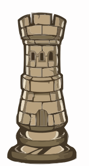
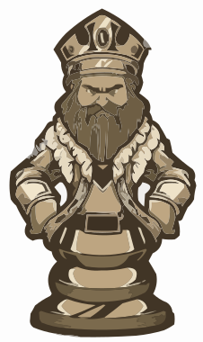
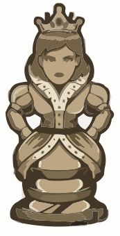
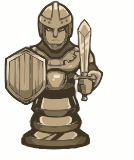
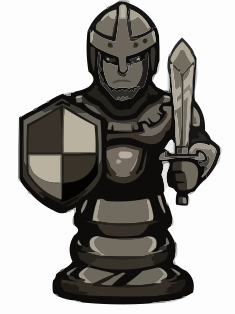
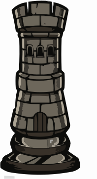
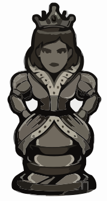

📢 Nominate ([@madhavagarwal3012](https://github.com/madhavagarwal3012/)) as **[GitHub Star ★](https://stars.github.com/nominate)**. If you appreciate his hard work and dedication to open source.


<p align="right">
  <a href="https://github.com/madhavagarwal3012">
    
  </a>
  <a href="https://github.com/madhavagarwal3012?tab=followers">
    
  </a>
  <a href="https://github.com/sponsors/madhavagarwal3012">
    
  </a>
  <a href="https://www.naukri.com/code360/profile/madhvagrwal3012">
    
  </a>
</p>

<h1 align="center"></a></h1>

<h2 align="center">I’m a web developer in the making, learning from Coding Ninja’s full stack web development course. I have a solid foundation in Python, SQL, Java, and DSA. I enjoy discovering new tools and techniques to make awesome web apps. I’m looking for opportunities to apply my skills and creativity to real-world projects. I value teamwork, problem-solving, and continuous improvement as the keys to success. 🚀</h2>

<h2 align="center">🎓 I have finished my class 12th from GD Goenka Public School in 2023, where I spent my entire school life. I have always been an avid and curious learner, participating in various academic and co-curricular activities. I have earned certificates of excellence in Java from Coding Ninja, and certificates of completion in Python and SQL from SoloLearn. I have also aced the LinkedIn skill assessment test in Python. I’m proud of my achievements and thankful for the support of my teachers, mentors, and friends. 🙌</h2>

<h2 align="center">👩‍💻 I’m currently pursuing my BCA Honours from the prestigious Jaypee Institute of Information Technology (JIIT, Noida). Taking my web development skills to the next level and exploring new technologies. Excited to apply my expertise and creativity in building amazing and user-friendly web apps. 💯</h2>

<p align="left"> <a href="https://github.com/ryo-ma/github-profile-trophy"></a> </p>
<p align="left"> <a href="https://twitter.com/madhvagrwal3012" target="blank"></a> </p>

- 🌱 I’m currently learning **Data Structures And Algorithm In Java**
-  **📫 How to reach me**

<div align="left"> 
  <a href="mailto:madhavaggarwal3584@hotmail.com">
    
  </a>
  <a href="https://madhavagarwal3012.github.io./Portfolio/index.html" target="_blank">
      <!-- sqlite, safari, google-chrome are other good icon options -->
  </a>
  <a href="https://madhavagarwal3012-resume.tiiny.site" target="_blank">
     
  </a>
</div>

<h2 align="left">Connect With Me:</h2>
<p align="left">
<a href="https://twitter.com/madhvagrwal3012" target="blank"></a>
<a href="https://linkedin.com/in/madhavagarwal3012" target="blank"></a>
<a href="https://instagram.com/madhavagarwal3012" target="blank"></a>
<a href="https://youtube.com/@madhavagarwal3012?si=lYsWf56XH8R9EMQT" target="blank"></a>
<a href="https://www.hackerrank.com/madhvagarwal3012" target="blank"></a>
<a href="https://www.leetcode.com/madhavagarwal3012" target="blank"></a>
<a href="https://auth.geeksforgeeks.org/user/madhavagarwal3012" target="blank"></a>

---

<h2 align="left">Languages and Tools:</h2>
<p align="left">
    <a href="https://www.java.com" target="_blank" rel="noreferrer">
        
    </a>
    <a href="https://www.python.org" target="_blank" rel="noreferrer">
        
    </a>
    <a href="https://www.cprogramming.com/" target="_blank" rel="noreferrer">
        
    </a>
    <a href="https://www.w3schools.com/html/" target="_blank" rel="noreferrer">
        
    </a>
    <a href="https://www.w3schools.com/css/" target="_blank" rel="noreferrer">
        
    </a>
    <a href="https://developer.mozilla.org/en-US/docs/Web/JavaScript" target="_blank" rel="noreferrer">
        
    </a>
    <a href="https://www.mysql.com/" target="_blank" rel="noreferrer">
        
    </a>
    <a href="https://www.linux.org/" target="_blank" rel="noreferrer">
        
    </a>
    <a href="https://www.vectorlogo.zone/logos/google_cloud/google_cloud-icon.svg" target="_blank" rel="noreferrer">
        
    </a>
    <a href="https://www.photoshop.com/en" target="_blank" rel="noreferrer">
        
    </a>
</p>

<p align="center">
  
</p>

---

 <h2 align="left">  My Main Projects </h2>

```javascript
console.log(`Feel free to contribute`);
```

<table style="width:100%" align="center">
  <tr>
    <td>
      <a href="https://github.com/madhavagarwal3012/Calcunite-Executable-File-Application ">
        
      </a>
    </td>
    <td>
      <a href="https://github.com/madhavagarwal3012/2D-Array-Operation-Executable-File-Application-">
        
      </a>
    </td>
    </tr>
  <tr>
    <td>
      <a href="https://github.com/madhavagarwal3012/Game-Arena-Board-Verse-GameHub">
        
      </a>
    </td>
  </tr>
</table>


<br>


---

<div align="left">
  <h2>🐍 My Contributions 🐍</h2>
  <br>
  
  
  
  
</div>

  ---
  
  <div>
  <h2 align="left">Support:</h2>
  
  <p><a href="https://buymeacoffee.com/madhavagarwal3012"> </a><a href="https://github.com/sponsors/madhavagarwal3012"> </a></p>
</div>

<br/><br/><br/>

--- 

<h2 align="left">Stats:</h2>
<br>
<div align=left>
  
  
  <br/>
  <br><br>

  ---
  
  <!--START_SECTION:waka-->
**🐱 My GitHub Data** 

> 📦 45.7 kB Used in GitHub's Storage 
 > 
> 🏆 865 Contributions in the Year 2025
 > 
> 🚫 Not Opted to Hire
 > 
> 📜 19 Public Repositories 
 > 
> 🔑 2 Private Repositories 
 > 
**I'm a Night 🦉** 

```text
🌞 Morning                350 commits         ██░░░░░░░░░░░░░░░░░░░░░░░   09.37 % 
🌆 Daytime                448 commits         ███░░░░░░░░░░░░░░░░░░░░░░   11.99 % 
🌃 Evening                1373 commits        █████████░░░░░░░░░░░░░░░░   36.76 % 
🌙 Night                  1564 commits        ██████████░░░░░░░░░░░░░░░   41.87 % 
```
📅 **I'm Most Productive on Sunday** 

```text
Monday                   542 commits         ████░░░░░░░░░░░░░░░░░░░░░   14.51 % 
Tuesday                  665 commits         ████░░░░░░░░░░░░░░░░░░░░░   17.80 % 
Wednesday                273 commits         ██░░░░░░░░░░░░░░░░░░░░░░░   07.31 % 
Thursday                 338 commits         ██░░░░░░░░░░░░░░░░░░░░░░░   09.05 % 
Friday                   643 commits         ████░░░░░░░░░░░░░░░░░░░░░   17.22 % 
Saturday                 598 commits         ████░░░░░░░░░░░░░░░░░░░░░   16.01 % 
Sunday                   676 commits         █████░░░░░░░░░░░░░░░░░░░░   18.10 % 
```


📊 **This Week I Spent My Time On** 

```text
🕑︎ Time Zone: Asia/Kolkata

💬 Programming Languages: 
No Activity Tracked This Week

🔥 Editors: 
No Activity Tracked This Week

🐱‍💻 Projects: 
No Activity Tracked This Week
```

**Timeline**


 Last Updated on 27/08/2025 18:47:30 UTC
<!--END_SECTION:waka-->
</div>

---

<h2 align="left">🏆 Hacktoberfest Badges</h2>
<div align="left">
<a href="https://www.holopin.io/@madhavagarwal3012#" target="_blank" rel="noopener noreferrer">
    <picture>
      <source media="(max-width: 600px)" srcset="https://holopin.me/madhavagarwal3012?size=small">
      
    </picture>
  </a>
</div>

<div style="display: flex; justify-content: space-between; align-items: center;">
  <h2>Random Dev Quotes:</h2>
   <div style="display: flex; justify-content: space-between; width: 100%;">
    
  </div>
</div>

---

<div>
  
  
</div>

Counting of visitors to this page started on <strong>August 28, 2025</strong>

<a href="https://info.flagcounter.com/isZI"></a>
<br clear="both">

---

## ♟️ Chess Game ♟️
This is an open chess tournament where ANYONE can play. That's the fun part.  
It's your turn to play! Move a <!-- BEGIN TURN -->black<!-- END TURN --> piece.

<!-- BEGIN CHESS BOARD -->
|   | H | G | F | E | D | C | B | A |   |
|---|:-:|:-:|:-:|:-:|:-:|:-:|:-:|:-:|:-:|
| **1** |  |  |  |  |  |  |  |  | **1** |
| **2** |  |  |  |  |  |  |  |  | **2** |
| **3** |  |  |  |  |  |  |  |  | **3** |
| **4** |  |  |  |  |  |  |  |  | **4** |
| **5** |  |  |  |  |  |  |  |  | **5** |
| **6** |  |  |  |  |  |  |  |  | **6** |
| **7** |  |  |  |  |  |  |  |  | **7** |
| **8** |  |  |  |  |  |  |  |  | **8** |
|   | **H** | **G** | **F** | **E** | **D** | **C** | **B** | **A** |   |
<!-- END CHESS BOARD -->

**It's your turn to move! Choose one from the following table**
<!-- BEGIN MOVES LIST -->
|  FROM  | TO (Just click a link!) |
| :----: | :---------------------- |
| **A7** | [A5](https://github.com/madhavagarwal3012/madhavagarwal3012/issues/new?body=Please+do+not+change+the+title.+Just+click+%22Submit+new+issue%22.+You+don%27t+need+to+do+anything+else+%3AD&title=Chess%3A+Move+A7+to+A5), [A6](https://github.com/madhavagarwal3012/madhavagarwal3012/issues/new?body=Please+do+not+change+the+title.+Just+click+%22Submit+new+issue%22.+You+don%27t+need+to+do+anything+else+%3AD&title=Chess%3A+Move+A7+to+A6) |
| **B7** | [B5](https://github.com/madhavagarwal3012/madhavagarwal3012/issues/new?body=Please+do+not+change+the+title.+Just+click+%22Submit+new+issue%22.+You+don%27t+need+to+do+anything+else+%3AD&title=Chess%3A+Move+B7+to+B5), [B6](https://github.com/madhavagarwal3012/madhavagarwal3012/issues/new?body=Please+do+not+change+the+title.+Just+click+%22Submit+new+issue%22.+You+don%27t+need+to+do+anything+else+%3AD&title=Chess%3A+Move+B7+to+B6) |
| **B8** | [A6](https://github.com/madhavagarwal3012/madhavagarwal3012/issues/new?body=Please+do+not+change+the+title.+Just+click+%22Submit+new+issue%22.+You+don%27t+need+to+do+anything+else+%3AD&title=Chess%3A+Move+B8+to+A6), [C6](https://github.com/madhavagarwal3012/madhavagarwal3012/issues/new?body=Please+do+not+change+the+title.+Just+click+%22Submit+new+issue%22.+You+don%27t+need+to+do+anything+else+%3AD&title=Chess%3A+Move+B8+to+C6) |
| **C7** | [C5](https://github.com/madhavagarwal3012/madhavagarwal3012/issues/new?body=Please+do+not+change+the+title.+Just+click+%22Submit+new+issue%22.+You+don%27t+need+to+do+anything+else+%3AD&title=Chess%3A+Move+C7+to+C5), [C6](https://github.com/madhavagarwal3012/madhavagarwal3012/issues/new?body=Please+do+not+change+the+title.+Just+click+%22Submit+new+issue%22.+You+don%27t+need+to+do+anything+else+%3AD&title=Chess%3A+Move+C7+to+C6) |
| **D7** | [D5](https://github.com/madhavagarwal3012/madhavagarwal3012/issues/new?body=Please+do+not+change+the+title.+Just+click+%22Submit+new+issue%22.+You+don%27t+need+to+do+anything+else+%3AD&title=Chess%3A+Move+D7+to+D5), [D6](https://github.com/madhavagarwal3012/madhavagarwal3012/issues/new?body=Please+do+not+change+the+title.+Just+click+%22Submit+new+issue%22.+You+don%27t+need+to+do+anything+else+%3AD&title=Chess%3A+Move+D7+to+D6) |
| **E7** | [E5](https://github.com/madhavagarwal3012/madhavagarwal3012/issues/new?body=Please+do+not+change+the+title.+Just+click+%22Submit+new+issue%22.+You+don%27t+need+to+do+anything+else+%3AD&title=Chess%3A+Move+E7+to+E5), [E6](https://github.com/madhavagarwal3012/madhavagarwal3012/issues/new?body=Please+do+not+change+the+title.+Just+click+%22Submit+new+issue%22.+You+don%27t+need+to+do+anything+else+%3AD&title=Chess%3A+Move+E7+to+E6) |
| **F7** | [F5](https://github.com/madhavagarwal3012/madhavagarwal3012/issues/new?body=Please+do+not+change+the+title.+Just+click+%22Submit+new+issue%22.+You+don%27t+need+to+do+anything+else+%3AD&title=Chess%3A+Move+F7+to+F5), [F6](https://github.com/madhavagarwal3012/madhavagarwal3012/issues/new?body=Please+do+not+change+the+title.+Just+click+%22Submit+new+issue%22.+You+don%27t+need+to+do+anything+else+%3AD&title=Chess%3A+Move+F7+to+F6) |
| **G7** | [G5](https://github.com/madhavagarwal3012/madhavagarwal3012/issues/new?body=Please+do+not+change+the+title.+Just+click+%22Submit+new+issue%22.+You+don%27t+need+to+do+anything+else+%3AD&title=Chess%3A+Move+G7+to+G5), [G6](https://github.com/madhavagarwal3012/madhavagarwal3012/issues/new?body=Please+do+not+change+the+title.+Just+click+%22Submit+new+issue%22.+You+don%27t+need+to+do+anything+else+%3AD&title=Chess%3A+Move+G7+to+G6) |
| **G8** | [F6](https://github.com/madhavagarwal3012/madhavagarwal3012/issues/new?body=Please+do+not+change+the+title.+Just+click+%22Submit+new+issue%22.+You+don%27t+need+to+do+anything+else+%3AD&title=Chess%3A+Move+G8+to+F6), [H6](https://github.com/madhavagarwal3012/madhavagarwal3012/issues/new?body=Please+do+not+change+the+title.+Just+click+%22Submit+new+issue%22.+You+don%27t+need+to+do+anything+else+%3AD&title=Chess%3A+Move+G8+to+H6) |
| **H7** | [H5](https://github.com/madhavagarwal3012/madhavagarwal3012/issues/new?body=Please+do+not+change+the+title.+Just+click+%22Submit+new+issue%22.+You+don%27t+need+to+do+anything+else+%3AD&title=Chess%3A+Move+H7+to+H5), [H6](https://github.com/madhavagarwal3012/madhavagarwal3012/issues/new?body=Please+do+not+change+the+title.+Just+click+%22Submit+new+issue%22.+You+don%27t+need+to+do+anything+else+%3AD&title=Chess%3A+Move+H7+to+H6) |
<!-- END MOVES LIST -->

Having fun? Ask a friend to do the next move!

#### How it works

When you click on a link and submit a new issue with the desired move, a GitHub action is triggered, which in turn runs a small python script that performs the specified movement, updates this README file and commits the changes.

<details>
  <summary>Last 5 moves in this game</summary>
<!-- BEGIN LAST MOVES -->

| Move | Author |
| :--: | :----- |
| `D2` to `D3` | [ @madhavagarwal3012](https://github.com/madhavagarwal3012) |
| `Start game` | [ @madhavagarwal3012](https://github.com/madhavagarwal3012) |

<!-- END LAST MOVES -->
</details>

<details>
  <summary>Top 10 most moves across all games</summary>
<!-- BEGIN TOP MOVES -->

| Total moves |  User  |
| :---------: | :----- |
| 1 | [@madhavagarwal3012](https://github.com/madhavagarwal3012) |

<!-- END TOP MOVES -->
</details>

---

## 🎵 Spotify Vibes 🎧
<div align="center">
  <!-- Now Playing Widget -->
  <h3>Currently Spinning 💿</h3>
  <a href="https://spotify-github-profile.kittinanx.com/api/view?uid=31q27rypvnbypdgwqqzr3unsvyrq&redirect=true" target="_blank">
    
  </a>
  
  <!-- Recently Played Widget -->
  <h3>Recently Played 🎼</h3>
  
</div>


