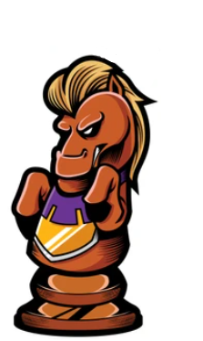
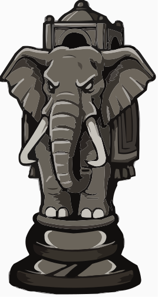
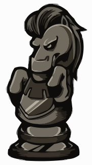
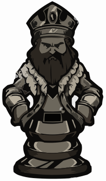
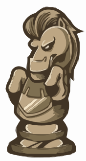

**[License](LICENSE.md)** 📢 Nominate ([@madhavagarwal3012](https://github.com/madhavagarwal3012/)) as **[GitHub Star ★](https://stars.github.com/nominate)**. If you appreciate his hard work and dedication to open source.


<p align="right">
  <a href="https://github.com/madhavagarwal3012">
    
  </a>
  <a href="https://github.com/madhavagarwal3012?tab=followers">
    
  </a>
  <a href="https://github.com/sponsors/madhavagarwal3012">
    
  </a>
  <a href="https://www.naukri.com/code360/profile/madhvagrwal3012">
    
  </a>
</p>

<h1 align="center"></a></h1>

<h2 align="center">I’m a web developer in the making, learning from Coding Ninja’s full stack web development course. I have a solid foundation in Python, SQL, Java, and DSA. I enjoy discovering new tools and techniques to make awesome web apps. I’m looking for opportunities to apply my skills and creativity to real-world projects. I value teamwork, problem-solving, and continuous improvement as the keys to success. 🚀</h2>

<h2 align="center">🎓 I have finished my class 12th from GD Goenka Public School in 2023, where I spent my entire school life. I have always been an avid and curious learner, participating in various academic and co-curricular activities. I have earned certificates of excellence in Java from Coding Ninja, and certificates of completion in Python and SQL from SoloLearn. I have also aced the LinkedIn skill assessment test in Python. I’m proud of my achievements and thankful for the support of my teachers, mentors, and friends. 🙌</h2>

<h2 align="center">👩‍💻 I’m currently pursuing my Bachelors in Computer Applications from the prestigious Jaypee Institute of Information Technology (JIIT, Noida). Taking my web development skills to the next level and exploring new technologies. Excited to apply my expertise and creativity in building amazing and user-friendly web apps. 💯</h2>

<p align="left"> <a href="https://github.com/ryo-ma/github-profile-trophy"></a> </p>
<p align="left"> <a href="https://twitter.com/madhvagrwal3012" target="blank"></a> </p>

- 🌱 I’m currently learning **Data Structures And Algorithm In Java**
-  **📫 How to reach me**

<div align="left"> 
  <a href="mailto:madhavaggarwal3584@hotmail.com">
    
  </a>
  <a href="https://madhavagarwal3012.github.io./Portfolio/index.html" target="_blank">
      <!-- sqlite, safari, google-chrome are other good icon options -->
  </a>
  <a href="https://madhavagarwal3012-resume.tiiny.site" target="_blank">
     
  </a>
</div>

<h2 align="left">Connect With Me:</h2>
<p align="left">
<a href="https://twitter.com/madhvagrwal3012" target="blank"></a>
<a href="https://linkedin.com/in/madhavagarwal3012" target="blank"></a>
<a href="https://instagram.com/madhavagarwal3012" target="blank"></a>
<a href="https://youtube.com/@madhavagarwal3012?si=lYsWf56XH8R9EMQT" target="blank"></a>
<a href="https://www.hackerrank.com/madhvagarwal3012" target="blank"></a>
<a href="https://www.leetcode.com/madhavagarwal3012" target="blank"></a>
<a href="https://auth.geeksforgeeks.org/user/madhavagarwal3012" target="blank"></a>

---

<h2 align="left">Languages and Tools:</h2>
<p align="left">
    <a href="https://www.java.com" target="_blank" rel="noreferrer">
        
    </a>
    <a href="https://www.python.org" target="_blank" rel="noreferrer">
        
    </a>
    <a href="https://www.cprogramming.com/" target="_blank" rel="noreferrer">
        
    </a>
    <a href="https://www.w3schools.com/html/" target="_blank" rel="noreferrer">
        
    </a>
    <a href="https://www.w3schools.com/css/" target="_blank" rel="noreferrer">
        
    </a>
    <a href="https://developer.mozilla.org/en-US/docs/Web/JavaScript" target="_blank" rel="noreferrer">
        
    </a>
    <a href="https://www.mysql.com/" target="_blank" rel="noreferrer">
        
    </a>
    <a href="https://www.linux.org/" target="_blank" rel="noreferrer">
        
    </a>
    <a href="https://www.vectorlogo.zone/logos/google_cloud/google_cloud-icon.svg" target="_blank" rel="noreferrer">
        
    </a>
    <a href="https://www.photoshop.com/en" target="_blank" rel="noreferrer">
        
    </a>
</p>

<p align="center">
  
</p>

---

 <h2 align="left">  My Main Projects </h2>

```javascript
console.log(`Feel free to contribute`);
```

<table style="width:100%" align="center">
  <tr>
    <td>
      <a href="https://github.com/madhavagarwal3012/Calcunite-Executable-File-Application ">
        
      </a>
    </td>
    <td>
      <a href="https://github.com/madhavagarwal3012/2D-Array-Operation-Executable-File-Application-">
        
      </a>
    </td>
    </tr>
  <!-- <tr>
    <td>
      <a href="https://github.com/madhavagarwal3012/Game-Arena-Board-Verse-GameHub">
        
      </a>
    </td>
  </tr> -->
</table>


<br>


---

## 📂 My Repository Structure & Workflows 📂

```
├── .github
    ├── FUNDING.yml
    └── workflows
    │   ├── Chess.yml
    │   ├── breakout.yaml
    │   ├── main.yml
    │   └── waka.yml
├── Black Background.gif
├── Github Ascii Art Text.png
├── Github Graph Wavy Art.svg
├── LICENSE.md
├── README.md
├── White Background.gif
├── assets
    ├── bar_graph.png
    └── breakout.svg
├── central text.svg
├── contribution name graph.svg
├── data
    ├── last_moves.txt
    ├── settings.yaml
    └── top_moves.txt
├── games
    └── current.pgn
├── header.png
├── img
    ├── black
    │   ├── bishop.svg
    │   ├── king.svg
    │   ├── knight.svg
    │   ├── pawn.svg
    │   ├── queen.svg
    │   └── rook.svg
    ├── blank.png
    ├── pieces
    │   ├── bishop.PNG
    │   ├── king.PNG
    │   ├── knight.PNG
    │   ├── pawn.PNG
    │   ├── queen.PNG
    │   └── rook.PNG
    └── white
    │   ├── bishop.svg
    │   ├── king.svg
    │   ├── knight.svg
    │   ├── pawn.svg
    │   ├── queen.svg
    │   └── rook.svg
├── main.py
├── random dev quote.png
├── requirements.txt
├── sponsor badge.jpg
├── src
    ├── __pycache__
    │   ├── markdown.cpython-310.pyc
    │   ├── mockGithub.cpython-310.pyc
    │   └── selftest.cpython-310.pyc
    ├── markdown.py
    ├── mockGithub.py
    └── selftest.py
├── techy.PNG
└── typing.gif
```

---

<div align="left">
  <h2>🐍 My Contributions 🐍</h2>
  <br>
  
  
  
  
  
  
</div>

  ---
  
  <div>
  <h2 align="left">Support:</h2>
  
  <p><a href="https://buymeacoffee.com/madhavagarwal3012"> </a><a href="https://github.com/sponsors/madhavagarwal3012"> </a></p>
</div>

<br/><br/><br/>

--- 

<h2 align="left">Stats:</h2>
<br>
<div align=left>
  
  
  <br/>
  <br><br>

  ---
  
  <!--START_SECTION:waka-->
**🐱 My GitHub Data** 

> 📦 58.1 kB Used in GitHub's Storage 
 > 
> 🏆 2 Contributions in the Year 2026
 > 
> 🚫 Not Opted to Hire
 > 
> 📜 20 Public Repositories 
 > 
> 🔑 3 Private Repositories 
 > 
**I'm a Night 🦉** 

```text
🌞 Morning                399 commits         ██░░░░░░░░░░░░░░░░░░░░░░░   09.59 % 
🌆 Daytime                521 commits         ███░░░░░░░░░░░░░░░░░░░░░░   12.52 % 
🌃 Evening                1503 commits        █████████░░░░░░░░░░░░░░░░   36.13 % 
🌙 Night                  1737 commits        ██████████░░░░░░░░░░░░░░░   41.75 % 
```
📅 **I'm Most Productive on Sunday** 

```text
Monday                   581 commits         ███░░░░░░░░░░░░░░░░░░░░░░   13.97 % 
Tuesday                  673 commits         ████░░░░░░░░░░░░░░░░░░░░░   16.18 % 
Wednesday                356 commits         ██░░░░░░░░░░░░░░░░░░░░░░░   08.56 % 
Thursday                 462 commits         ███░░░░░░░░░░░░░░░░░░░░░░   11.11 % 
Friday                   692 commits         ████░░░░░░░░░░░░░░░░░░░░░   16.63 % 
Saturday                 622 commits         ████░░░░░░░░░░░░░░░░░░░░░   14.95 % 
Sunday                   774 commits         █████░░░░░░░░░░░░░░░░░░░░   18.61 % 
```


📊 **This Week I Spent My Time On** 

```text
🕑︎ Time Zone: Asia/Kolkata

💬 Programming Languages: 
No Activity Tracked This Week

🔥 Editors: 
No Activity Tracked This Week

🐱‍💻 Projects: 
No Activity Tracked This Week
```

**Timeline**


 Last Updated on 14/01/2026 10:31:00 UTC
<!--END_SECTION:waka-->
</div>

---

<h2 align="left">🏆 Hacktoberfest Badges</h2>
<div align="left">
<a href="https://www.holopin.io/@madhavagarwal3012#" target="_blank" rel="noopener noreferrer">
    <picture>
      <source media="(max-width: 600px)" srcset="https://holopin.me/madhavagarwal3012?size=small">
      
    </picture>
  </a>
</div>

<div style="display: flex; justify-content: space-between; align-items: center;">
  <h2>Random Dev Quotes:</h2>
   <div style="display: flex; justify-content: space-between; width: 100%;">
    
  </div>
</div>

---

<div>
  
  
  
</div>
<div style="clear: both; text-align: center; padding-top: 20px;">
  
</div>

--- 


Counting of visitors to this page started on <strong>August 28, 2025</strong>

<a href="https://info.flagcounter.com/isZI"></a>
<br clear="both">

---

## ♟️ Chess Game ♟️
This is an open chess tournament where ANYONE can play. That's the fun part.  

### 🗺️ Guide to Chess Piece Movement

Before making your move, here's a quick refresher on how each piece can move and capture.

| Piece | Image | Movement | Capturing | Key Rule |
| :---: | :---: | :---: | :---: | :---: |
| **King** |  | Moves **one square** in any direction (horizontal, vertical, or diagonal). | Captures like it moves (1 square in any direction). | **Must never** move into a square where it can be captured (check). |
| **Queen** |  | Moves any number of squares **horizontally, vertically, or diagonally**. | Captures on any square along its line of movement. | The most powerful piece on the board. |
| **Rook (Elephant)** |  | Moves any number of squares **horizontally** (across files) or **vertically** (up/down ranks). | Captures on any square along its straight line of movement. | Cannot jump over other pieces. |
| **Bishop** |  | Moves any number of squares **diagonally**. | Captures on any square along its diagonal line of movement. | Stays on its original color square for the entire game. |
| **Knight (Horse)** |  | Moves in an **"L" shape** (two squares in one cardinal direction and then one square perpendicular). | Captures only on the square it lands on. | **The only piece that can jump** over other pieces. |
| **Pawn** |  | Moves **forward one square** (two squares on its first move only). | Captures **diagonally** one square forward. | If it reaches the opposite side of the board, it must **Promote** (usually to a Queen). |

**It's your turn to play! Move a <!-- BEGIN TURN -->white<!-- END TURN --> piece.**

<!-- BEGIN CHESS BOARD -->
|   | A | B | C | D | E | F | G | H |   |
|---|:-:|:-:|:-:|:-:|:-:|:-:|:-:|:-:|:-:|
| <span style="color:#A78C6F; font-weight:bold;">8</span> | <div style="background-color:#EDEAD8; display: block; height: 100%; margin: -8px -10px; padding: 8px 10px;"></div> | <div style="background-color:#A78C6F; display: block; height: 100%; margin: -8px -10px; padding: 8px 10px;"></div> | <div style="background-color:#EDEAD8; display: block; height: 100%; margin: -8px -10px; padding: 8px 10px;"></div> | <div style="background-color:#A78C6F; display: block; height: 100%; margin: -8px -10px; padding: 8px 10px;"></div> | <div style="background-color:#EDEAD8; display: block; height: 100%; margin: -8px -10px; padding: 8px 10px;"></div> | <div style="background-color:#A78C6F; display: block; height: 100%; margin: -8px -10px; padding: 8px 10px;"></div> | <div style="background-color:#EDEAD8; display: block; height: 100%; margin: -8px -10px; padding: 8px 10px;"></div> | <div style="background-color:#A78C6F; display: block; height: 100%; margin: -8px -10px; padding: 8px 10px;"></div> | <span style="color:#A78C6F; font-weight:bold;">8</span> |
| <span style="color:#A78C6F; font-weight:bold;">7</span> | <div style="background-color:#A78C6F; display: block; height: 100%; margin: -8px -10px; padding: 8px 10px;"></div> | <div style="background-color:#EDEAD8; display: block; height: 100%; margin: -8px -10px; padding: 8px 10px;"></div> | <div style="background-color:#A78C6F; display: block; height: 100%; margin: -8px -10px; padding: 8px 10px;"></div> | <div style="background-color:#EDEAD8; display: block; height: 100%; margin: -8px -10px; padding: 8px 10px;"></div> | <div style="background-color:#A78C6F; display: block; height: 100%; margin: -8px -10px; padding: 8px 10px;"></div> | <div style="background-color:#EDEAD8; display: block; height: 100%; margin: -8px -10px; padding: 8px 10px;"></div> | <div style="background-color:#A78C6F; display: block; height: 100%; margin: -8px -10px; padding: 8px 10px;"></div> | <div style="background-color:#EDEAD8; display: block; height: 100%; margin: -8px -10px; padding: 8px 10px;"></div> | <span style="color:#A78C6F; font-weight:bold;">7</span> |
| <span style="color:#A78C6F; font-weight:bold;">6</span> | <div style="background-color:#EDEAD8; display: block; height: 100%; margin: -8px -10px; padding: 8px 10px;"></div> | <div style="background-color:#A78C6F; display: block; height: 100%; margin: -8px -10px; padding: 8px 10px;"></div> | <div style="background-color:#EDEAD8; display: block; height: 100%; margin: -8px -10px; padding: 8px 10px;"></div> | <div style="background-color:#A78C6F; display: block; height: 100%; margin: -8px -10px; padding: 8px 10px;"></div> | <div style="background-color:#EDEAD8; display: block; height: 100%; margin: -8px -10px; padding: 8px 10px;"></div> | <div style="background-color:#A78C6F; display: block; height: 100%; margin: -8px -10px; padding: 8px 10px;"></div> | <div style="background-color:#EDEAD8; display: block; height: 100%; margin: -8px -10px; padding: 8px 10px;"></div> | <div style="background-color:#A78C6F; display: block; height: 100%; margin: -8px -10px; padding: 8px 10px;"></div> | <span style="color:#A78C6F; font-weight:bold;">6</span> |
| <span style="color:#A78C6F; font-weight:bold;">5</span> | <div style="background-color:#A78C6F; display: block; height: 100%; margin: -8px -10px; padding: 8px 10px;"></div> | <div style="background-color:#EDEAD8; display: block; height: 100%; margin: -8px -10px; padding: 8px 10px;"></div> | <div style="background-color:#A78C6F; display: block; height: 100%; margin: -8px -10px; padding: 8px 10px;"></div> | <div style="background-color:#EDEAD8; display: block; height: 100%; margin: -8px -10px; padding: 8px 10px;"></div> | <div style="background-color:#A78C6F; display: block; height: 100%; margin: -8px -10px; padding: 8px 10px;"></div> | <div style="background-color:#EDEAD8; display: block; height: 100%; margin: -8px -10px; padding: 8px 10px;"></div> | <div style="background-color:#A78C6F; display: block; height: 100%; margin: -8px -10px; padding: 8px 10px;"></div> | <div style="background-color:#EDEAD8; display: block; height: 100%; margin: -8px -10px; padding: 8px 10px;"></div> | <span style="color:#A78C6F; font-weight:bold;">5</span> |
| <span style="color:#A78C6F; font-weight:bold;">4</span> | <div style="background-color:#EDEAD8; display: block; height: 100%; margin: -8px -10px; padding: 8px 10px;"></div> | <div style="background-color:#A78C6F; display: block; height: 100%; margin: -8px -10px; padding: 8px 10px;"></div> | <div style="background-color:#EDEAD8; display: block; height: 100%; margin: -8px -10px; padding: 8px 10px;"></div> | <div style="background-color:#A78C6F; display: block; height: 100%; margin: -8px -10px; padding: 8px 10px;"></div> | <div style="background-color:#EDEAD8; display: block; height: 100%; margin: -8px -10px; padding: 8px 10px;"></div> | <div style="background-color:#A78C6F; display: block; height: 100%; margin: -8px -10px; padding: 8px 10px;"></div> | <div style="background-color:#EDEAD8; display: block; height: 100%; margin: -8px -10px; padding: 8px 10px;"></div> | <div style="background-color:#A78C6F; display: block; height: 100%; margin: -8px -10px; padding: 8px 10px;"></div> | <span style="color:#A78C6F; font-weight:bold;">4</span> |
| <span style="color:#A78C6F; font-weight:bold;">3</span> | <div style="background-color:#A78C6F; display: block; height: 100%; margin: -8px -10px; padding: 8px 10px;"></div> | <div style="background-color:#EDEAD8; display: block; height: 100%; margin: -8px -10px; padding: 8px 10px;"></div> | <div style="background-color:#A78C6F; display: block; height: 100%; margin: -8px -10px; padding: 8px 10px;"></div> | <div style="background-color:#EDEAD8; display: block; height: 100%; margin: -8px -10px; padding: 8px 10px;"></div> | <div style="background-color:#A78C6F; display: block; height: 100%; margin: -8px -10px; padding: 8px 10px;"></div> | <div style="background-color:#EDEAD8; display: block; height: 100%; margin: -8px -10px; padding: 8px 10px;"></div> | <div style="background-color:#A78C6F; display: block; height: 100%; margin: -8px -10px; padding: 8px 10px;"></div> | <div style="background-color:#EDEAD8; display: block; height: 100%; margin: -8px -10px; padding: 8px 10px;"></div> | <span style="color:#A78C6F; font-weight:bold;">3</span> |
| <span style="color:#A78C6F; font-weight:bold;">2</span> | <div style="background-color:#EDEAD8; display: block; height: 100%; margin: -8px -10px; padding: 8px 10px;"></div> | <div style="background-color:#A78C6F; display: block; height: 100%; margin: -8px -10px; padding: 8px 10px;"></div> | <div style="background-color:#EDEAD8; display: block; height: 100%; margin: -8px -10px; padding: 8px 10px;"></div> | <div style="background-color:#A78C6F; display: block; height: 100%; margin: -8px -10px; padding: 8px 10px;"></div> | <div style="background-color:#EDEAD8; display: block; height: 100%; margin: -8px -10px; padding: 8px 10px;"></div> | <div style="background-color:#A78C6F; display: block; height: 100%; margin: -8px -10px; padding: 8px 10px;"></div> | <div style="background-color:#EDEAD8; display: block; height: 100%; margin: -8px -10px; padding: 8px 10px;"></div> | <div style="background-color:#A78C6F; display: block; height: 100%; margin: -8px -10px; padding: 8px 10px;"></div> | <span style="color:#A78C6F; font-weight:bold;">2</span> |
| <span style="color:#A78C6F; font-weight:bold;">1</span> | <div style="background-color:#A78C6F; display: block; height: 100%; margin: -8px -10px; padding: 8px 10px;"></div> | <div style="background-color:#EDEAD8; display: block; height: 100%; margin: -8px -10px; padding: 8px 10px;"></div> | <div style="background-color:#A78C6F; display: block; height: 100%; margin: -8px -10px; padding: 8px 10px;"></div> | <div style="background-color:#EDEAD8; display: block; height: 100%; margin: -8px -10px; padding: 8px 10px;"></div> | <div style="background-color:#A78C6F; display: block; height: 100%; margin: -8px -10px; padding: 8px 10px;"></div> | <div style="background-color:#EDEAD8; display: block; height: 100%; margin: -8px -10px; padding: 8px 10px;"></div> | <div style="background-color:#A78C6F; display: block; height: 100%; margin: -8px -10px; padding: 8px 10px;"></div> | <div style="background-color:#EDEAD8; display: block; height: 100%; margin: -8px -10px; padding: 8px 10px;"></div> | <span style="color:#A78C6F; font-weight:bold;">1</span> |
|   | <span style="color:#A78C6F; font-weight:bold;">A</span> | <span style="color:#A78C6F; font-weight:bold;">B</span> | <span style="color:#A78C6F; font-weight:bold;">C</span> | <span style="color:#A78C6F; font-weight:bold;">D</span> | <span style="color:#A78C6F; font-weight:bold;">E</span> | <span style="color:#A78C6F; font-weight:bold;">F</span> | <span style="color:#A78C6F; font-weight:bold;">G</span> | <span style="color:#A78C6F; font-weight:bold;">H</span> |   |
<!-- END CHESS BOARD -->

**It's your turn to move! Choose one from the following table**
<!-- BEGIN MOVES LIST -->
|  FROM  | TO (Just click a link!) |
| :----: | :---------------------- |
| **A2** | [A3](https://github.com/madhavagarwal3012/madhavagarwal3012/issues/new?body=Please+do+not+change+the+title.+Just+click+%22Submit+new+issue%22.+You+don%27t+need+to+do+anything+else+%3AD&title=Chess%3A+Move+A2+to+A3), [A4](https://github.com/madhavagarwal3012/madhavagarwal3012/issues/new?body=Please+do+not+change+the+title.+Just+click+%22Submit+new+issue%22.+You+don%27t+need+to+do+anything+else+%3AD&title=Chess%3A+Move+A2+to+A4) |
| **B1** | [A3](https://github.com/madhavagarwal3012/madhavagarwal3012/issues/new?body=Please+do+not+change+the+title.+Just+click+%22Submit+new+issue%22.+You+don%27t+need+to+do+anything+else+%3AD&title=Chess%3A+Move+B1+to+A3), [C3](https://github.com/madhavagarwal3012/madhavagarwal3012/issues/new?body=Please+do+not+change+the+title.+Just+click+%22Submit+new+issue%22.+You+don%27t+need+to+do+anything+else+%3AD&title=Chess%3A+Move+B1+to+C3) |
| **B2** | [B3](https://github.com/madhavagarwal3012/madhavagarwal3012/issues/new?body=Please+do+not+change+the+title.+Just+click+%22Submit+new+issue%22.+You+don%27t+need+to+do+anything+else+%3AD&title=Chess%3A+Move+B2+to+B3), [B4](https://github.com/madhavagarwal3012/madhavagarwal3012/issues/new?body=Please+do+not+change+the+title.+Just+click+%22Submit+new+issue%22.+You+don%27t+need+to+do+anything+else+%3AD&title=Chess%3A+Move+B2+to+B4) |
| **C2** | [C3](https://github.com/madhavagarwal3012/madhavagarwal3012/issues/new?body=Please+do+not+change+the+title.+Just+click+%22Submit+new+issue%22.+You+don%27t+need+to+do+anything+else+%3AD&title=Chess%3A+Move+C2+to+C3), [C4](https://github.com/madhavagarwal3012/madhavagarwal3012/issues/new?body=Please+do+not+change+the+title.+Just+click+%22Submit+new+issue%22.+You+don%27t+need+to+do+anything+else+%3AD&title=Chess%3A+Move+C2+to+C4) |
| **D2** | [D3](https://github.com/madhavagarwal3012/madhavagarwal3012/issues/new?body=Please+do+not+change+the+title.+Just+click+%22Submit+new+issue%22.+You+don%27t+need+to+do+anything+else+%3AD&title=Chess%3A+Move+D2+to+D3), [D4](https://github.com/madhavagarwal3012/madhavagarwal3012/issues/new?body=Please+do+not+change+the+title.+Just+click+%22Submit+new+issue%22.+You+don%27t+need+to+do+anything+else+%3AD&title=Chess%3A+Move+D2+to+D4) |
| **E2** | [E3](https://github.com/madhavagarwal3012/madhavagarwal3012/issues/new?body=Please+do+not+change+the+title.+Just+click+%22Submit+new+issue%22.+You+don%27t+need+to+do+anything+else+%3AD&title=Chess%3A+Move+E2+to+E3), [E4](https://github.com/madhavagarwal3012/madhavagarwal3012/issues/new?body=Please+do+not+change+the+title.+Just+click+%22Submit+new+issue%22.+You+don%27t+need+to+do+anything+else+%3AD&title=Chess%3A+Move+E2+to+E4) |
| **F2** | [F3](https://github.com/madhavagarwal3012/madhavagarwal3012/issues/new?body=Please+do+not+change+the+title.+Just+click+%22Submit+new+issue%22.+You+don%27t+need+to+do+anything+else+%3AD&title=Chess%3A+Move+F2+to+F3), [F4](https://github.com/madhavagarwal3012/madhavagarwal3012/issues/new?body=Please+do+not+change+the+title.+Just+click+%22Submit+new+issue%22.+You+don%27t+need+to+do+anything+else+%3AD&title=Chess%3A+Move+F2+to+F4) |
| **G1** | [F3](https://github.com/madhavagarwal3012/madhavagarwal3012/issues/new?body=Please+do+not+change+the+title.+Just+click+%22Submit+new+issue%22.+You+don%27t+need+to+do+anything+else+%3AD&title=Chess%3A+Move+G1+to+F3), [H3](https://github.com/madhavagarwal3012/madhavagarwal3012/issues/new?body=Please+do+not+change+the+title.+Just+click+%22Submit+new+issue%22.+You+don%27t+need+to+do+anything+else+%3AD&title=Chess%3A+Move+G1+to+H3) |
| **G2** | [G3](https://github.com/madhavagarwal3012/madhavagarwal3012/issues/new?body=Please+do+not+change+the+title.+Just+click+%22Submit+new+issue%22.+You+don%27t+need+to+do+anything+else+%3AD&title=Chess%3A+Move+G2+to+G3), [G4](https://github.com/madhavagarwal3012/madhavagarwal3012/issues/new?body=Please+do+not+change+the+title.+Just+click+%22Submit+new+issue%22.+You+don%27t+need+to+do+anything+else+%3AD&title=Chess%3A+Move+G2+to+G4) |
| **H2** | [H3](https://github.com/madhavagarwal3012/madhavagarwal3012/issues/new?body=Please+do+not+change+the+title.+Just+click+%22Submit+new+issue%22.+You+don%27t+need+to+do+anything+else+%3AD&title=Chess%3A+Move+H2+to+H3), [H4](https://github.com/madhavagarwal3012/madhavagarwal3012/issues/new?body=Please+do+not+change+the+title.+Just+click+%22Submit+new+issue%22.+You+don%27t+need+to+do+anything+else+%3AD&title=Chess%3A+Move+H2+to+H4) |
<!-- END MOVES LIST -->

Having fun? Ask a friend to do the next move!

#### How it works ?

When you click on a link and submit a new issue with the desired move, a GitHub action is triggered, which in turn runs a small python script that performs the specified movement, updates this README file and commits the changes.

<details>
  <summary>Last 5 moves in this game</summary>
<!-- BEGIN LAST MOVES -->

| Move | Author |
| :--: | :----- |
| `Start game` | [ @madhavagarwal3012](https://github.com/madhavagarwal3012) |

<!-- END LAST MOVES -->
</details>

<details>
  <summary>Top 10 most moves across all games</summary>
<!-- BEGIN TOP MOVES -->

| Total moves |  User  |
| :---------: | :----- |

<!-- END TOP MOVES -->
</details>

--- 

### 🔵 Connect4 Game 🔴
This is an open connect4 tournament where ANYONE can play. That's the fun part.  

<!-- BEGIN CONNECT4 BOARD -->
<!-- END CONNECT4 BOARD -->

**It's your turn to move! Choose one from the following table**
<!-- BEGIN MOVES LIST -->
